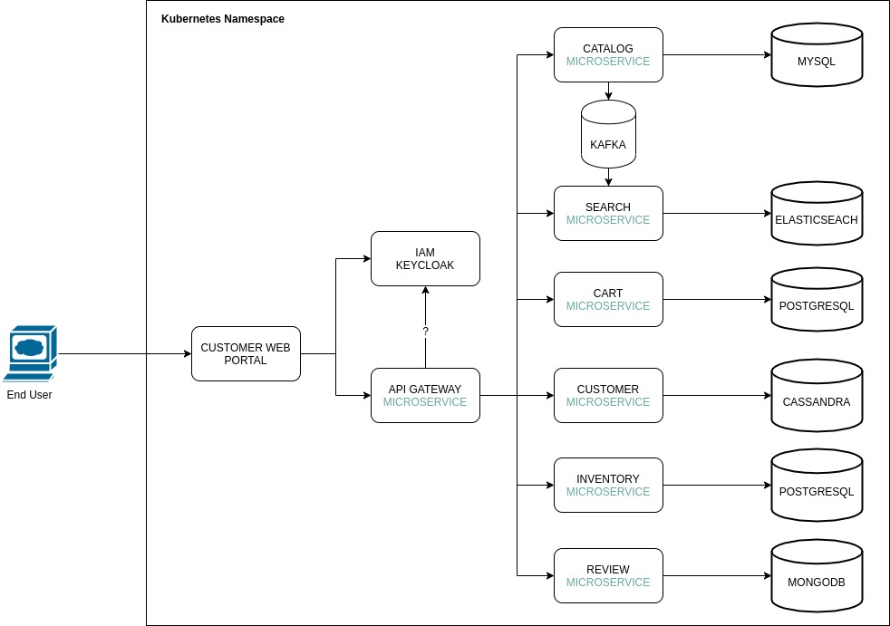
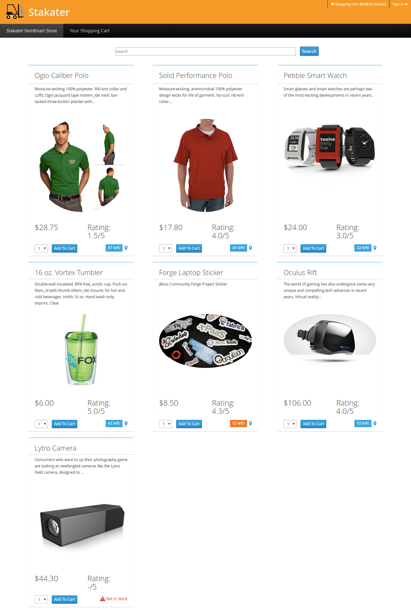
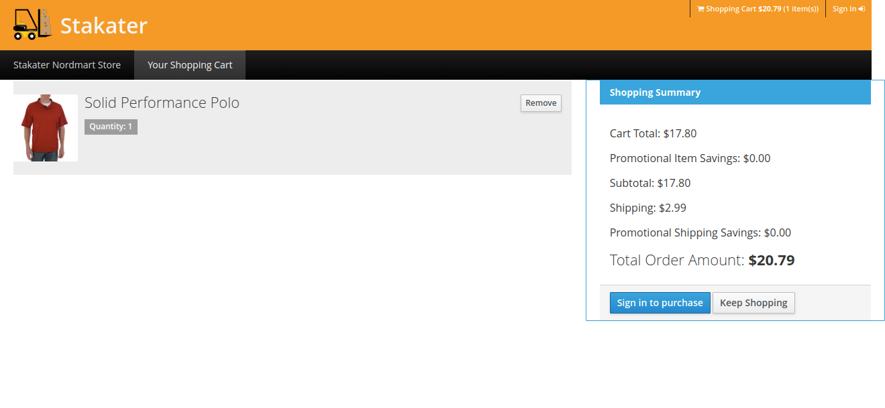
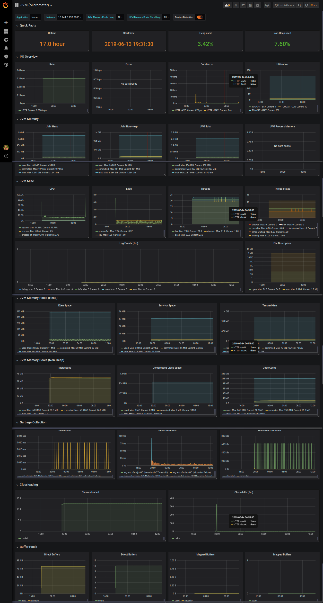

# NordMart Web Application

[[toc]]

## Introduction

Nordmart is an online store web application built using Spring Boot, WildFly Swarm, Eclipse Vert.x, Node.js and AngularJS adopting the microservices architecture.

## Services

* **Web**: A Node.js/Angular front-end. Details can be found on this [link](https://github.com/stakater-lab/stakater-nordmart-web)

* **API Gateway**: Vert.x service aggregates API calls to back-end services and provides a reactive REST API for front-end. Details can be found on this [link](https://github.com/stakater-lab/stakater-nordmart-gateway-vertx)

* **Catalog**: Spring Boot service exposing REST API for the product catalog and product information. It uses MYSQL Database. Details can be found on this [link](https://github.com/stakater-lab/stakater-nordmart-catalog).

* **Inventory**: WildFly Swarm service exposing REST API for product's inventory status. It uses Postgres as the Database. Details can be found on this [link](https://github.com/stakater-lab/stakater-nordmart-inventory)

* **Cart**: Spring Boot service exposing REST API for shopping cart. It uses Postgres database. Details can be found on this [link](https://github.com/stakater-lab/stakater-nordmart-cart)

* **Review**: Spring Boot service exposing REST API for reviews on Products. It uses MongoDB as database. Details can be found on this [link](https://github.com/stakater-lab/stakater-nordmart-review)

* **Search**: Spring Boot service exposing REST API to search products. It uses Elasticsearch as the Database. Details can be found on this [link](https://github.com/stakater-lab/stakater-nordmart-search)

* **Customer**: Spring Boot service exposing REST API to manage customer profile. It uses Cassandra as the Database. Details can be found on this [link](https://github.com/stakater-lab/stakater-nordmart-customer)

## Tools

* **Keycloak**: Nordmart uses Keycloak to authenticate a user and get the Customer Profile. A user can go through products but he would have to Sign in to purchase an item.

* **Kafka**: Nordmart uses Kafka as the message broker, whenever a CRUD operation is performed in Catalog, it sends the message to Search Service using Kafka.

## Architecture

The diagram given below shows architecture of the application.

  

## Views

The app contains two main screens.

* First one is the home screen which lists all the products. It fetches all the products from catalog and their available stock value from inventory and displays them. You can add an item to the cart using the respective `Add To Cart` button.

  

* Second is the cart screen which shows the items currently in your cost and their cost.

  

## Monitoring

Dasbhoards given below can be used to monitor application by configuring them in Monitoring stack.

* JVM metrics dashboard is offered via the monitoring stack which displays JVM metrices.

  

* Catalog service metrics dashboard can be configured using this [config](https://github.com/stakater-lab/nordmart-dev-apps/blob/master/releases/catalog-service-dashboard.yaml).

  
