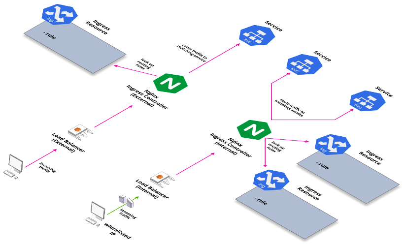

# Ingress
  
  A more efficient way of exposing services is the use of Ingress. Instead of using lots of services, such as LoadBalancer, we can route traffic based on the request host or path using Ingress Controllers and rules. This allows for centralization of many services to a single point. We leave the services as ClusterIP types since they can connect to the Ingress, and define how the traffic gets routed to that service using an Ingress Rule. An ingress rule consists of an optional host, a list of paths, and a backend. The host and path are used to identify which host and path the rule applies to. And the backend identifies the service and port to direct the request to.
  
  For an ingress resource to work, the cluster must have an ingress controller running.
  
## Ingress controller
   
   An Ingress Controller basically looks up Ingress resource definitions and routes traffic to services according to those definitions. An Ingress Controller can match with specific Ingresses based on a custom annotation specifying the ingress class.
   
   At Stakater we use the Kubernetes supported nginx ingress controller. Other community supported controllers are also available. The controller automatically creates a Load Balancer, such as ELB in our AWS clusters. While one load balancer and ingress controller may be enough for a particular workload, from a security point of view, we follow the practice of having 2 ingress controllers and load balancers; one for public applications, an “external” ingress controller and the other for private applications, and “internal” ingress controller. The ingress class names are chosen to match their purpose. The two ingress controllers are deployed with the relevant ingress class as it’s configuration parameter. And any ingresses that are created as part of a deployment are annotated with the relevant ingress class as well.
   
   With two ingress controllers in this configuration, we can run both public and private applications within a single cluster. But more importantly this serves a security purpose while helping us in automation of our deployment processes. While the public applications and load balancer should indeed be accessible from anywhere in the world, the private applications and load balancer should have restricted access as much as possible, and this is where security groups and IP whitelisting plays a role. These rules can be constantly applied to the private load balancer, and any private application that is being deployed in the cluster, need only be annotated with the internal ingress class. The service when deployed automatically becomes accessible online while still following security rules defined as per organization policy. Now, depending on the organization and policies, this idea can indeed be extended to even more ingress controllers and load balancers. In case there are multiple sub-organizations that must maintain some access boundaries, multiple ingress controllers and load balancers can be deployed with a meaningful ingress class. And all relevant ingresses will be accessible only from within the sub-organization’s origin network, while filtering out requests from any other network.
   
   
   
   Using Ingress controllers and Load balancers we can indeed expose our apps externally, but they will still be accessible by the load balancer’s dns name, which can be quite clunky and not at all easy to remember or write down. A custom DNS name is of course used for this purpose which can point to the load balancer instead. A DNS service such as Route53 in AWS can be used. Here is where another tool comes into play.

More on this tool (here)[https://playbook.stakater.com/tools/global/nginx-ingress]