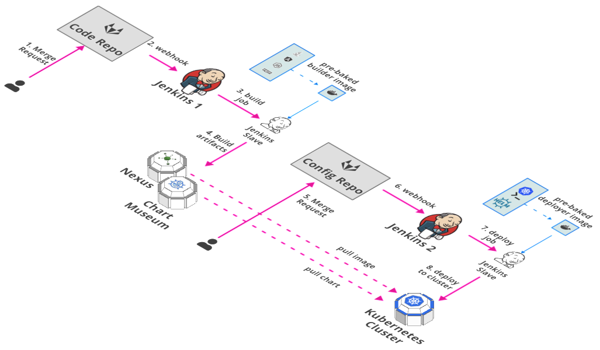

# Bird’s eye view: GitOps with Jenkins

1. **Merge Request:** The developer merges code into the Code repository.
2. **webhook:** A webhook configured in Jenkins automatically triggers the Jenkins pipeline.
3. **build job:** The jenkins instance assigns the job to a Jenkins slave running the required docker image for the build job.
4. **build artifacts:** The jenkins job builds the docker image and pushes to Nexus, and pushes the helm chart to Chart Museum.
5. **Merge request:** The developer merges updates to the configuration, e.g. bump the version of the helm chart for deployment, in the Configuration repository. 
6. **webhook:** A webhook configured in Jenkins automatically triggers the Jenkins pipeline for deployment.
7. **deploy job:** The jenkins instance assigns the job to a Jenkins slave running the required docker image for the deploy job.
8. **deploy to cluster:** The deploy job makes the required deployment e.g. `helm upgrade` or `kubectl apply`, etc.