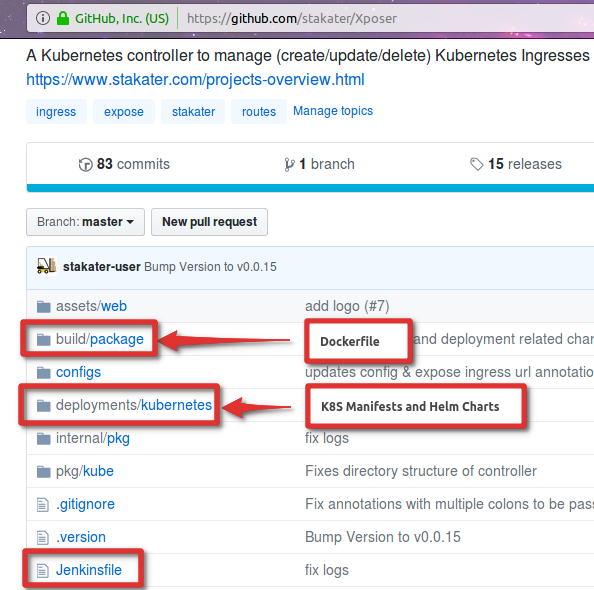
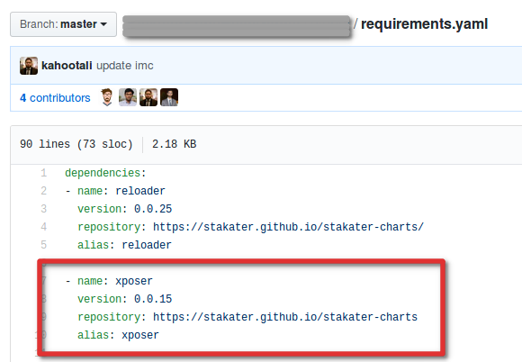
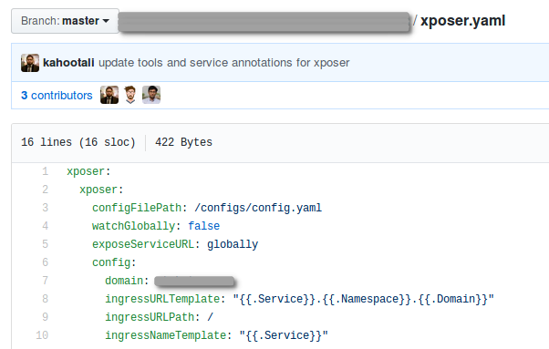
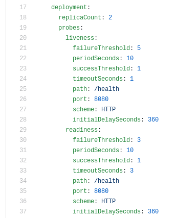

# GitOps with Jenkins
[[toc]]

## Anti-pattern?

You may see discussions that implementing deployment with a CI server is an anti-pattern, however, with some tweaks we will be able to workaround some of the reasons for that argument, which isn’t to say that it will be enough for a proper GitOps implementation.

Firstly, it is argued that the CI pipeline should not directly deploy. Indeed we will see that we do not take this route. We essentially maintain separate repositories for the application code, and the cluster configuration. And in doing so we also have separate pipelines for each, the latter being responsible for the deployment.

And secondly, keeping a clear security boundary between the code build pipeline, and config deploy pipeline can be achieved by using two instances of jenkins.

## Implementation detail

The first thing to do is to have your code and configuration repositories separate. We will take a look at one of Stakater’s opensource projects, Xposer as an example, to illustrate the points that are being discussed. You can follow the github link to get a better view of the individual files.

### Code repository

The code repo will have the application code including a Dockerfile and helm chart. The reason for this is that the Dockerfile and Helm Chart at this point are serving only as a packaging tool. The responsibility and knowledge of how the application code should be packaged should be included within the Application code repository. In the following screenshot we can see the code repository for Xposer. As visible, apart from the application code, we also have the Dockerfile, Kubernetes manifests (for completeness sake), Helm Charts, and Jenkinsfile.

### Configuration Repository

Next we need a configuration repository. This in fact can in most cases be used for a group of deployments that are related either by namespace, or other dependencies. For this we use the umbrella chart pattern of Helm. The repository will have a list of required charts in yaml, and for each chart the custom values that will be used for the deployment. The required charts are listed in a yaml file as below:

The customer values of the charts are defined in individual value yaml files as below:

The following example is from a different project, and shows how other deployment configuration where parameterized, can be customized in an umbrella chart value file. This way we customize the number of replicas, the health checks, the tolerations, etc. for a particular deployment in our configuration repository.

### Updates

When a change is merged into the Code repository, The code pipeline runs in Jenkins, and upon success it pushes the packaged docker image and helm chart to the artifact repositories, Nexus and ChartMuseum respectively in our case. This pipeline will us a pre-baked builder docker image on the Jenkins slave to build the artifacts. This builder image may include tools such as the JDK, npm, go releaser, etc. depending on the project. At this point while our new project version is packaged into our artifact repository, it has in no way been indicated that it should also be deployed. That part will be handled by the Configuration repo pipeline.

As discussed, the configuration repository has a separate pipeline, probably that will be run in a separate Jenkins instance. To deploy our new project version, we will need to create a pull request and merge changes into our configuration repository. In the case of our Xposer project, we can create a pull request to update the chart version in the requirements.yaml. If any configuration values also need to be updated, for the new deployment, we can do that in the values file, xposer.yaml, and create a single pull request for these changes. Once the pull request is merged, the Jenkins pipeline runs and on success, it updates the deployment on the cluster. This pipeline will use a pre-baked deployer docker image on the Jenkins slave to deploy the charts. This builder image may include tools such as the kubectl client or helm client.

## Summary
As discussed we want to maintain everything in git as per GItOps principles, and all updates will be done with git operations, such as pull requests. Our code and configuration are defined in separate repositories since the scope of each is different. The code repository merely defines the software artifact. It is the configuration repository declares where and how the deployment of this artifact should take place.

Additionally, the two repository CI and CD pipelines are ideally handled by independent Jenkins servers. This allows each server to receive only the required security level. The Jenkins instance for the code repository will have access to the code repository obviously, and write access to the artifact repositories, and it will not need any access on the configuration repository or deployment related access level on the cluster. The Jenkins instance for the configuration repository will not need access to the code repository, and will have access to the configuration repository, read-only access to the artifact repositories and deployment access on the cluster.

This way we do satisfy the core principles of GitOps. One thing that remains missing is for the deployment configuration to be self-healing. In case someone manually updates the deployment on the cluster, using kubectl client for instance, our Jenkins instance will not be aware of this, as it is not watching the cluster status. The deployment will only be fixed in such a case when the Jenkins pipeline for the configuration repo is rerun manually, or runs automatically triggered by a new updated merged to the configuration repository.