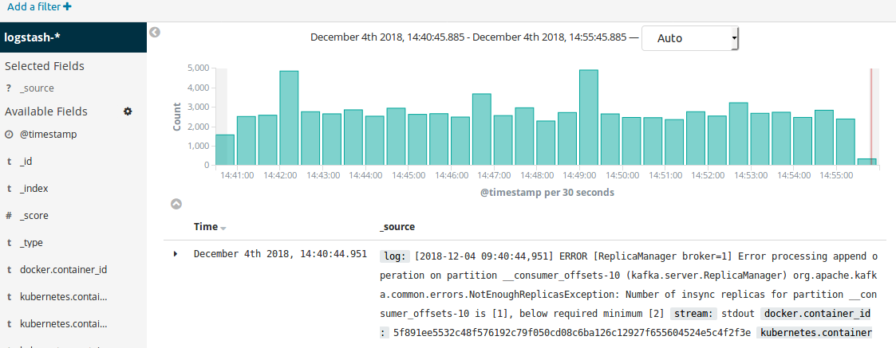

# Logging Flow

## Fluentd
Fluentd is an open source data collector for a unified logging layer. It has a flexible plugin architecture, allowing easy extension of its functionality. We deploy it as a DaemonSet on our cluster to ensure that all Nodes run a copy of the fluentd Pod. Any new node that is added to the cluster will also get a fluentd pod automatically.

The fluentd input plugin has the responsibility for reading in data from these log sources, and generating a Fluentd event against it. We use the in_tail Input plugin which allows Fluentd to read events from the tail of text files. This position from where fluentd has read a particular log file is recorded in a position file. And next time fluentd will pick up reading from this position in the file. The input is parsed, based on the configuration provided to the input plugin.

The fluentd event contains information such as where an event comes from, the time of the event, and the actual log content. We use the kubernetes_metadata_filter plugin to enrich the log event with kubernetes pod and namespace metadata. The plugin gets basic metadata about the container that emitted a given log record using the source of the log record.

These log events are matched to an Output plugin type in the Fluentd configuration. We use the out_elasticsearch Output plugin to forward these records to Elasticsearch.

## Logrotate

Log rotation essentially renames the old log file, and creates a new log file in its place for continued capturing of logs. This is done so that the file size remains manageable. At Stakater we use the linux logrotate utility for this, also as a daemonset so that it runs on every node like fluentd. At the moment there isn’t a public chart available in the official helm repository, we are using our own which you can find here.

We can see an example configuration as follows. The schedule is maintained through cron and the rest of the parameters such as path and size of file, number of rotations, etc. are specified in the configuration:
```yaml
environment:
  cronSchedule: 0 */12 * * *

config:
  k8sRotatorConf: |-
     /var/lib/docker/containers/*/*.log {
     rotate 5
     copytruncate
     missingok
     notifempty
     compress
     maxsize 200M
     daily
     create 0644 root root
     }
```

## Elasticsearch

Elasticsearch is basically a NoSQL database that became popular in the Logging domain as part of the ELK/ElasticStack. As we saw before, Fluentd forwards the log streams to Elasticsearch, which then goes on to index and store the log information. Elasticsearch basically allows us to easily search logs based on the metadata that was added by Fluentd. We can easily get results from its REST API to look at logs of a particular application, or apps on a particular node, or even search for all ERROR logs that may have been generated throughout the cluster. A RESTful api however is not a user friendly way of viewing log information, and can also be restricting to one query at a time. A more powerful use of this is to be able to see the log data in terms of trends, and also aggregations. This is where Kibana comes in as we will see in a subsequent section.

With Elasticsearch we would like to have persistent storage, so that our log data and indices are safe in case of a server crash. We there back the Elasticsearch deployment with a Persistent Volume Claim (PVC) on Kubernetes. This way the logs are persisted across Node restarts.

## ES Curator

We may also like to archive our Elasticsearch indices instead of having them all maintained since the beginning of time in our EBS. Old logs may not be needed and we can easily move them to a cheaper form of storage, such as an AWS S3 bucket with glacial storage. In such cases we use ES Curator. It helps us to curate our Elasticsearch indices. Following is an example configuration of how the curator cron schedule and other properties can be configured.

```yaml

config:
 cronSchedule: 0 0 * * *
 esHost: elasticsearch
 esPort: 9200
 snapshotName: stackator-es
 bucketName: 12345678912-stakater-store
 bucketBasePath: /es-indices-snapshots/
 awsRegion: us-east-2
 timeUnit: days
 olderThan: 30
 loglevel: INFO

```

## Cerebro

Cerebro is a tool we use for web administration of Elasticsearch. It can be useful to get a web view of the elasticsearch nodes, indices, shards, resource usage etc.


## Kibana

Kibana, is a visualization tool which helps us to view queries on Elasticsearch. We can view the text log data as-is, filter and query it based on certain labels to view just a subset, and we can also view it in the form of a chart, graph or other visualization. Kibana comes with some visualizations out of the box, and we can also build custom visualizations and dashboards as per our requirement. Visualizations can be helpful in indicating trends such as number of warning or error logs throughout the day time, which could be correlated to changing server load or other factors. Such analyses can then help identify issues pro-actively.

