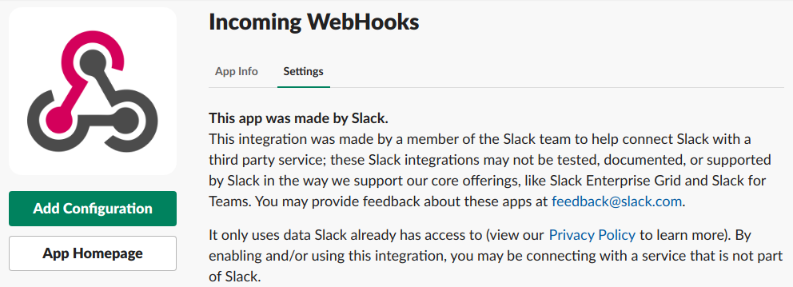

# Creating Hooks in Slack

## 1. Configure through an App

You will have to select an app for creating hooks, if you dont have one, you would have to create one.

### If you dont have one already

Go to `https://api.slack.com/apps` and click create new app.

Pick a name, choose a workspace to install your app to, and then click Create App.

### If you already have an app

Go to `https://api.slack.com/apps` and select the app from the list that you want to configure.

### Activate Webhooks

Selecting your app, will take you to Settings of the app, then go to Incoming Webhooks from the left side.

From here, click the Activate Incoming Webhooks toggle to switch it on

If you want to create a hook for a slack channel and add an app to post in that channel, follow that steps

### Add Webhook To Workspace

Now that Incoming Webhooks are enabled, the settings page should refresh and some extra options will appear below. One of those options will be a really helpful button marked Add New Webhook to Workspace, and you should click it.

So go ahead and pick a channel that the app will post to, and then click to Authorize your app. You'll be sent back to your app settings, and you should now see a new entry under the Webhook URLs for Your Workspace section.

So go ahead and pick a channel that the app will post to, and then click to Authorize your app. You'll be sent back to your app settings, and you should now see a new entry under the Webhook URLs for Your Workspace section. Use this slack hook to post messages to that channel.

## 2. Configure a Custom Integration

Go to `https://<your-workspace>.slack.com/apps/manage`, go to Custom Integrations. Select the Incoming Webhooks, and Select Add Configuration.

After this, you will be redirected and there will be an option to select a channel or you can even create a new channel from there.

And then click **Add Incoming Webhooks Integration**.

This will give you the webhook URL.