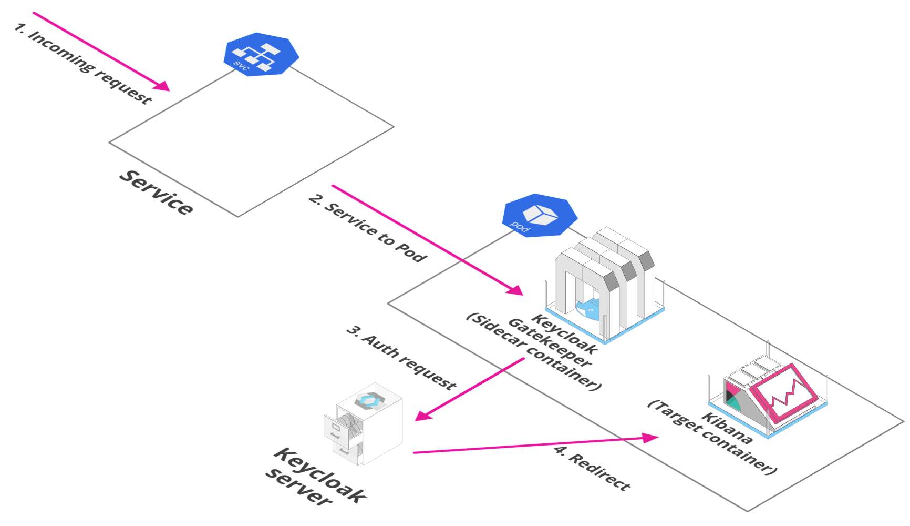

# Keycloak Gatekeeper

Keycloak Gatekeeper is an adapter which integrates with the Keycloak authentication service. We deploy it on a per-application instance basis. So usually this will be a sidecar container deployed with the application container on the kubernetes pod. We configure the kubernetes service of the application so that it points to the gatekeeper rather than the application itself, so that the gatekeeper can act as a proxy for incoming requests. The gatekeeper then verifies from the Keycloak server if an active authenticated session exists or not. If not, it redirects the client to the Keycloak login page. If the session exists, it allows the incoming request to pass through to the application container.

Using the Keycloak Gatekeeper allows us to have zero authentication configuration within the application itself. The session verification, redirection to Keycloak in case of an invalid session, and pass through to the application in case of a valid session, are all handled by the gatekeeper.