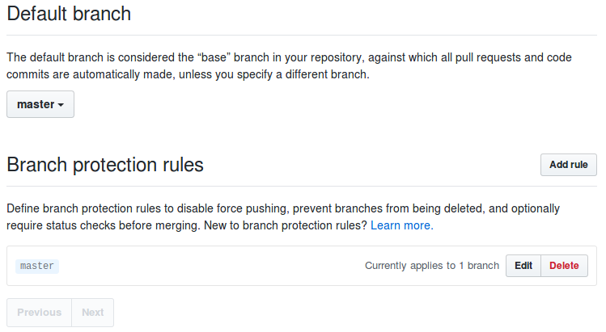

# Github configuration

## Branch protection
The default(master) branch should be protected so that no commits can be directly pushed into this branch, and only
Pull Request pushes are accepted. This can be done on the settings/branches page of a repository. See screenshot:

