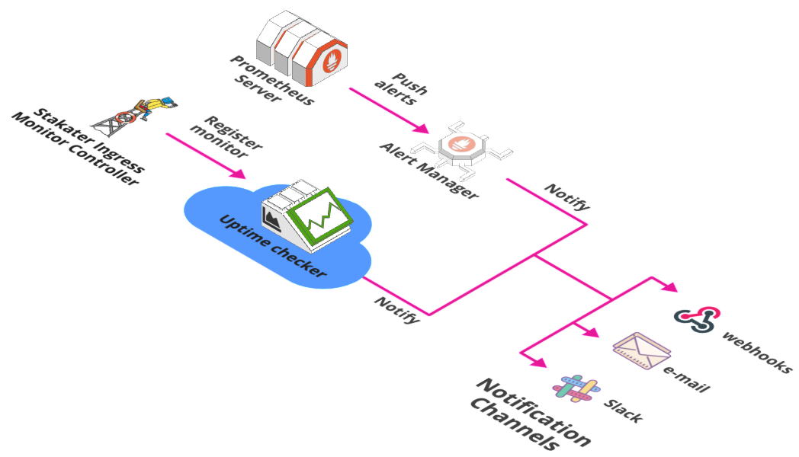

# Alerting Stack

## Overview

This stack provides tools that are responsible for alert functions of StakaterPlatform.

## Tools Matrix

|       Tool        | URL  |  Description |
| :---------------: | :--: | :-----------:|
| UptimeRobot | [https://www.uptimerobot.com](https://www.uptimerobot.com) | Uptime Robot monitors URLs via [IngressMonitorController](https://github.com/stakater/IngressMonitorController) and inform downtime/uptime events on Slack |
| Slack | [https://www.slack.com]([https://www.slack.com/]) | Slack is where all alerts from Stakater Platform is aggregated for the users to see via Logging/Monitoring/Alerting tools. |