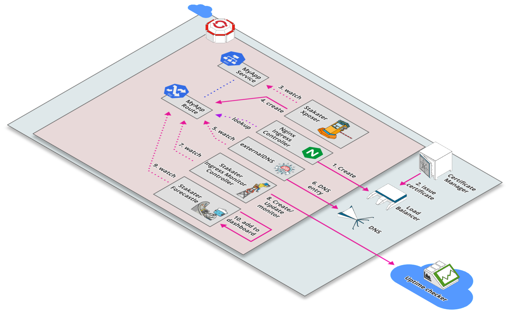

# Control Stack

This stack provides tools that controls the components of StakaterPlatform.



## Tools Matrix

|       Tool        | Chart Repository  |   Cherry Pickable |    SSO        | Pre-Requisites |
| :---------------: | :---------------: | :----------------:| :------------:| :-------------:|
| [External DNS](https://github.com/kubernetes-sigs/external-dns) | [Public](https://github.com/helm/charts/tree/master/stable/external-dns) | Yes | N/A |  None |
| [Nginx Ingress](https://github.com/kubernetes/ingress-nginx) | [Public](https://github.com/helm/charts/tree/master/stable/nginx-ingress) | Yes | N/A |  None |
| [Descheduler](https://github.com/kubernetes-sigs/descheduler) | [Stakater](https://github.com/stakater-charts/descheduler) | Yes | N/A |  None |
| [Forecastle](https://github.com/stakater/forecastle) | [Stakater](https://github.com/stakater/Forecastle/tree/master/deployments/kubernetes/chart/forecastle) | Yes | Yes |  Keycloak |
| [Reloader](https://github.com/stakater/Reloader) | [Stakater](https://github.com/stakater/Reloader/tree/master/deployments/kubernetes/chart/reloader) | Yes | N/A |  None |
| [Sealed Secrets Controller](https://github.com/bitnami-labs/sealed-secrets) | [Public](https://github.com/helm/charts/tree/master/stable/sealed-secrets) | Yes | N/A |  None |
| [K8s Dashboard](https://github.com/kubernetes/dashboard) | [Public](https://github.com/helm/charts/tree/master/stable/kubernetes-dashboard) | Yes | Depends |  None |
| [Gitwebhookproxy](https://github.com/stakater/GitWebhookProxy) | [Stakater](https://github.com/stakater/GitWebhookProxy/tree/master/deployments/kubernetes/chart/gitwebhookproxy) | Yes | N/A |  None |
| [IMC](https://github.com/stakater/IngressMonitorController) | [Stakater](https://github.com/stakater/IngressMonitorController/tree/master/deployments/kubernetes/chart/ingressmonitorcontroller) | Yes | N/A |  None |
| [Xposer](https://github.com/stakater/Xposer) | [Stakater](https://github.com/stakater/Xposer/tree/master/deployments/kubernetes/chart/xposer) | Yes | N/A |  None |


## Default Configurations

Following are the default configurations that are used by StakaterPlatform for `Control` stack. These configurations can be found under `config/` directory in the StakaterPlatform Github [repository](https://github.com/stakater/StakaterPlatform)

### IngressMonitorController IMC

IMC supports multiple online monitor services. By default UptimeRobot is configured. Provide `IMC_API_KEY` and `IMC_ALERT_CONTACTS` in `variables.config` to monitor every ingress via UptimeRobot.

| Variables | Description | Default |  
|:---|:---|---|
| IMC_API_KEY | API key of the monitor service provider |`nil` |
| IMC_ALERT_CONTACTS | Alert contacts for the monitor service provider |`nil` |

For more details See IMC [Github Repository](https://github.com/stakater/IngressMonitorController)

`configs/imc.yaml:`
```
# For more details: https://github.com/stakater/IngressMonitorController
providers:
  - name: UptimeRobot
    apiKey: IMC_API_KEY
    apiURL: https://api.uptimerobot.com/v2/
    alertContacts: "IMC_ALERT_CONTACTS"
enableMonitorDeletion: true
monitorNameTemplate: "{{.IngressName}}-{{.Namespace}}"
resyncPeriod: 0 # how often (in seconds) monitors should be synced to their Kubernetes resources (0 = disabled)
```
