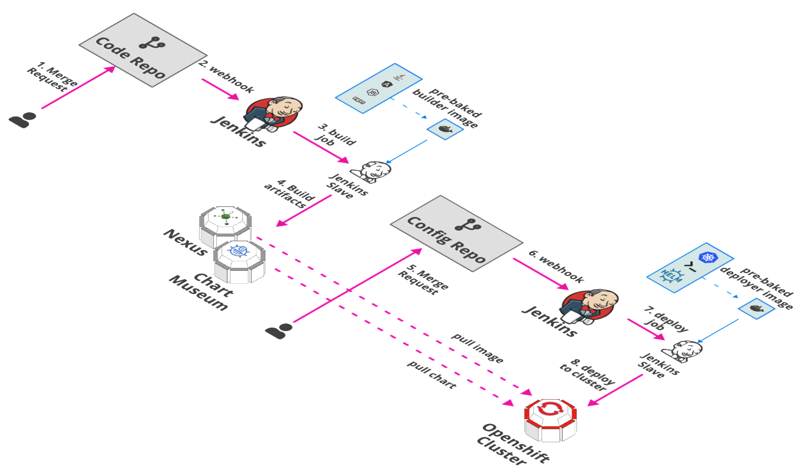

# Delivery Stack

Delivery Stack is responsible for CI/CD and respective saving artifacts of the pipelines.

## Tools Matrix

|       Tool        | Chart Repository                                                     | Cherry Pickable | SSO | Pre-Requisites |
| :---------------: | :------------------------------------------------------------------: | :--------------:| :--:| :-------------:|
| [Jenkins](https://github.com/jenkinsci/jenkins) | [Public](https://github.com/helm/charts/tree/master/stable/jenkins)            |       Yes       | Yes |     KeyCloak   |
| [Sonatype-Nexus](https://github.com/sonatype/nexus-public)   | [Public](https://github.com/helm/charts/tree/master/stable/sonatype-nexus)     |       Yes       | No  |      None      |
| RDLM    | [Stakater](https://github.com/stakater-charts/restful-distributed-lock-manager)|       Yes       | N/A |      None      |
| [Chartmuseum](https://github.com/helm/chartmuseum)    | [Public](https://github.com/helm/charts/tree/master/stable/chartmuseum)|       Yes       | N/A |      None      |

## Substitutions before deployment

### Jenkins

Following value should be replaced with appropriate security Realm settings before deployment

- `JENKINS_SECURITY_REALM`               Location: values.master.SecurityRealm

### Nexus

Following two values should be replaced as base64 encoded json in Nexus HelmReleases

- `BASE64_ENCODED_ADMIN_ACCOUNT_JSON`    Location: values.nexus.secret.data.admin_account.json
- `BASE64_ENCODED_CLUSTER_ACCOUNT_JSON`  Location: values.nexus.secret.data.cluster_account.json

Following two values should be replaced with the admin account and cluster account values as configured in the encoded json above

- `REPLACE_ADMIN_ACCOUNT_USERNAME`       Location: values.nexus.config.data.postStart.sh
- `REPLACE_CLUSTER_ACCOUNT_USERNAME`     Location: values.nexus.config.data.postStart.sh

### SonarQube

Following value should be replaced with appropriate properties for sonarqube.

- `SONARQUBE_PROPERTIES`                 Location: values.sonarProperties

## Draft Packs

Here are the [Build Packs](https://github.com/stakater/draft-pack)

## Stakater Pipeline Library

Here is stakater pipeline library for Jenkins & Gitlab

[Stakater Pipeline Library](https://github.com/stakater/stakater-pipeline-library)

## Storage Details

|          Tool         |                            PVC                                     | Recommended Space |
| :-------------------: | :------------------------------------------------------------------------------: | :--------------:| :--:| :-------------:|
| [Jenkins](https://github.com/jenkinsci/jenkins)          | [stakater-delivery-jenkins](https://github.com/helm/charts/tree/master/stable/jenkins#persistence)                                 |     8Gi |
| [Sonatype-Nexus](https://github.com/sonatype/nexus-public)           | [stakater-delivery-sonatype-nexus-data-big](https://github.com/helm/charts/tree/master/stable/sonatype-nexus#persistence)                             |     80Gi |
