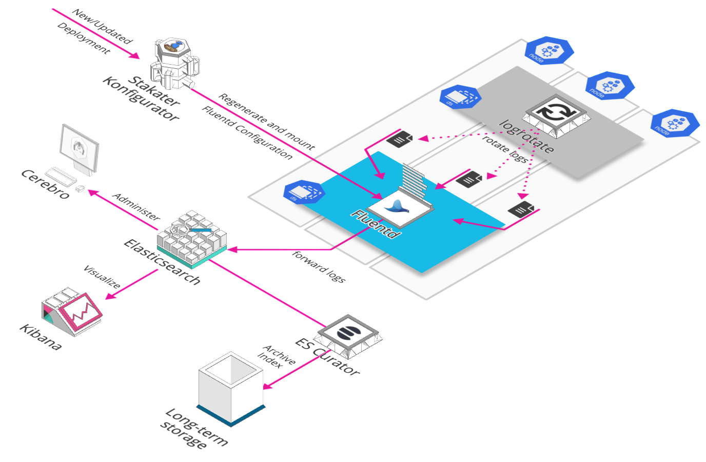

# Logging Stack

Logging Stack contains all tools required to collect and store logs of your pods.

## Tools Matrix

|          Tool         |                            Chart Repository                                      | Cherry Pickable | SSO | Pre-Requisites |
| :-------------------: | :------------------------------------------------------------------------------: | :--------------:| :--:| :-------------:|
| Elasticsearch         | [Public](https://github.com/elastic/helm-charts)                                 |       Yes       | N/A |      None      |
| Fluentd               | [Public](https://github.com/kiwigrid/helm-charts)                                |        No      | N/A |      Elasticsearch      |
| Eventrouter           | [Public](https://github.com/helm/charts/tree/master/stable/eventrouter)          |        No      | N/A |      None      |
| Kibana                | [Public](https://github.com/helm/charts/tree/master/stable/kibana)               |       No       | Yes |    KeyCloak, Elasticsearch    |
| Cerebro               | [Public](https://github.com/helm/charts/tree/master/stable/cerebro)              |       No       | Yes |    KeyCloak, Elasticsearch    |
| Elasticsearch Curator | [Public](https://github.com/helm/charts/tree/master/stable/elasticsearch-curator)|       No       | N/A |      Elasticsearch      |
| Logrotate             | [Stakater](https://github.com/stakater-charts/logrotate)                         |      Yes       | N/A |      None      |
| [Konfigurator](https://github.com/stakater/Konfigurator)          | [Stakater](https://github.com/stakater/Konfigurator/tree/master/deployments/kubernetes/chart/konfigurator)                      |       No       | N/A |      Fluentd      |

## Storage Details

|          Tool         |                            PVC                                     | Recommended Space |
| :-------------------: | :------------------------------------------------------------------------------: | :--------------:| :--:| :-------------:|
| [Elasticsearch](https://github.com/elastic/elasticsearch)          | [PVC details](https://github.com/elastic/helm-charts/tree/master/elasticsearch)                                 |     - |
| -          | elasticsearch-master-elasticsearch-master-0                                |     8Gi |
| -          | elasticsearch-data-elasticsearch-data-0                             |     20Gi |
| -          | elasticsearch-data-elasticsearch-data-1                                 |     20Gi |

**Details:** Our recommended configuration for elasticsearch, used in StakaterPlatform, is to have 1 master node, 1 client node and 2 data nodes. Persistence should be enabled for master and data nodes. 