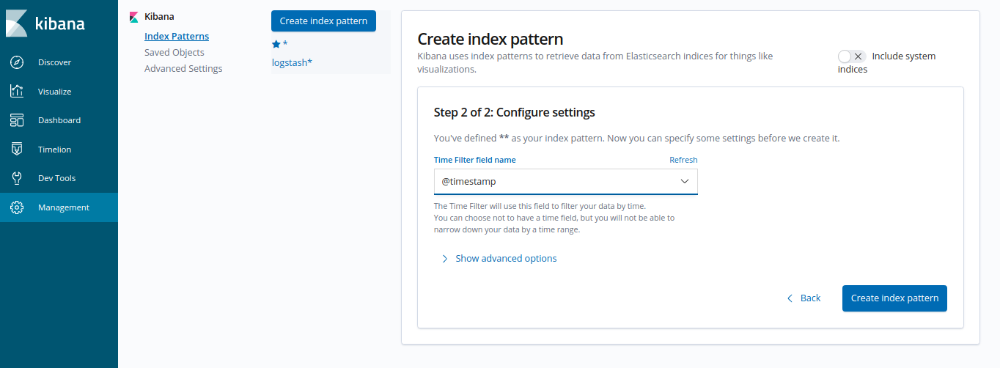

# Configuring Kibana

At first start, before visualizing logs, Kibana needs to be configured with an index pattern for elasticsearch indices.

At first startup kibana will automatically redirect you for index creation. Create an index from 
Management -> Index Patterns -> Create Index Pattern

1. Create Index Patterns and name the index `*`

2. Click "Next" and set `@timestamp` as the **Time filter field name**

Once index pattern is created kibana will take a few seconds to fetch data from ES and after that you'll start seeing logs in kibana.

## Useful Resources

https://logz.io/learn/complete-guide-elk-stack

https://www.elastic.co/guide/en/kibana/current/tutorial-define-index.html