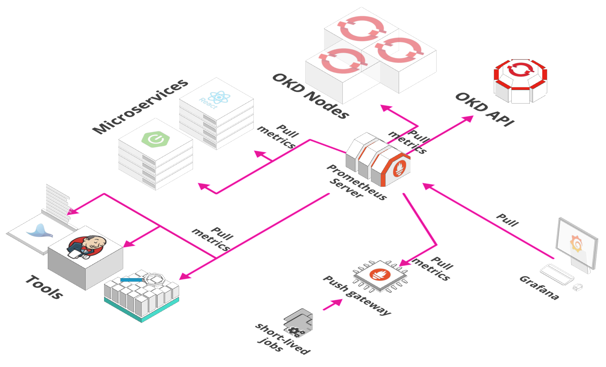

# Monitoring Stack

Monitoring Stack includes all tools related to monitoring your application as well as the infrastructure.

## Tools Matrix

|          Tool         |                            Chart Repository                                      | Cherry Pickable | SSO | Pre-Requisites |
| :-------------------: | :------------------------------------------------------------------------------: | :--------------:| :--:| :-------------:|
| [Prometheus Operator](https://github.com/coreos/prometheus-operator)         | [Public](https://github.com/helm/charts/tree/master/stable/prometheus-operator)                                 |       Yes       | N/A |      None      |
| [Metrics server](https://github.com/coreos/prometheus-operator)         | [Public](https://github.com/helm/charts/tree/master/stable/metrics-server)                                 |       Yes       | N/A |      None      |

We are using Prometheus Operator helm chart to deploy following monitoring components:

- **Prometheus**: It is an opensource monitoring solution for metrics and alerting.

- **Service Monitors**: CRD to generate prometheus configuration to monitor Kubernetes services.

- **AlertManager**: It is part of Prometheus's alerting feature. Alert rules are defined in Prometheus server that send alerts to Alertmanager. Once alerts are received Alertmanager can group, inhibit or silence them.

- **Node Exporter**: Prometheus exporter for hardware and OS metrics exposed by *NIX kernels, with pluggable metric collectors.

- **Kube State Metrics**: It is a service that generates metrics about kubernetes objects by using Kubebernetes API server.

- **Grafana**: Grafana is an open source metric analytics & visualization suite with support for Elasticsearch, Prometheus etc. Currently, it is being used with Prometheus.

Metrics-server is a cluster level component that uses Summary API to scrape metrics from all nodes & pods served by kubelet. 
It allows us to query resource metrics using kubectl right from the command line.

It is a cluster level component which periodically scrapes metrics from all Kubernetes nodes served by Kubelet through Summary API

## Storage Details

|          Tool         |                            PVC                                     | Recommended Space |
| :-------------------: | :------------------------------------------------------------------------------: | :--------------:| :--:| :-------------:|
| [Prometheus Operator](https://github.com/coreos/prometheus-operator)          | [prometheus-stakater-prometheus-db-prometheus-stakater-prometheus-0](https://github.com/helm/charts/tree/master/stable/prometheus-operator#persistent-volumes)                                 |     6Gi |
