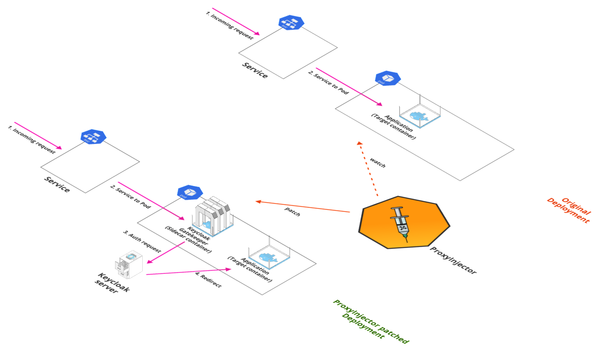

# Security Stack

Security Stack includes applications related to providing authentication on your applications.



## Tools Matrix

|       Tool        | Chart Repository                                                     | Cherry Pickable | SSO | Pre-Requisites |
| :---------------: | :------------------------------------------------------------------: | :--------------:| :--:| :-------------:|
| [Keycloak](https://github.com/keycloak/keycloak) | [Public](https://github.com/codecentric/helm-charts/tree/master/charts/keycloak)            |       Yes       | N/A |     Postgres   |
| [ProxyInjector](https://github.com/stakater/proxyinjector) | [Stakater](https://github.com/stakater/ProxyInjector/tree/master/deployments/kubernetes/chart/proxyinjector) | No | N/A |  Keycloak |


## Default Configurations

Following are the default configurations that are used by StakaterPlatform for `Security` stack. These configurations can be found under `configs/` directory in the StakaterPlatform Github [repository](https://github.com/stakater/StakaterPlatform)

### ProxyInjector

ProxyInjector serves as a client proxy for KeyCloak SSO server. ProxyInjector Injects side proxy on the basis of annotations on pods.

For more information See ProxyInjector Github [repository](https://github.com/stakater/ProxyInjector)

Configure the following variables in `variables.config` to configure proxy sidecar

| Variables | Description | Default |  
|---|---|---|
| KEYCLOAK_CLIENT_ID | Client ID for KeyCloak Gatekeeper  | `stakater-online-platform` |
| KEYCLOAK_CLIENT_SECRET | Client Secret for KeyCloak Gatekeeper | `1ce66f91-2068-4f3d-9578-f03fa8259230` |

`Note: KEYCLOAK_CLIENT_ID and KEYCLOAK_CLIENT_SECRET variables will be used by both ProxyInjector and KeyCloak.`


`configs/proxyinjector.yaml:`
```
gatekeeper-image : "keycloak/keycloak-gatekeeper:5.0.0"
client-id: KEYCLOAK_CLIENT_ID
client-secret: KEYCLOAK_CLIENT_SECRET
discovery-url: "https://keycloak-security.DOMAIN/auth/realms/stakater"
enable-default-deny: true
secure-cookie: false
verbose: true
enable-logging: true
cors-origins:
  - '*'
cors-methods:
  - GET
  - POST
resources:
  - uri: '/*'
scopes:
  - 'good-service'
```


### KeyCloak

KeyCloak provides Single Sign On (SSO) server for all applications in StakaterPlatform. It is responsible for authentication of users. By default a single user `stakater-user` is used for providing SSO and an admin user `stakater` for accessing KeyCloak administration console.

Update the following variables to change default configurations: 

| Variables | Description | Default |  
|---|---|---|
| KEYCLOAK_DEFAULT_USERNAME | Username for the default user created |`stakater-user` |
| KEYCLOAK_DEFAULT_PASSWORD | Password for the default user created |`zUPaZnEfmYpcdd6X` |
| KEYCLOAK_DB_USER | KeyCloak DB (Postgresql) username |`admin` |
| KEYCLOAK_DB_PASSWORD | KeyCloak DB (Postgresql) password |`L3VT3hBysLGtsJaZ` |
| KEYCLOAK_PASSWORD | Password for the admin user `stakater` |`vuHBBDaVsS35jvF9` |

`configs/keycloak.json:`
```
{
  "realm": "stakater",
  "enabled": true,
  "loginTheme": "keycloak",
  "sslRequired": "external",
  "accessTokenLifespan" : 2592000,
  "accessTokenLifespanForImplicitFlow" : 1296000,
  "ssoSessionIdleTimeout" : 2592000,
  "accessCodeLifespanUserAction" : 36000,
  "accessCodeLifespanLogin" : 2592000,
  "ssoSessionMaxLifespan" : 2592000,
  "offlineSessionIdleTimeout" : 2592000,
  "accessCodeLifespan" : 60,
  "clients": [
    {
      "clientId": "KEYCLOAK_CLIENT_ID",
      "enabled": true,
      "standardFlowEnabled": true,
      "implicitFlowEnabled": false,
      "directAccessGrantsEnabled": true,
      "authorizationServicesEnabled" : true,
      "fullScopeAllowed": true,
      "serviceAccountsEnabled": true,
      "clientAuthenticatorType": "client-secret",
      "secret": "KEYCLOAK_CLIENT_SECRET",
      "publicClient" : true,
      "adminUrl" : "",
      "baseUrl" : "",
      "redirectUris": [
        "*"
      ],
      "webOrigins": [
        "*"
      ],
      "defaultRoles": ["uma_protection"],
      "authorizationSettings" : {
        "allowRemoteResourceManagement" : true,
        "policyEnforcementMode" : "ENFORCING",
        "scopes" : [ {
          "name" : "read:space"
          }, {
          "name" : "admin:space"
        } ]
      },
      "protocolMappers": [
        {
          "name": "Groups",
          "protocol": "openid-connect",
          "protocolMapper": "oidc-group-membership-mapper",
          "consentRequired": false,
          "config": {
            "full.path": "true",
            "id.token.claim": "true",
            "access.token.claim": "true",
            "claim.name": "groups",
            "userinfo.token.claim": "true"
          }
        }
      ],
      "defaultClientScopes": [
        "good-service",
        "email"
      ]
    },
    {
      "clientId": "che",
      "enabled": true,
      "redirectUris": [
        "*"
      ],
      "implicitFlowEnabled": false,
      "directAccessGrantsEnabled": true,
      "publicClient": true,
      "protocol": "openid-connect",
      "fullScopeAllowed": true
    }
  ],
  "clientScopes": [
    {              
      "name": "email",
      "description": "OpenID Connect built-in scope: email",
      "protocol": "openid-connect",
      "attributes": {
        "include.in.token.scope": "true",
        "display.on.consent.screen": "true",
        "consent.screen.text": "${emailScopeConsentText}"
      },
      "protocolMappers": [
        {
          "name": "email",
          "protocol": "openid-connect",
          "protocolMapper": "oidc-usermodel-property-mapper",
          "consentRequired": false,
          "config": {
            "userinfo.token.claim": "true",
            "user.attribute": "email",
            "id.token.claim": "true",
            "access.token.claim": "true",
            "claim.name": "email",
            "jsonType.label": "String"
          }
        },
        {                  
          "name": "email verified",
          "protocol": "openid-connect",
          "protocolMapper": "oidc-usermodel-property-mapper",
          "consentRequired": false,
          "config": {
            "userinfo.token.claim": "true",
            "user.attribute": "emailVerified",
            "id.token.claim": "true",
            "access.token.claim": "true",
            "claim.name": "email_verified",
            "jsonType.label": "boolean"
          }
        }
      ]
    },
    {
      "name": "good-service",
      "protocol": "openid-connect",
      "attributes": {
        "include.in.token.scope": "true",
        "display.on.consent.screen": "true"
      },
      "protocolMappers": [
        {
          "name": "stakater-audience",
          "protocol": "openid-connect",
          "protocolMapper": "oidc-audience-mapper",
          "consentRequired": false,
          "config": {
            "included.client.audience": "KEYCLOAK_CLIENT_ID",
            "id.token.claim": "false",
            "access.token.claim": "true"
          }
        }
      ]
    }
  ],
  "clientScopeMappings": {
    "realm-management": [
        {
            "client": "KEYCLOAK_CLIENT_ID",
            "roles": ["view-users"]
        },
        {
            "client": "KEYCLOAK_CLIENT_ID",
            "roles": ["manage-authorization"]
        }
    ],
    "broker": [
        {
            "client": "KEYCLOAK_CLIENT_ID",
            "roles": ["read-token"]
        }
    ]
  },
  "users": [{
      "username": "service-account-KEYCLOAK_CLIENT_ID",
      "enabled": true,
      "totp": false,
      "emailVerified": false,
      "email": "service-account-KEYCLOAK_CLIENT_ID@placeholder.org",
      "serviceAccountClientId": "KEYCLOAK_CLIENT_ID",
      "credentials": [],
      "disableableCredentialTypes": [],
      "requiredActions": [],
      "realmRoles": ["offline_access", "uma_authorization"],
      "clientRoles": {
        "realm-management": ["view-users", "manage-authorization"],
        "broker": ["read-token"],
        "KEYCLOAK_CLIENT_ID": ["uma_protection"],
        "account": ["manage-account", "view-profile"]
      },
      "groups": []
    },
    {
      "username": "KEYCLOAK_DEFAULT_USERNAME",
      "enabled": true,
      "emailVerified": false,
      "email": "stakater-userm@placeholder.org",
      "credentials": [
        { 
          "type" : "password",
          "value" : "KEYCLOAK_DEFAULT_PASSWORD"
        }
      ],
      "realmRoles": ["offline_access", "uma_authorization"],
      "clientRoles": {
        "realm-management": ["view-users", "manage-authorization"],
        "broker": ["read-token"],
        "KEYCLOAK_CLIENT_ID": ["uma_protection"],
        "account": ["manage-account", "view-profile"]
      }
    }],
  "roles" : {
    "realm" : [
      {
        "name": "read:space",
        "description": "Read space"
      },
      {
        "name": "admin:space",
        "description": "Admin space"
      }
    ]
  },
  "authenticationFlows": [
    {
      "id": "8f18a831-de51-4163-89fc-c90d274d13b7",
      "alias": "Basic Auth",
      "description": "",
      "providerId": "basic-flow",
      "topLevel": true,
      "builtIn": false,
      "authenticationExecutions": [
        {
          "authenticator": "registration-page-form",
          "requirement": "REQUIRED",
          "priority": 0,
          "flowAlias": "Form",
          "userSetupAllowed": false,
          "autheticatorFlow": true
        }
      ]
    },
        {
      "id": "e540d440-9943-4a64-a79c-c3930f432acf",
      "alias": "Form",
      "description": "",
      "providerId": "basic-flow",
      "topLevel": false,
      "builtIn": false,
      "authenticationExecutions": [
        {
          "authenticator": "auth-cookie",
          "requirement": "ALTERNATIVE",
          "priority": 0,
          "userSetupAllowed": false,
          "autheticatorFlow": false
        },
        {
          "authenticator": "auth-username-password-form",
          "requirement": "REQUIRED",
          "priority": 4,
          "userSetupAllowed": false,
          "autheticatorFlow": false
        }
      ]
    },
    {
      "id": "5bd08fae-683d-4580-974e-a0fa1ca703ff",
      "alias": "Browser Passwordless",
      "description": "Browser flow without username password form",
      "providerId": "basic-flow",
      "topLevel": true,
      "builtIn": false,
      "authenticationExecutions": [
        {
          "authenticator": "auth-cookie",
          "requirement": "ALTERNATIVE",
          "priority": 0,
          "userSetupAllowed": false,
          "autheticatorFlow": false
        },
        {
          "authenticator": "registration-page-form",
          "requirement": "ALTERNATIVE",
          "priority": 1,
          "flowAlias": "Email Verifier",
          "userSetupAllowed": false,
          "autheticatorFlow": true
        }
      ]
    },
    {
      "id": "b2becd61-16d7-480d-b4db-ef61f12ab632",
      "alias": "Email Verifier",
      "description": "",
      "providerId": "basic-flow",
      "topLevel": false,
      "builtIn": false,
      "authenticationExecutions": [
        {
          "authenticatorConfig": "google",
          "authenticator": "identity-provider-redirector",
          "requirement": "ALTERNATIVE",
          "priority": 0,
          "userSetupAllowed": false,
          "autheticatorFlow": false
        },
        {
          "authenticatorConfig": "azure",
          "authenticator": "identity-provider-redirector",
          "requirement": "ALTERNATIVE",
          "priority": 1,
          "userSetupAllowed": false,
          "autheticatorFlow": false
        }
      ]
    },
    {
      "id": "8095b653-cd87-45f2-a434-426232e5167c",
      "alias": "Handle Existing Account",
      "description": "Handle what to do if there is existing account with same email/username like authenticated identity provider",
      "providerId": "basic-flow",
      "topLevel": false,
      "builtIn": true,
      "authenticationExecutions": [
        {
          "authenticator": "idp-confirm-link",
          "requirement": "REQUIRED",
          "priority": 10,
          "userSetupAllowed": false,
          "autheticatorFlow": false
        },
        {
          "authenticator": "idp-email-verification",
          "requirement": "ALTERNATIVE",
          "priority": 20,
          "userSetupAllowed": false,
          "autheticatorFlow": false
        },
        {
          "requirement": "ALTERNATIVE",
          "priority": 30,
          "flowAlias": "Verify Existing Account by Re-authentication",
          "userSetupAllowed": false,
          "autheticatorFlow": true
        }
      ]
    },
    {
      "id": "fe8cb277-fb16-4fc9-a840-1c66b3e36815",
      "alias": "Verify Existing Account by Re-authentication",
      "description": "Reauthentication of existing account",
      "providerId": "basic-flow",
      "topLevel": false,
      "builtIn": true,
      "authenticationExecutions": [
        {
          "authenticator": "idp-username-password-form",
          "requirement": "REQUIRED",
          "priority": 10,
          "userSetupAllowed": false,
          "autheticatorFlow": false
        },
        {
          "authenticator": "auth-otp-form",
          "requirement": "OPTIONAL",
          "priority": 20,
          "userSetupAllowed": false,
          "autheticatorFlow": false
        }
      ]
    },
    {
      "id": "4fbe8594-cb0e-498f-af94-a54de2f71075",
      "alias": "browser",
      "description": "browser based authentication",
      "providerId": "basic-flow",
      "topLevel": true,
      "builtIn": true,
      "authenticationExecutions": [
        {
          "authenticator": "auth-cookie",
          "requirement": "ALTERNATIVE",
          "priority": 10,
          "userSetupAllowed": false,
          "autheticatorFlow": false
        },
        {
          "authenticator": "auth-spnego",
          "requirement": "DISABLED",
          "priority": 20,
          "userSetupAllowed": false,
          "autheticatorFlow": false
        },
        {
          "authenticator": "identity-provider-redirector",
          "requirement": "ALTERNATIVE",
          "priority": 25,
          "userSetupAllowed": false,
          "autheticatorFlow": false
        },
        {
          "requirement": "ALTERNATIVE",
          "priority": 30,
          "flowAlias": "forms",
          "userSetupAllowed": false,
          "autheticatorFlow": true
        }
      ]
    },
    {
      "id": "df29c121-3f20-4051-b7ba-baa75c029c10",
      "alias": "clients",
      "description": "Base authentication for clients",
      "providerId": "client-flow",
      "topLevel": true,
      "builtIn": true,
      "authenticationExecutions": [
        {
          "authenticator": "client-secret",
          "requirement": "ALTERNATIVE",
          "priority": 10,
          "userSetupAllowed": false,
          "autheticatorFlow": false
        },
        {
          "authenticator": "client-jwt",
          "requirement": "ALTERNATIVE",
          "priority": 20,
          "userSetupAllowed": false,
          "autheticatorFlow": false
        },
        {
          "authenticator": "client-secret-jwt",
          "requirement": "ALTERNATIVE",
          "priority": 30,
          "userSetupAllowed": false,
          "autheticatorFlow": false
        },
        {
          "authenticator": "client-x509",
          "requirement": "ALTERNATIVE",
          "priority": 40,
          "userSetupAllowed": false,
          "autheticatorFlow": false
        }
      ]
    },
    {
      "id": "702b8a07-d62d-4e37-ad3d-c9375a4ef92e",
      "alias": "direct grant",
      "description": "OpenID Connect Resource Owner Grant",
      "providerId": "basic-flow",
      "topLevel": true,
      "builtIn": true,
      "authenticationExecutions": [
        {
          "authenticator": "direct-grant-validate-username",
          "requirement": "REQUIRED",
          "priority": 10,
          "userSetupAllowed": false,
          "autheticatorFlow": false
        },
        {
          "authenticator": "direct-grant-validate-password",
          "requirement": "REQUIRED",
          "priority": 20,
          "userSetupAllowed": false,
          "autheticatorFlow": false
        },
        {
          "authenticator": "direct-grant-validate-otp",
          "requirement": "OPTIONAL",
          "priority": 30,
          "userSetupAllowed": false,
          "autheticatorFlow": false
        }
      ]
    },
    {
      "id": "fb3f60b9-ead2-4739-a184-a866649f2fc7",
      "alias": "docker auth",
      "description": "Used by Docker clients to authenticate against the IDP",
      "providerId": "basic-flow",
      "topLevel": true,
      "builtIn": true,
      "authenticationExecutions": [
        {
          "authenticator": "docker-http-basic-authenticator",
          "requirement": "REQUIRED",
          "priority": 10,
          "userSetupAllowed": false,
          "autheticatorFlow": false
        }
      ]
    },
    {
      "id": "e966f6f0-9705-4b66-bd13-657d437676f3",
      "alias": "first broker login",
      "description": "Actions taken after first broker login with identity provider account, which is not yet linked to any Keycloak account",
      "providerId": "basic-flow",
      "topLevel": true,
      "builtIn": true,
      "authenticationExecutions": [
        {
          "authenticatorConfig": "review profile config",
          "authenticator": "idp-review-profile",
          "requirement": "REQUIRED",
          "priority": 10,
          "userSetupAllowed": false,
          "autheticatorFlow": false
        },
        {
          "authenticatorConfig": "create unique user config",
          "authenticator": "idp-create-user-if-unique",
          "requirement": "ALTERNATIVE",
          "priority": 20,
          "userSetupAllowed": false,
          "autheticatorFlow": false
        },
        {
          "requirement": "ALTERNATIVE",
          "priority": 30,
          "flowAlias": "Handle Existing Account",
          "userSetupAllowed": false,
          "autheticatorFlow": true
        }
      ]
    },
    {
      "id": "29844e30-39ac-4693-b3cd-acfbefc8e660",
      "alias": "forms",
      "description": "Username, password, otp and other auth forms.",
      "providerId": "basic-flow",
      "topLevel": false,
      "builtIn": true,
      "authenticationExecutions": [
        {
          "authenticator": "auth-username-password-form",
          "requirement": "REQUIRED",
          "priority": 10,
          "userSetupAllowed": false,
          "autheticatorFlow": false
        },
        {
          "authenticator": "auth-otp-form",
          "requirement": "OPTIONAL",
          "priority": 20,
          "userSetupAllowed": false,
          "autheticatorFlow": false
        }
      ]
    },
    {
      "id": "0e9065bb-43b6-4ccd-a762-15133577183a",
      "alias": "http challenge",
      "description": "An authentication flow based on challenge-response HTTP Authentication Schemes",
      "providerId": "basic-flow",
      "topLevel": true,
      "builtIn": true,
      "authenticationExecutions": [
        {
          "authenticator": "no-cookie-redirect",
          "requirement": "REQUIRED",
          "priority": 10,
          "userSetupAllowed": false,
          "autheticatorFlow": false
        },
        {
          "authenticator": "basic-auth",
          "requirement": "REQUIRED",
          "priority": 20,
          "userSetupAllowed": false,
          "autheticatorFlow": false
        },
        {
          "authenticator": "basic-auth-otp",
          "requirement": "DISABLED",
          "priority": 30,
          "userSetupAllowed": false,
          "autheticatorFlow": false
        },
        {
          "authenticator": "auth-spnego",
          "requirement": "DISABLED",
          "priority": 40,
          "userSetupAllowed": false,
          "autheticatorFlow": false
        }
      ]
    },
    {
      "id": "4db462fc-2a42-4928-877a-026178ddf6cb",
      "alias": "registration",
      "description": "registration flow",
      "providerId": "basic-flow",
      "topLevel": true,
      "builtIn": true,
      "authenticationExecutions": [
        {
          "authenticator": "registration-page-form",
          "requirement": "REQUIRED",
          "priority": 10,
          "flowAlias": "registration form",
          "userSetupAllowed": false,
          "autheticatorFlow": true
        }
      ]
    },
    {
      "id": "ec602541-0374-45a8-afac-b3f7fd5c71b8",
      "alias": "registration form",
      "description": "registration form",
      "providerId": "form-flow",
      "topLevel": false,
      "builtIn": true,
      "authenticationExecutions": [
        {
          "authenticator": "registration-user-creation",
          "requirement": "REQUIRED",
          "priority": 20,
          "userSetupAllowed": false,
          "autheticatorFlow": false
        },
        {
          "authenticator": "registration-profile-action",
          "requirement": "REQUIRED",
          "priority": 40,
          "userSetupAllowed": false,
          "autheticatorFlow": false
        },
        {
          "authenticator": "registration-password-action",
          "requirement": "REQUIRED",
          "priority": 50,
          "userSetupAllowed": false,
          "autheticatorFlow": false
        },
        {
          "authenticator": "registration-recaptcha-action",
          "requirement": "DISABLED",
          "priority": 60,
          "userSetupAllowed": false,
          "autheticatorFlow": false
        }
      ]
    },
    {
      "id": "52860428-390b-49f1-a3e2-600501cde677",
      "alias": "reset credentials",
      "description": "Reset credentials for a user if they forgot their password or something",
      "providerId": "basic-flow",
      "topLevel": true,
      "builtIn": true,
      "authenticationExecutions": [
        {
          "authenticator": "reset-credentials-choose-user",
          "requirement": "REQUIRED",
          "priority": 10,
          "userSetupAllowed": false,
          "autheticatorFlow": false
        },
        {
          "authenticator": "reset-credential-email",
          "requirement": "REQUIRED",
          "priority": 20,
          "userSetupAllowed": false,
          "autheticatorFlow": false
        },
        {
          "authenticator": "reset-password",
          "requirement": "REQUIRED",
          "priority": 30,
          "userSetupAllowed": false,
          "autheticatorFlow": false
        },
        {
          "authenticator": "reset-otp",
          "requirement": "OPTIONAL",
          "priority": 40,
          "userSetupAllowed": false,
          "autheticatorFlow": false
        }
      ]
    },
    {
      "id": "70e73944-986b-41c0-99f9-c2f70fd930e9",
      "alias": "saml ecp",
      "description": "SAML ECP Profile Authentication Flow",
      "providerId": "basic-flow",
      "topLevel": true,
      "builtIn": true,
      "authenticationExecutions": [
        {
          "authenticator": "http-basic-authenticator",
          "requirement": "REQUIRED",
          "priority": 10,
          "userSetupAllowed": false,
          "autheticatorFlow": false
        }
      ]
    }
  ],
  "authenticatorConfig": [
    {
      "id": "b9690fd2-6a1b-415d-b880-2c7118905404",
      "alias": "azure",
      "config": {}
    },
    {
      "id": "b9503c78-8714-441c-8286-5160168cdea8",
      "alias": "create unique user config",
      "config": {
        "require.password.update.after.registration": "false"
      }
    },
    {
      "id": "be242f49-d017-46bf-a377-4819fc3b2aa8",
      "alias": "google",
      "config": {
        "defaultProvider": "google"
      }
    },
    {
      "id": "3754de52-4f27-4e55-ab34-0b31207cbe36",
      "alias": "review profile config",
      "config": {
        "update.profile.on.first.login": "missing"
      }
    }
  ],
  "requiredActions": [
    {
      "alias": "CONFIGURE_TOTP",
      "name": "Configure OTP",
      "providerId": "CONFIGURE_TOTP",
      "enabled": true,
      "defaultAction": false,
      "priority": 10,
      "config": {}
    },
    {
      "alias": "terms_and_conditions",
      "name": "Terms and Conditions",
      "providerId": "terms_and_conditions",
      "enabled": false,
      "defaultAction": false,
      "priority": 20,
      "config": {}
    },
    {
      "alias": "UPDATE_PASSWORD",
      "name": "Update Password",
      "providerId": "UPDATE_PASSWORD",
      "enabled": true,
      "defaultAction": false,
      "priority": 30,
      "config": {}
    },
    {
      "alias": "UPDATE_PROFILE",
      "name": "Update Profile",
      "providerId": "UPDATE_PROFILE",
      "enabled": true,
      "defaultAction": false,
      "priority": 40,
      "config": {}
    },
    {
      "alias": "VERIFY_EMAIL",
      "name": "Verify Email",
      "providerId": "VERIFY_EMAIL",
      "enabled": true,
      "defaultAction": false,
      "priority": 50,
      "config": {}
    }
  ],
  "browserFlow": "Basic Auth",
  "registrationFlow": "registration",
  "directGrantFlow": "direct grant",
  "resetCredentialsFlow": "reset credentials",
  "clientAuthenticationFlow": "clients",
  "dockerAuthenticationFlow": "docker auth"
}
```

## Storage Details

|          Tool         |                            PVC                                     | Recommended Space |
| :-------------------: | :------------------------------------------------------------------------------: | :--------------:| :--:| :-------------:|
| [Keycloak](https://github.com/keycloak/keycloak)         | [data-stakater-security-postgresql-postgresql-0](https://github.com/codecentric/helm-charts/tree/master/charts/keycloak#database-setup)                                 |     1Gi |
