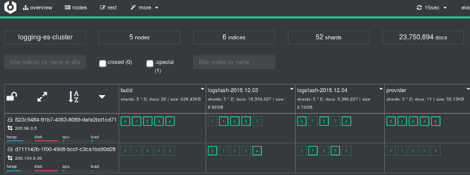

# StakaterPlatform

[[toc]]

## Overview 

Stakater has developed a consolidated solution named [StakaterPlatform](https://github.com/stakater/StakaterPlatform) that gives head-start to individuals and companies with a set of seven stacks containing opensource tools based on industry's recommendation and best practices for monitoring, logging, security, tracing, control, delivery and alerting of Kubernetes cluster. 

End-users only need to focus on developing their application while everything else will be managed by StakaterPlatform. StakaterPlatform consist of 7 [stacks](/content/stakaterplatform/stakaterplatform.html#stacks).

## Workflow

StakaterPlatform works on GitOps principle using an opensource tool [Flux](https://github.com/fluxcd/flux) which makes sure that cluster is always in the desired state by tracking a git repository. To make changes in your cluster, commit your changes in the git repository and the changes will be reflected in the kubernetes cluster.

## Prerequisites

- Kubernetes cluster with at least 8 VCPUS & 32 GB of RAM
- kubectl (between v1.11 & v1.15.3)
- helm (v2.15.0 or lower)
- A working domain (e.g. `stakaterplatform.com` ) 
- SSL Certificate for that domain

## Install via local machine

1. [Duplicate](https://help.github.com/en/github/creating-cloning-and-archiving-repositories/duplicating-a-repository#mirroring-a-repository) this [repository](https://github.com/stakater/stakaterplatform).
2. Update [configuration variables](#Basic-Configuration) in `variables.config` file and provide the relevant values.
3. [Recommended but optional] To take full advantage of the tool stack configure [Additional Variables](docs/detailed-config.md) as well.
4. Ensure that correct context is set for kubectl & helm.
5. Run `make configure`, this will make all required substitutions based on configuration variables in the repository. When prompted commit those changes.
6. [Add the public SSH key](https://help.github.com/en/github/authenticating-to-github/adding-a-new-ssh-key-to-your-github-account) of flux(configs/flux.pub) to your Git repository with **write access**.
7. Once changes are committed, run `make deploy` this will deploy flux, which will in turn deploy StakaterPlatform via GitOps strategy. Estimated time for everything to be up and running is 5-10.
9. Use the printed dashboard token to access the Kubernetes dashboard at `dashboard-control.YOURDOMAINNAME`
10. Visit `https://forecastle-control.YOURDOMAINNAME` and you'll be able to view all applications deployed by StakaterPlatform.


::: tip
Since `variables.config` file and `configs/` directory contains private information those files are not being tracked in git and won't/shouldn't be committed. In case you want to commit those changes run `make track-secrets`.
:::

## Install via GitLab CI Pipeline

1. [Duplicate](https://help.github.com/en/github/creating-cloning-and-archiving-repositories/duplicating-a-repository#mirroring-a-repository) this [repository](https://github.com/stakater/stakaterplatform) in a GitLab account.
2. Update [configuration variables](#Basic-Configuration) in `variables.config` file and provide the relevant values.
3. Create a [Personal Access Token](https://docs.gitlab.com/ee/user/profile/personal_access_tokens.html#creating-a-personal-access-token) on GitLab and note down Personal Access Token (Available only when created)
4. Configure CI/CD Environment variables in `<Your GitLab Project> -> Settings -> CI/CD`.
5. Add Following variables for the pipeline

| Pipeline Variables | Description |  
|:---|:---|
| KUBE_CONFIG | `Base64 encoded` KubeConfig of the kubernetes cluster you want to deploy on |
| REPO_ACCESS_TOKEN | Personal access token generated in Step 3 |
| TARGET | Make file target. Value: `pipeline-deploy` |
| AWS_ACCESS_KEY_ID | (Define only if `CLOUD_PROVIDER` is `aws`) AWS Access Key Id. |
| AWS_SECRET_ACCESS_KEY | (Define only if `CLOUD_PROVIDER` is `aws`) AWS Secret Access Key. |

6. [Add the public SSH key](https://docs.gitlab.com/ee/ssh/#per-repository-deploy-keys)(Deploy Keys) to your GitLab account with **write access** printed at the end of pipeline logs.
7. Once key is added, StakaterPlatform will deploy on your cluster (Estimated time: 10-15 minutes). :confetti_ball: :confetti_ball:
8. Use the printed dashboard token to access the Kubernetes dashboard at `dashboard-control.DOMAIN`

## Verification

### Locally
Run `make verify` to run tests to ensure that all the relevant endpoints are up and running.

### GitLab CI
Run pipeline with Pipeline variable: `TARGET` = verify 

## Basic Configuration
| Variables | Description | Default |  
|:---|:---|:---:|
| CLOUD_PROVIDER | Name of the k8s cloud provider | `nil` <br> (`aws` \| `azure`) |
| DNS_PROVIDER | Cloud DNS Provider | `aws` (Route53) |
| EXTERNAL_DNS_AWS_ACCESS_KEY_ID | AWS Access Key Id having access to create/delete/update Route53 HostedZone entries | `nil` |
| EXTERNAL_DNS_AWS_SECRET_ACCESS_KEY | AWS Secret Access Key having access to create/delete/update Route53 HostedZone entries | `nil` |
| DOMAIN | Domain to use for StakaterPlatform | `nil` |
| BASE64_ENCODED_SSL_CERTIFICATE_CA_CRT | Base64 encoded Intermediate Certificate value | `nil` |
| BASE64_ENCODED_SSL_CERTIFICATE_TLS_CRT | Base64 encoded Server Certificate value |`nil` |
| BASE64_ENCODED_SSL_CERTIFICATE_TLS_KEY | Base64 encoded Certificate Key value |`nil` |
| STAKATER_PLATFORM_SSH_GIT_URL | SSH URL for your Github repo. | `nil`<br>(e.g `git@github.com/stakater/StakaterPlatform.git`. Notice `:` is replaced with `/` in the URL ) |
| STAKATER_PLATFORM_BRANCH | Branch to use for `STAKATER_PLATFORM_SSH_GIT_URL` | `master` |


For generating certificates view: [Creating & using custom SSL certificates](https://playbook.stakater.com/content/processes/exposing/create-use-tls-custom-cert.html)


## Detailed Configuration and Stack definitions

To take full advantage of our tool stack, it is recommended to have the following things set-up:
1. 3 Slack channels with [webhook's](https://slack.com/intl/en-pk/help/articles/115005265063-Incoming-WebHooks-for-Slack) added. These are required for:
    * `Dev-notifications`: Notifications regarding up/down time and regarding new builds from jenkins
    * `infra-alerts`: Alerts from infrastructure
    * `apps-alerts`: Alerts for apps
2. An account at (Uptime Robot)[https://uptimerobot.com/] for [IMC](https://github.com/stakater/IngressMonitorController)
to work and provide you with up/down time alerts. For other supported down time monitors visit [Ingress Monitor Controller](https://github.com/stakater/IngressMonitorController#supported-uptime-checkers).


### Global Variables
| Variables | Description | Default |  
|---|---|---|
| CLOUD_PROVIDER | Name of the k8s cloud provider | `nil` <br> (`aws` \| `azure`) |
| DNS_PROVIDER | Cloud DNS Provider | `aws` (Route53). Currently only `Route53` is supported. |
| EXTERNAL_DNS_AWS_ACCESS_KEY_ID | AWS Access Key Id | `nil` |
| EXTERNAL_DNS_AWS_SECRET_ACCESS_KEY | AWS Secret Access Key | `nil` |
| DOMAIN | Domain to expose StakaterPlatform | `nil` |
| BASE64_ENCODED_SSL_CERTIFICATE_CA_CRT | Base64 encoded Intermediate Certificate value | `nil` |
| BASE64_ENCODED_SSL_CERTIFICATE_TLS_CRT | Base64 encoded Server Certificate value |`nil` |
| BASE64_ENCODED_SSL_CERTIFICATE_TLS_KEY | Base64 encoded Certificate Key value |`nil` |
| STAKATER_PLATFORM_SSH_GIT_URL | SSH URL for your Github repo. | `nil`<br>(e.g `git@github.com/stakater/StakaterPlatform.git`. Notice `:` is replaced with `/` in the URL ) |
| STAKATER_PLATFORM_BRANCH | Branch to use for `STAKATER_PLATFORM_SSH_GIT_URL` | `master` |

### KeyCloak
| Variables | Description | Default |  
|---|---|---|
| KEYCLOAK_CLIENT_ID | Client ID for KeyCloak Gatekeeper  | `stakater-online-platform` |
| KEYCLOAK_CLIENT_SECRET | Client Secret for KeyCloak Gatekeeper | `1de22f11-2068-df5h-9418-dawzxqwe2` |
| KEYCLOAK_DEFAULT_USERNAME | Username for the default user created |`stakater-user` |
| KEYCLOAK_DEFAULT_PASSWORD | Password for the default user created |`zUPaZnEfmYpcdd6X` |
| KEYCLOAK_DB_USER | KeyCloak DB (Postgresql) username |`admin` |
| KEYCLOAK_DB_PASSWORD | KeyCloak DB (Postgresql) password |`L3VT3hBysLGtsJaZ` |
| KEYCLOAK_PASSWORD | Password for the admin user `stakater` |`vuHBBDaVsS35jvF9` |

### IngressMonitorController IMC

| Variables | Description | Default |  
|---|---|---|
| IMC_API_KEY | API key of the monitor service provider |`nil` |
| IMC_ALERT_CONTACTS | Alert contacts for the monitor service provider |`nil` |

### Nexus
| Variables | Description | Default |  
|---|---|---|
| NEXUS_ADMIN_ACCOUNT_USER | Username for admin account |`nexus-admin` |
| NEXUS_ADMIN_ACCOUNT_PASSWORD | Password for admin account |`L8TcnrwMytCFpAFe` |
| NEXUS_CLUSTER_ACCOUNT_USER | Username for cluster admin account |`nexus-cluster-admin` |
| NEXUS_CLUSTER_ACCOUNT_PASSWORD | Password for cluster admin account |`mrzUGWrD9buDYhMF` |

### Jenkins
| Variables | Description | Default |  
|---|---|---|
| JENKINS_NOTIFICATIONS_SLACK_CHANNEL | Slack channel name to notify for jenkins pipeline result |`OPTIONAL` (e.g. `#slack-channel-name`) |
| JENKINS_NOTIFICATIONS_SLACK_WEBHOOK_URL | Slack webhook URL to notify for jenkins pipeline result |`OPTIONAL` |
| JENKINS_PIPELINE_GITHUB_TOKEN | GitHub API token. If configured Pipeline will comment on Pull Requests |`OPTIONAL` |
| JENKINS_PIPELINE_GITLAB_TOKEN | GitLab API token. If configured Pipeline will comment on Pull Requests |`OPTIONAL` |
| JENKINS_PIPELINE_BITBUCKET_TOKEN | BitBuckt API token. If configured Pipeline will comment on Pull Requests  |`OPTIONAL` |
| JENKINS_DOCKER_MAVEN_USERNAME | Maven repository used by Jenkins to store maven artifiacts |`admin` |
| JENKINS_DOCKER_MAVEN_PASSWORD | Maven repository used by Jenkins to store maven artifiacts |`xJuAWjG4GzrCkPJU` |
| JENKINS_LOCAL_NEXUS_USERNAME | Local repository used by Jenkins to store artifiacts |`admin` |
| JENKINS_LOCAL_NEXUS_PASSWORD | Local repository used by Jenkins to store artifiacts | `LXwEkC4jZzQj3DHY` |
| JENKINS_NEXUS_USERNAME | Nexus Username. Used by docker command in Jenkins Pipeline | `admin` |
| JENKINS_NEXUS_PASSWORD | Nexus Password. Used by docker command in Jenkins Pipeline | `CN3B6uY998kpBFDd` |
 
### AlertManager
| Variables | Description | Default |  
|---|---|---|
| SLACK_INFRA_ALERTS_CHANNEL | Slack channel name to send Alertmanager infrastructure alerts |`#stakater-platform-infra-alerts` |
| SLACK_INFRA_ALERTS_WEBHOOK_URL | Slack channel webhook URL to send Alertmanager infrastructure alerts |`OPTIONAL` |
| SLACK_APPS_ALERTS_CHANNEL | Slack channel webhook URL to send Alertmanager application alerts |`#stakater-platform-apps-alerts` |
| SLACK_APPS_ALERTS_WEBHOOK_URL | Slack channel name to send Alertmanager application alerts |`OPTIONAL` |

### Grafana
| Variables | Description | Default |  
|---|---|---|
| GRAFANA_USERNAME | Grafana dashboard username |`admin` |
| GRAFANA_PASSWORD | Grafana dashboard password |`CN3B6uY998kpBFDd` |


### Flux
In directory `configs`, SSH keys flux(private) & flux.pub(public) exist which flux uses for GitOps. You can provide, paste content of, your own SSH keys there. Else, a new unique key pair will be generated every time for you. 


## Uninstall

Run `make destroy` to remove StakaterPlatform from your cluster.


## Production Configuration and Hardening

- Change default usernames and passwords for all tools (`variables.config`)
- Add your own SSH keys for flux
- Use Identity Providers (e.g. Google, Active Directory etc.) and configure keyCloak to use that
- Replace all secrets with sealed-secrets. [Stakater Workshop - Sealed Secrets](https://playbook.stakater.com/content/workshop/sealed-secrets/introduction.html)
- Use keycloak for SSO over all exposed applications

## Compatibility Matrix

StakaterPlatform has been tested on following kubernetes flavors:

| Platform Version| K8s Version  | Infrastructure |
|---|---|---|
| v0.0.1 | 1.14 | [](https://aws.amazon.com/eks/) &nbsp; eks.6 |
| v0.0.1 | 1.14.8 | [](https://docs.microsoft.com/en-us/azure/aks/) &nbsp; aks |

<!-- #################################################### -->
<!-- ###################  STACKS  ########################## -->
<!-- #################################################### -->
## Stacks
[[toc]]

### Control Stack


#### Overview

This stack provides tools that manage the components of StakaterPlatform.

#### Tools Introduction

* **External DNS**

ExternalDNS synchronizes exposed Kubernetes Services and Ingresses with DNS providers. ExternalDNS makes Kubernetes resources discoverable via public DNS servers. Like KubeDNS, it retrieves a list of resources (Services, Ingresses, etc.) from the Kubernetes API to determine a desired list of DNS records. Unlike KubeDNS, however, it's not a DNS server itself, but merely configures other DNS providers accordingly.

* **Nginx Ingress**

nginx-ingress is an Ingress controller that uses ConfigMap to store the nginx configuration

* **Descheduler**

In Kubernetes the [`Kubernetes Scheduler`](https://kubernetes.io/docs/concepts/scheduling/kube-scheduler/) component schedule pods on nodes based on the defined policy. Pods can be scheduled on other nodes due to following reasons:

1. `Node utilization:` Pods will be scheduled to other nodes if a node is `under` or `over` utilized. 

2. `Scheduling Policies:` Scheduling policies like taints, labels and node/pod affinity rules are changed. 

3. `Node Failure:` A Node is failed its pods will be scheduled to other availble node in the cluster. 

4. `Node Addition`: A node is added in the cluster then pods from the other nodes that are over utilized will be scheduled to the new node.

[Deschedular](https://github.com/kubernetes-sigs/descheduler) based on its policy can move and evict pods but it doesn't reschedule them. Pods rescheduling is done by Kubernetes Scheduler.  

5. **Forecastle**

[Forecastle](https://github.com/stakater/forecastle) is a control panel which dynamically discovers and provides a launchpad to access applications deployed on Kubernetes.

6. **Reloader**

Reloader watch changes in ConfigMap and Secret and do rolling upgrades on Pods with their associated DeploymentConfigs, Deployments, Daemonsets and Statefulsets.

7. **Kubernetes Dashboard**

[Kubernetes Dashboard](https://github.com/kubernetes/dashboard) is a general purpose, web-based UI for Kubernetes clusters. It allows users to manage applications running in the cluster and troubleshoot them, as well as manage the cluster itself.

8. **GitWebhookProxy**

[Gitwebhookproxy](https://github.com/stakater/GitWebhookProxy) is a proxy to let webhooks to reach a Jenkins instance running behind a firewall. Jenkins is awesome and matchless tool for both CI & CD; but unfortunately its a gold mine if left in wild with wide open access; so, we always want to put it behind a firewall. But when we put it behind firewall then webhooks don't work anymore, so we at stakater use gitwebhookproxy to bypass the firewall and trigger pipelines in jenkins.

9. **Ingress Monitor Controller**

A Kubernetes/Openshift controller to watch ingresses/routes and create liveness alerts for your apps/microservices in Uptime checkers.

10. **Xposer**

Xposer watch all services running in a cluster; Creates, Updates, Deletes Ingresses and uses certmanager to generate TLS certificates automatically based on some annotations.

#### Tools Matrix

|       Tool        | Chart Repository  |   Cherry Pickable |    SSO        | Pre-Requisites |
| :---------------: | :---------------: | :----------------:| :------------:| :-------------:|
| [External DNS](https://github.com/kubernetes-sigs/external-dns) | [Public](https://github.com/helm/charts/tree/master/stable/external-dns) | Yes | N/A |  None |
| [Nginx Ingress](https://github.com/kubernetes/ingress-nginx) | [Public](https://github.com/helm/charts/tree/master/stable/nginx-ingress) | Yes | N/A |  None |
| [Descheduler](https://github.com/kubernetes-sigs/descheduler) | [Stakater](https://github.com/stakater-charts/descheduler) | Yes | N/A |  None |
| [Forecastle](https://github.com/stakater/forecastle) | [Stakater](https://github.com/stakater/Forecastle/tree/master/deployments/kubernetes/chart/forecastle) | Yes | Yes |  Keycloak |
| [Reloader](https://github.com/stakater/Reloader) | [Stakater](https://github.com/stakater/Reloader/tree/master/deployments/kubernetes/chart/reloader) | Yes | N/A |  None |
| [K8s Dashboard](https://github.com/kubernetes/dashboard) | [Public](https://github.com/helm/charts/tree/master/stable/kubernetes-dashboard) | Yes | Depends |  None |
| [Gitwebhookproxy](https://github.com/stakater/GitWebhookProxy) | [Stakater](https://github.com/stakater/GitWebhookProxy/tree/master/deployments/kubernetes/chart/gitwebhookproxy) | Yes | N/A |  None |
| [IMC](https://github.com/stakater/IngressMonitorController) | [Stakater](https://github.com/stakater/IngressMonitorController/tree/master/deployments/kubernetes/chart/ingressmonitorcontroller) | Yes | N/A |  None |
| [Xposer](https://github.com/stakater/Xposer) | [Stakater](https://github.com/stakater/Xposer/tree/master/deployments/kubernetes/chart/xposer) | Yes | N/A |  None |


#### Default Configurations

Following are the default configurations that are used by StakaterPlatform for `Control` stack. These configurations can be found under `config/` directory in the StakaterPlatform Github [repository](https://github.com/stakater/StakaterPlatform)

#### IngressMonitorController IMC

IMC supports multiple online monitoring services. By default `UptimeRobot` is configured. Provide `IMC_API_KEY` and `IMC_ALERT_CONTACTS` in `variables.config` to monitor every ingress via UptimeRobot.

| Variables | Description | Default |  
|:---|:---|---|
| IMC_API_KEY | API key of the monitor service provider |`nil` |
| IMC_ALERT_CONTACTS | Alert contacts for the monitor service provider |`nil` |

For more details See IMC [Github Repository](https://github.com/stakater/IngressMonitorController)

`configs/imc.yaml:`
```
# For more details: https://github.com/stakater/IngressMonitorController
providers:
  - name: UptimeRobot
    apiKey: IMC_API_KEY
    apiURL: https://api.uptimerobot.com/v2/
    alertContacts: "IMC_ALERT_CONTACTS"
enableMonitorDeletion: true
monitorNameTemplate: "{{.IngressName}}-{{.Namespace}}"
resyncPeriod: 0 # how often (in seconds) monitors should be synced to their Kubernetes resources (0 = disabled)
```


<!-- DELIVERY STACK -->
### Delivery Stack


#### Overview

Delivery Stack is responsible for CI/CD and artifacts management of pipelines.

#### Tools Introduction

* **Jenkins**

We at Stakater use Jenkins as our continuous integration, continuous development and  continuous testing server. Jenkins is a self-contained, open source automation server which can be used to automate all sorts of tasks related to building, testing, and delivering or deploying software.

* **Sonatype-Nexus**

[Nexus](https://www.sonatype.com/nexus-repository-sonatype) is a repository manager that can store and manage components, build artifacts, and release candidates in one central location. At stakater, we use nexus to store docker images of our prod application like stakaterfrontend and emailservice etc.

#### Tools Matrix

|       Tool        | Chart Repository                                                     | Cherry Pickable | SSO | Pre-Requisites |
| :---------------: | :------------------------------------------------------------------: | :--------------:| :--:| :-------------:|
| [Jenkins](https://github.com/jenkinsci/jenkins) | [Public](https://github.com/helm/charts/tree/master/stable/jenkins)            |       Yes       | Yes |     KeyCloak   |
| [Sonatype-Nexus](https://github.com/sonatype/nexus-public)   | [Public](https://github.com/helm/charts/tree/master/stable/sonatype-nexus)     |       Yes       | No  |      None      |
| RDLM    | [Stakater](https://github.com/stakater-charts/restful-distributed-lock-manager)|       Yes       | N/A |      None      |

#### Default Configurations

Following are the default configurations that are used by StakaterPlatform for `Delivery` stack. These configurations can be found under `configs/` directory in the StakaterPlatform Github [repository](https://github.com/stakater/StakaterPlatform)

#### Jenkins

Jenkins provide automation pipelines for CI/CD workflow. 

#### Maven Configs

Following variables should be configured in `variables.config` for Caching maven artifacts and speeding up maven builds.

| Variables | Description | Default |  
|:---|:---|---|
| JENKINS_DOCKER_MAVEN_USERNAME | Maven repository used by Jenkins to store maven artifiacts |`admin` |
| JENKINS_DOCKER_MAVEN_PASSWORD | Maven repository used by Jenkins to store maven artifiacts |`xJuAWjG4GzrCkPJU` |
| JENKINS_LOCAL_NEXUS_USERNAME | Local repository used by Jenkins to store artifiacts |`admin` |
| JENKINS_LOCAL_NEXUS_PASSWORD | Local repository used by Jenkins to store artifiacts | `LXwEkC4jZzQj3DHY` |
| JENKINS_NEXUS_USERNAME | Nexus Username. Used by docker command in Jenkins Pipeline | `admin` |
| JENKINS_NEXUS_PASSWORD | Nexus Password. Used by docker command in Jenkins Pipeline | `CN3B6uY998kpBFDd` |

`configs/jenkins-maven-config.xml:`
```
<settings>
    <!-- sets the local maven repository outside of the ~/.m2 folder for easier mounting of secrets and repo -->
    <localRepository>${user.home}/.mvnrepository</localRepository>
    <mirrors>
        <mirror>
            <id>nexus</id>
            <mirrorOf>external:*</mirrorOf>
            <url>http://nexus.release/repository/public/</url>
        </mirror>
    </mirrors>

    <!-- lets disable the download progress indicator that fills up logs -->
    <interactiveMode>false</interactiveMode>

    <servers>
        <server>
            <id>docker-delivery.DOMAIN:443</id>
            <username>JENKINS_DOCKER_MAVEN_USERNAME</username>
            <password>JENKINS_DOCKER_MAVEN_PASSWORD</password>
        </server>
        <server>
            <id>local-nexus</id>
            <username>JENKINS_LOCAL_NEXUS_USERNAME</username>
            <password>JENKINS_LOCAL_NEXUS_PASSWORD</password>
        </server>
        <server>
            <id>nexus</id>
            <username>JENKINS_NEXUS_USERNAME</username>
            <password>JENKINS_NEXUS_PASSWORD</password>
        </server>
        <server>
            <id>oss-sonatype-staging</id>
            <username></username>
            <password></password>
        </server>
    </servers>

    <profiles>
        <profile>
            <id>nexus</id>
            <properties>
                <altDeploymentRepository>local-nexus::default::http://nexus.release/repository/maven-releases/</altDeploymentRepository>
                <altReleaseDeploymentRepository>local-nexus::default::http://nexus.release/repository/maven-releases/</altReleaseDeploymentRepository>
                <altSnapshotDeploymentRepository>local-nexus::default::http://nexus.release/repository/maven-snapshots/</altSnapshotDeploymentRepository>
            </properties>
            <repositories>
                <repository>
                    <id>central</id>
                    <url>http://central</url>
                    <releases><enabled>true</enabled></releases>
                    <snapshots><enabled>true</enabled></snapshots>
                </repository>
            </repositories>
            <pluginRepositories>
                <pluginRepository>
                    <id>central</id>
                    <url>http://central</url>
                    <releases><enabled>true</enabled></releases>
                    <snapshots><enabled>true</enabled></snapshots>
                </pluginRepository>
            </pluginRepositories>
        </profile>
        <profile>
            <id>release</id>
            <properties>
                <gpg.executable>gpg</gpg.executable>
                <gpg.passphrase>mysecretpassphrase</gpg.passphrase>
            </properties>
        </profile>
    </profiles>
    <activeProfiles>
        <!--make the profile active all the time -->
        <activeProfile>nexus</activeProfile>
    </activeProfiles>
</settings>
```

#### Jenkins docker cfg

Jenkins use docker to build images for CI/CD pipleline. To push and pull images from image registry ( Nexus in `StakaterPlatform`) docker configuration file needs to be provided. This configuration file corresponds to `$HOME/.docker/config.json`. Configure following varaibles in `variables.config` to allow pull/push from nexus repository in Jenkins

| Variables | Description | Default |  
|:---|:---|---|
| JENKINS_NEXUS_USERNAME | Nexus Username. Used by docker command in Jenkins Pipeline | `admin` |
| JENKINS_NEXUS_PASSWORD | Nexus Password. Used by docker command in Jenkins Pipeline | `CN3B6uY998kpBFDd` |

`JENKINS_NEXUS_AUTH` is replaced by encoding above variables in base64 in this format: `NEXUS_ADMIN_ACCOUNT_USER:NEXUS_ADMIN_ACCOUNT_PASSWORD`

`configs/jenkins.json:`
```
{
  "auths": {
    "docker-delivery.DOMAIN:443": {
      "auth": "JENKINS_NEXUS_AUTH"
    }
  }
}
```

#### Nexus

Nexus is used as a private image repository to push/pull images and artifacts. Configure following varaibles in `variables.config` to configure nexus registry.

| Variables | Description | Default |  
|:---|:---|---|
| NEXUS_ADMIN_ACCOUNT_USER | Username for admin account |`nexus-admin` |
| NEXUS_ADMIN_ACCOUNT_PASSWORD | Password for admin account |`L8TcnrwMytCFpAFe` |
| NEXUS_CLUSTER_ACCOUNT_USER | Username for cluster admin account |`nexus-cluster-admin` |
| NEXUS_CLUSTER_ACCOUNT_PASSWORD | Password for cluster admin account |`mrzUGWrD9buDYhMF` |

`configs/nexus-admin-account.json:`
```
{"name": "NEXUS_ADMIN_ACCOUNT_USER","type": "groovy","content": "security.addUser('NEXUS_ADMIN_ACCOUNT_USER', 'Stakater', 'Admin', 'user@gmail.com', true, 'NEXUS_ADMIN_ACCOUNT_PASSWORD', ['nx-admin'])"}
```

`configs/nexus-cluster-account.json:`
```
{"name": "NEXUS_CLUSTER_ACCOUNT_USER","type": "groovy","content": "security.addRole('cluster', 'cluster', 'User with privileges to allow read access to repo content and healtcheck', ['nx-healthcheck-read','nx-repository-view-docker-stakater-docker-browse','nx-repository-view-docker-stakater-docker-read','nx-search-read'],  ['nx-anonymous']); security.addUser('NEXUS_CLUSTER_ACCOUNT_USER', 'Cluster', 'Cluster', 'user@gmail.com', true, 'NEXUS_CLUSTER_ACCOUNT_PASSWORD', ['cluster'])"}
```

[Stakater Pipeline Library](https://github.com/stakater/stakater-pipeline-library)

#### Storage Details

|          Tool         |                            PVC                                     | Recommended Space |
| :-------------------: | :------------------------------------------------------------------------------: | :--------------:| :--:| :-------------:|
| [Jenkins](https://github.com/jenkinsci/jenkins)          | [stakater-delivery-jenkins](https://github.com/helm/charts/tree/master/stable/jenkins#persistence)                                 |     8Gi |
| [Sonatype-Nexus](https://github.com/sonatype/nexus-public)           | [stakater-delivery-sonatype-nexus-data-big](https://github.com/helm/charts/tree/master/stable/sonatype-nexus#persistence)                             |     80Gi |


<!-- LOGGING STACK -->

### Logging Stack


#### Overview

Logging is one of the pillars of observability. In the simplest sense logging is about recording discrete events. An monitoring these logs is important as they provide detailed information about events and errors that are useful to understand the flow of events that occurs in the application, and where and why the normal flow gets disrupted in case of an error. Application logs are usually generated with different levels of severity such as ERROR, WARN, INFO, etc. which are useful to indicate what the impact of the logged event is, and the level of attention that should be given to it. Apart from application logs, it is also prudent to monitor logs from the rest of the application environment such as middleware, application servers, and also system logs. This will help provide a complete picture not just confined to the application. And therefore a system level issue impacting the application may also be captured and observed.

At Stakater we use open source tools for internal use as well as our customer implementations, and for log monitoring our stack of choice is EFK (short for Elasticsearch, Fluentd and Kibana). EFK. While Elasticsearch and Kibana are used to index, search and visualize the logs, Fluentd is the log aggregator, essentially going door to door and collecting all the logs that are configured to be collected.

#### Details

* **Log File Generation**

Let’s first take a look at how a log file is generated on the cluster. All applications are run in docker containers, so how they generate logs is important. At Stakater we follow the best practice of writing our logs to STDOUT stream in the container. This is compliant with the twelve-factor app principle in that, the application running within the container should not concern itself with how to write, buffer or store the logs. It should simply write its stream of logs to STDOUT. It should be the responsibility of the execution environment to capture, process and route the logs in whichever way is suitable. Also, we do not need to separately add volume mounts to map our log files outside of the container to have them be processed, which would add the path of the log file into the equation. Should there be any change in the file path in future, you will need to handle that in volume mount and maybe even any downstream system. Another benefit of writing to STDOUT is that the logs are automatically captured by docker logs, which is not the case for logs that are not written to STDOUT, such as to a custom log file. Docker of course captures these logs based on the logging driver that it is configured with. Using the default json driver means that the logs are stored in json format on disk in a specific file path.

In case you are using a third party application or tool which writes its logs to a log file rather than STDOUT, you need not worry. There is always a workaround, and one suitable workaround for this is adding a symbolic link (symlink) from the log file to `/dev/stdout`. An example of this is Nginx, where the server itself writes its logs to a logfile, but the officially provided dockerfile adds the symlink.

Outside of the containers, Kubernetes creates symlinks to the docker log files at `/var/log/containers/*.log` on the Node. We can therefore easily locate and capture logs within our fluentd daemonset.

We do not handle persistent storage of log files at this point since we have our fluentd daemonset forwarding the logs in real-time. Persistence of the log files will handled at a later point in the logging flow as we will see soon.

* **Logging Flow**

1. `Fluentd`
Fluentd is an open source data collector for a unified logging layer. It has a flexible plugin architecture, allowing easy extension of its functionality. We deploy it as a DaemonSet on our cluster to ensure that all Nodes run a copy of the fluentd Pod. Any new node that is added to the cluster will also get a fluentd pod automatically.

The fluentd input plugin has the responsibility for reading in data from these log sources, and generating a Fluentd event against it. We use the in_tail Input plugin which allows Fluentd to read events from the tail of text files. This position from where fluentd has read a particular log file is recorded in a position file. And next time fluentd will pick up reading from this position in the file. The input is parsed, based on the configuration provided to the input plugin.

The fluentd event contains information such as where an event comes from, the time of the event, and the actual log content. We use the kubernetes_metadata_filter plugin to enrich the log event with kubernetes pod and namespace metadata. The plugin gets basic metadata about the container that emitted a given log record using the source of the log record.

These log events are matched to an Output plugin type in the Fluentd configuration. We use the out_elasticsearch Output plugin to forward these records to Elasticsearch.

2. `Konfigurator`

It is a kubernetes operator that can dynamically generate app configuration when kubernetes resources change. It uses `KonfiguratorTemplate` resource type to inject configurations on a specified path inside fluentd daemonset's container. 


```yaml
apiVersion: konfigurator.stakater.com/v1alpha1
kind: KonfiguratorTemplate
metadata:
  name: fluentd
  namespace: logging
  labels:
    app: konfigurator
spec:
  renderTarget: ConfigMap
  app:
    name: stakater-logging-fluentd
    kind: DaemonSet
    volumeMounts:
      - mountPath: /etc/fluent
        container: stakater-logging-fluentd
  templates:
    fluent.conf: |
      <add fluentd configurations here>
```

3. `Eventrouter`

A kubernetes service that forwards events to a sink. Events are an essential part of a cluster and provide great insight
to your cluster state, eventrouter makes it easy to persist those events in user specified sink i.e. stdout, AWS S3 etc.
By default `kube-apiserver` has a `-event-ttl` flag set to 1 hour and it retains events for that specific amount of 
time. Since, we use elasticsearch as the persistence layer of our logging stack all we do is print logs from 
event-router to `STDOUT` and those logs are then picked up Fluentd and forwarded to elasticsearch.

4. `Logrotate`

Log rotation essentially renames the old log file, and creates a new log file in its place for continued capturing of logs. This is done so that the file size remains manageable. At Stakater we use the linux logrotate utility for this, also as a daemonset so that it runs on every node like fluentd. At the moment there isn’t a public chart available in the official helm repository, we are using our own which you can find here.

We can see an example configuration as follows. The schedule is maintained through cron and the rest of the parameters such as path and size of file, number of rotations, etc. are specified in the configuration:
```yaml
environment:
  cronSchedule: 0 */12 * * *

config:
  k8sRotatorConf: |-
     /var/lib/docker/containers/*/*.log {
     rotate 5
     copytruncate
     missingok
     notifempty
     compress
     maxsize 200M
     daily
     create 0644 root root
     }
```

5. `Elasticsearch`

Elasticsearch is basically a NoSQL database that became popular in the Logging domain as part of the ELK/ElasticStack. As we saw before, Fluentd forwards the log streams to Elasticsearch, which then goes on to index and store the log information. Elasticsearch basically allows us to easily search logs based on the metadata that was added by Fluentd. We can easily get results from its REST API to look at logs of a particular application, or apps on a particular node, or even search for all ERROR logs that may have been generated throughout the cluster. A RESTful api however is not a user friendly way of viewing log information, and can also be restricting to one query at a time. A more powerful use of this is to be able to see the log data in terms of trends, and also aggregations. This is where Kibana comes in as we will see in a subsequent section.

With Elasticsearch we would like to have persistent storage, so that our log data and indices are safe in case of a server crash. We there back the Elasticsearch deployment with a Persistent Volume Claim (PVC) on Kubernetes. This way the logs are persisted across Node restarts.

6. `ES Curator`

We may also like to archive our Elasticsearch indices instead of having them all maintained since the beginning of time in our EBS. Old logs may not be needed and we can easily move them to a cheaper form of storage, such as an AWS S3 bucket with glacial storage. In such cases we use ES Curator. It helps us to curate our Elasticsearch indices. Following is an example configuration of how the curator cron schedule and other properties can be configured.

```yaml

config:
 cronSchedule: 0 0 * * *
 esHost: elasticsearch
 esPort: 9200
 snapshotName: stackator-es
 bucketName: 12345678912-stakater-store
 bucketBasePath: /es-indices-snapshots/
 awsRegion: us-east-2
 timeUnit: days
 olderThan: 30
 loglevel: INFO

```

7. `Cerebro`

Cerebro is a tool we use for web administration of Elasticsearch. It can be useful to get a web view of the elasticsearch nodes, indices, shards, resource usage etc.



8. `Kibana`

Kibana, is a visualization tool which helps us to view queries on Elasticsearch. We can view the text log data as-is, filter and query it based on certain labels to view just a subset, and we can also view it in the form of a chart, graph or other visualization. Kibana comes with some visualizations out of the box, and we can also build custom visualizations and dashboards as per our requirement. Visualizations can be helpful in indicating trends such as number of warning or error logs throughout the day time, which could be correlated to changing server load or other factors. Such analyses can then help identify issues pro-actively.


* **Configuring Kibana**

At first start, before visualizing logs, Kibana needs to be configured with an index pattern for elasticsearch indices.

At first startup kibana will automatically redirect you for index creation. Create an index from 
Management -> Index Patterns -> Create Index Pattern

1. Create Index Patterns and name the index `*`


2. Click "Next" and set `@timestamp` as the **Time filter field name**


Once index pattern is created kibana will take a few seconds to fetch data from ES and after that you'll start seeing logs in kibana.


#### Tools Matrix

|          Tool         |                            Chart Repository                                      | Cherry Pickable | SSO | Pre-Requisites |
| :-------------------: | :------------------------------------------------------------------------------: | :--------------:| :--:| :-------------:|
| Elasticsearch         | [Public](https://github.com/elastic/helm-charts)                                 |       Yes       | N/A |      None      |
| Fluentd               | [Public](https://github.com/kiwigrid/helm-charts)                                |        No      | N/A |      Elasticsearch      |
| Eventrouter           | [Public](https://github.com/helm/charts/tree/master/stable/eventrouter)          |        No      | N/A |      None      |
| Kibana                | [Public](https://github.com/helm/charts/tree/master/stable/kibana)               |       No       | Yes |    KeyCloak, Elasticsearch    |
| Cerebro               | [Public](https://github.com/helm/charts/tree/master/stable/cerebro)              |       No       | Yes |    KeyCloak, Elasticsearch    |
| Elasticsearch Curator | [Public](https://github.com/helm/charts/tree/master/stable/elasticsearch-curator)|       No       | N/A |      Elasticsearch      |
| Logrotate             | [Stakater](https://github.com/stakater-charts/logrotate)                         |      Yes       | N/A |      None      |
| [Konfigurator](https://github.com/stakater/Konfigurator)          | [Stakater](https://github.com/stakater/Konfigurator/tree/master/deployments/kubernetes/chart/konfigurator)                      |       No       | N/A |      Fluentd      |

#### Storage Details

|          Tool         |                            PVC                                     | Recommended Space |
| :-------------------: | :------------------------------------------------------------------------------: | :--------------:| :--:| :-------------:|
| [Elasticsearch](https://github.com/elastic/elasticsearch)          | [PVC details](https://github.com/elastic/helm-charts/tree/master/elasticsearch)                                 |     - |
| -          | elasticsearch-master-elasticsearch-master-0                                |     8Gi |
| -          | elasticsearch-data-elasticsearch-data-0                             |     20Gi |
| -          | elasticsearch-data-elasticsearch-data-1                                 |     20Gi |

**Details:** Our recommended configuration for elasticsearch, used in StakaterPlatform, is to have 1 master node, 1 client node and 2 data nodes. Persistence should be enabled for master and data nodes. 

<!-- MONITORING STACK -->
### Monitoring Stack


#### Overview

Monitoring Stack includes tools required for the monitoring of applications and infrastructure.

#### Details


* **PrometheusOperator in Openshift**

Prometheus operator can be deployed in openshift using Openshift subscription. Create a file named `prometheus-subscription.yaml` with following content

```yaml
apiVersion: operators.coreos.com/v1alpha1
kind: Subscription
metadata:
  generateName: prometheus-
  namespace: {NAMESPACE}
spec:
  source: rh-operators
  name: prometheus
  startingCSV: prometheusoperator.0.22.2
  channel: preview
```

Replace `{NAMESPACE}` with the name of namespace in which you want prometheus operator to be deployed.

Currently okd doesn't support prometheus operator to watch more than one namespace. If needed you can create a custom CSV of prometheus operator that uses the latest version of prometheus operator image and specify multiple namespaces to watch.

To get the current CSV, create a subscription for the prometheus operator and then go to `k8s/all-namespaces/clusterserviceversions` in the browser and select the subscription you created and copy its yaml file. Make the following changes to the CSV:

- Change version
- Remove fields like selflink, uuid etc.
- Update image of prometheus operator, minimum v0.29.0.
- Search the block that creates the prometheus operator container and update the `namespace` arg and change it to `'-namespaces=$(K8S_NAMESPACE),SECOND_NAMESPACE'` (change `SECOND_NAMESPACE` to the name of extra namespace that you want it to watch). You can add multiple namespaces as well by separating there names with `,`.

After changes your CSV should look something like this
```yaml
apiVersion: operators.coreos.com/v1alpha1
kind: ClusterServiceVersion
metadata:
  annotations:
    alm-examples: >-
      [{"apiVersion":"monitoring.coreos.com/v1","kind":"Prometheus","metadata":{"name":"example","labels":{"prometheus":"k8s"}},"spec":{"replicas":2,"version":"v2.3.2","serviceAccountName":"prometheus-k8s","securityContext":
      {},
      "serviceMonitorSelector":{"matchExpressions":[{"key":"k8s-app","operator":"Exists"}]},"ruleSelector":{"matchLabels":{"role":"prometheus-rulefiles","prometheus":"k8s"}},"alerting":{"alertmanagers":[{"namespace":"monitoring","name":"alertmanager-main","port":"web"}]}}},{"apiVersion":"monitoring.coreos.com/v1","kind":"ServiceMonitor","metadata":{"name":"example","labels":{"k8s-app":"prometheus"}},"spec":{"selector":{"matchLabels":{"k8s-app":"prometheus"}},"endpoints":[{"port":"web","interval":"30s"}]}},{"apiVersion":"monitoring.coreos.com/v1","kind":"Alertmanager","metadata":{"name":"alertmanager-main"},"spec":{"replicas":3,
      "securityContext": {}}}]
  labels:
    alm-catalog: rh-operators
  name: prometheusoperator.0.29.0
  namespace: {NAMESPACE}
spec:
  apiservicedefinitions: {}
  customresourcedefinitions:
    owned:
      - description: A running Prometheus instance
        displayName: Prometheus
        kind: Prometheus
        name: prometheuses.monitoring.coreos.com
        resources:
          - kind: StatefulSet
            name: ''
            version: v1beta2
          - kind: Pod
            name: ''
            version: v1
        specDescriptors:
          - description: Desired number of Pods for the cluster
            displayName: Size
            path: replicas
            x-descriptors:
              - 'urn:alm:descriptor:com.tectonic.ui:podCount'
          - description: A selector for the ConfigMaps from which to load rule files
            displayName: Rule Config Map Selector
            path: ruleSelector
            x-descriptors:
              - 'urn:alm:descriptor:com.tectonic.ui:selector:core:v1:ConfigMap'
          - description: ServiceMonitors to be selected for target discovery
            displayName: Service Monitor Selector
            path: serviceMonitorSelector
            x-descriptors:
              - >-
                urn:alm:descriptor:com.tectonic.ui:selector:monitoring.coreos.com:v1:ServiceMonitor
          - description: The ServiceAccount to use to run the Prometheus pods
            displayName: Service Account
            path: serviceAccountName
            x-descriptors:
              - 'urn:alm:descriptor:io.kubernetes:ServiceAccount'
          - description: >-
              Limits describes the minimum/maximum amount of compute resources
              required/allowed
            displayName: Resource Requirements
            path: resources
            x-descriptors:
              - 'urn:alm:descriptor:com.tectonic.ui:resourceRequirements'
        version: v1
      - description: >-
          A Prometheus Rule configures groups of sequentially evaluated
          recording and alerting rules.
        displayName: Prometheus Rule
        kind: PrometheusRule
        name: prometheusrules.monitoring.coreos.com
        version: v1
      - description: Configures prometheus to monitor a particular k8s service
        displayName: Service Monitor
        kind: ServiceMonitor
        name: servicemonitors.monitoring.coreos.com
        resources:
          - kind: Pod
            name: ''
            version: v1
        specDescriptors:
          - description: The label to use to retrieve the job name from
            displayName: Job Label
            path: jobLabel
            x-descriptors:
              - 'urn:alm:descriptor:com.tectonic.ui:label'
          - description: A list of endpoints allowed as part of this ServiceMonitor
            displayName: Endpoints
            path: endpoints
            x-descriptors:
              - 'urn:alm:descriptor:com.tectonic.ui:endpointList'
        version: v1
      - description: Configures an Alertmanager for the namespace
        displayName: Alertmanager
        kind: Alertmanager
        name: alertmanagers.monitoring.coreos.com
        resources:
          - kind: StatefulSet
            name: ''
            version: v1beta2
          - kind: Pod
            name: ''
            version: v1
        specDescriptors:
          - description: Desired number of Pods for the cluster
            displayName: Size
            path: replicas
            x-descriptors:
              - 'urn:alm:descriptor:com.tectonic.ui:podCount'
          - description: >-
              Limits describes the minimum/maximum amount of compute resources
              required/allowed
            displayName: Resource Requirements
            path: resources
            x-descriptors:
              - 'urn:alm:descriptor:com.tectonic.ui:resourceRequirements'
        version: v1
  description: >
    The Prometheus Operator for Kubernetes provides easy monitoring definitions
    for Kubernetes services and deployment and management of Prometheus
    instances.


    Once installed, the Prometheus Operator provides the following features:


    * **Create/Destroy**: Easily launch a Prometheus instance for your
    Kubernetes namespace, a specific application or team easily using the
    Operator.


    * **Simple Configuration**: Configure the fundamentals of Prometheus like
    versions, persistence, retention policies, and replicas from a native
    Kubernetes resource.


    * **Target Services via Labels**: Automatically generate monitoring target
    configurations based on familiar Kubernetes label queries; no need to learn
    a Prometheus specific configuration language.


    ### Other Supported Features


    **High availability**


    Multiple instances are run across failure zones and data is replicated. This
    keeps your monitoring available during an outage, when you need it most.


    **Updates via automated operations**


    New Prometheus versions are deployed using a rolling update with no
    downtime, making it easy to stay up to date.


    **Handles the dynamic nature of containers**


    Alerting rules are attached to groups of containers instead of individual
    instances, which is ideal for the highly dynamic nature of container
    deployment.
  displayName: Prometheus Operator
  icon:
    - base64data: >-
        PHN2ZyB3aWR0aD0iMjQ5MCIgaGVpZ2h0PSIyNTAwIiB2aWV3Qm94PSIwIDAgMjU2IDI1NyIgeG1sbnM9Imh0dHA6Ly93d3cudzMub3JnLzIwMDAvc3ZnIiBwcmVzZXJ2ZUFzcGVjdFJhdGlvPSJ4TWlkWU1pZCI+PHBhdGggZD0iTTEyOC4wMDEuNjY3QzU3LjMxMS42NjcgMCA1Ny45NzEgMCAxMjguNjY0YzAgNzAuNjkgNTcuMzExIDEyNy45OTggMTI4LjAwMSAxMjcuOTk4UzI1NiAxOTkuMzU0IDI1NiAxMjguNjY0QzI1NiA1Ny45NyAxOTguNjg5LjY2NyAxMjguMDAxLjY2N3ptMCAyMzkuNTZjLTIwLjExMiAwLTM2LjQxOS0xMy40MzUtMzYuNDE5LTMwLjAwNGg3Mi44MzhjMCAxNi41NjYtMTYuMzA2IDMwLjAwNC0zNi40MTkgMzAuMDA0em02MC4xNTMtMzkuOTRINjcuODQyVjE3OC40N2gxMjAuMzE0djIxLjgxNmgtLjAwMnptLS40MzItMzMuMDQ1SDY4LjE4NWMtLjM5OC0uNDU4LS44MDQtLjkxLTEuMTg4LTEuMzc1LTEyLjMxNS0xNC45NTQtMTUuMjE2LTIyLjc2LTE4LjAzMi0zMC43MTYtLjA0OC0uMjYyIDE0LjkzMyAzLjA2IDI1LjU1NiA1LjQ1IDAgMCA1LjQ2NiAxLjI2NSAxMy40NTggMi43MjItNy42NzMtOC45OTQtMTIuMjMtMjAuNDI4LTEyLjIzLTMyLjExNiAwLTI1LjY1OCAxOS42OC00OC4wNzkgMTIuNTgtNjYuMjAxIDYuOTEuNTYyIDE0LjMgMTQuNTgzIDE0LjggMzYuNTA1IDcuMzQ2LTEwLjE1MiAxMC40Mi0yOC42OSAxMC40Mi00MC4wNTYgMC0xMS43NjkgNy43NTUtMjUuNDQgMTUuNTEyLTI1LjkwNy02LjkxNSAxMS4zOTYgMS43OSAyMS4xNjUgOS41MyA0NS40IDIuOTAyIDkuMTAzIDIuNTMyIDI0LjQyMyA0Ljc3MiAzNC4xMzguNzQ0LTIwLjE3OCA0LjIxMy00OS42MiAxNy4wMTQtNTkuNzg0LTUuNjQ3IDEyLjguODM2IDI4LjgxOCA1LjI3IDM2LjUxOCA3LjE1NCAxMi40MjQgMTEuNDkgMjEuODM2IDExLjQ5IDM5LjYzOCAwIDExLjkzNi00LjQwNyAyMy4xNzMtMTEuODQgMzEuOTU4IDguNDUyLTEuNTg2IDE0LjI4OS0zLjAxNiAxNC4yODktMy4wMTZsMjcuNDUtNS4zNTVjLjAwMi0uMDAyLTMuOTg3IDE2LjQwMS0xOS4zMTQgMzIuMTk3eiIgZmlsbD0iI0RBNEUzMSIvPjwvc3ZnPg==
      mediatype: image/svg+xml
  install:
    spec:
      deployments:
        - name: prometheus-operator
          spec:
            replicas: 1
            selector:
              matchLabels:
                k8s-app: prometheus-operator
            template:
              metadata:
                labels:
                  k8s-app: prometheus-operator
              spec:
                containers:
                  - args:
                      - '-namespaces=$(K8S_NAMESPACE),{TARGET_NAMESPACE}'
                      - '-manage-crds=false'
                      - '-logtostderr=true'
                      - >-
                        --config-reloader-image=quay.io/coreos/configmap-reload:v0.0.1
                      - >-
                        --prometheus-config-reloader=quay.io/coreos/prometheus-config-reloader:v0.29.0
                    env:
                      - name: K8S_NAMESPACE
                        valueFrom:
                          fieldRef:
                            fieldPath: metadata.namespace
                    image: >-
                      quay.io/coreos/prometheus-operator@sha256:5abe9bdfd93ac22954e3281315637d9721d66539134e1c7ed4e97f13819e62f7
                    name: prometheus-operator
                    ports:
                      - containerPort: 8080
                        name: http
                    resources:
                      limits:
                        cpu: 200m
                        memory: 100Mi
                      requests:
                        cpu: 100m
                        memory: 50Mi
                    securityContext:
                      allowPrivilegeEscalation: false
                      readOnlyRootFilesystem: true
                nodeSelector:
                  beta.kubernetes.io/os: linux
                serviceAccount: prometheus-operator-0-29-0
      permissions:
        - rules:
            - apiGroups:
                - ''
              resources:
                - nodes
                - services
                - endpoints
                - pods
              verbs:
                - get
                - list
                - watch
            - apiGroups:
                - ''
              resources:
                - configmaps
              verbs:
                - get
          serviceAccountName: prometheus-k8s
        - rules:
            - apiGroups:
                - apiextensions.k8s.io
              resources:
                - customresourcedefinitions
              verbs:
                - '*'
            - apiGroups:
                - monitoring.coreos.com
              resources:
                - alertmanagers
                - prometheuses
                - prometheuses/finalizers
                - alertmanagers/finalizers
                - servicemonitors
                - prometheusrules
              verbs:
                - '*'
            - apiGroups:
                - apps
              resources:
                - statefulsets
              verbs:
                - '*'
            - apiGroups:
                - ''
              resources:
                - configmaps
                - secrets
              verbs:
                - '*'
            - apiGroups:
                - ''
              resources:
                - pods
              verbs:
                - list
                - delete
            - apiGroups:
                - ''
              resources:
                - services
                - endpoints
              verbs:
                - get
                - create
                - update
            - apiGroups:
                - ''
              resources:
                - nodes
              verbs:
                - list
                - watch
            - apiGroups:
                - ''
              resources:
                - namespaces
              verbs:
                - list
                - get
                - watch
          serviceAccountName: prometheus-operator-0-29-0
    strategy: deployment
  keywords:
    - prometheus
    - monitoring
    - tsdb
    - alerting
  labels:
    alm-owner-prometheus: prometheusoperator
    alm-status-descriptors: prometheusoperator.0.29.0
  links:
    - name: Prometheus
      url: 'https://www.prometheus.io/'
    - name: Documentation
      url: 'https://coreos.com/operators/prometheus/docs/latest/'
    - name: Prometheus Operator
      url: 'https://github.com/coreos/prometheus-operator'
  maintainers:
    - email: openshift-operators@redhat.com
      name: Red Hat
  maturity: beta
  provider:
    name: Red Hat
  replaces: prometheusoperator.0.22.2
  selector:
    matchLabels:
      alm-owner-prometheus: prometheusoperator
  version: 0.29.0
```

 Now you can simply create this new CSV by doing `oc apply` and use by referencing this new CSV in the subscription in the `startingCSV` field.

 Also for each extra namespace added, you must give access to prometheus operator's service account in the extra namespace. The permissions needed are below

```yaml
apiVersion: rbac.authorization.k8s.io/v1
kind: Role
metadata:
  name: prometheus-{EXTRA_NAMESPACE}
  namespace: {EXTRA_NAMESPACE}
rules:
  - apiGroups:
      - ''
    resources:
      - nodes
      - services
      - endpoints
      - pods
    verbs:
      - get
      - list
      - watch
  - apiGroups:
      - ''
    resources:
      - configmaps
    verbs:
      - get
---
apiVersion: rbac.authorization.k8s.io/v1
kind: RoleBinding
metadata:
  name: prometheus-binding-{EXTRA_NAMESPACE}
  namespace: {EXTRA_NAMESPACE}
roleRef:
  apiGroup: rbac.authorization.k8s.io
  kind: Role
  name: prometheus-{EXTRA_NAMESPACE}
subjects:
  - kind: ServiceAccount
    name: prometheus-k8s
    namespace: {NAMESPACE}
---
apiVersion: rbac.authorization.k8s.io/v1
kind: Role
metadata:
  name: prometheus-operator-{EXTRA_NAMESPACE}
  namespace: {EXTRA_NAMESPACE}
rules:
  - apiGroups:
      - apiextensions.k8s.io
    resources:
      - customresourcedefinitions
    verbs:
      - '*'
  - apiGroups:
      - monitoring.coreos.com
    resources:
      - alertmanagers
      - prometheuses
      - prometheuses/finalizers
      - alertmanagers/finalizers
      - servicemonitors
      - prometheusrules
    verbs:
      - '*'
  - apiGroups:
      - apps
    resources:
      - statefulsets
    verbs:
      - '*'
  - apiGroups:
      - ''
    resources:
      - configmaps
      - secrets
    verbs:
      - '*'
  - apiGroups:
      - ''
    resources:
      - pods
    verbs:
      - list
      - delete
  - apiGroups:
      - ''
    resources:
      - services
      - endpoints
    verbs:
      - get
      - create
      - update
  - apiGroups:
      - ''
    resources:
      - nodes
    verbs:
      - list
      - watch
  - apiGroups:
      - ''
    resources:
      - namespaces
    verbs:
      - list
      - get
      - watch
---
apiVersion: rbac.authorization.k8s.io/v1
kind: RoleBinding
metadata:
  name: prometheus-operator-binding-{EXTRA_NAMESPACE}
  namespace: {EXTRA_NAMESPACE}
roleRef:
  apiGroup: rbac.authorization.k8s.io
  kind: Role
  name: prometheus-operator-{EXTRA_NAMESPACE}
subjects:
  - kind: ServiceAccount
    name: prometheus-operator-0-29-0
    namespace: {NAMESPACE}
```

Replace `{NAMESPACE}` and `{EXTRA_NAMESPACE}` with appropriate values. In case of multiple namespaces, create one copy of above manifest for each extra namespace. The name of the service account should match the name provided in CSV above.


* **Prometheus in Openshift**

To create prometheus in openshift, Create a file named prometheus.yaml with the following content

```yaml
apiVersion: monitoring.coreos.com/v1
kind: Prometheus
metadata:
  labels:
    prometheus: k8s
  name: prometheus-dev
  namespace: {NAMESPACE}
spec:
  alerting:
    alertmanagers:
      - name: alertmanager-operated
        namespace: {NAMESPACE}
        port: web
  replicas: 1
  ruleSelector:
    matchLabels:
      prometheus: k8s
      role: prometheus-rulefiles
  securityContext: {}
  serviceAccountName: prometheus-k8s
  serviceMonitorNamespaceSelector:
    any: true
  serviceMonitorSelector:
    matchLabels:
      app: "common-service"
  version: v2.3.2
---
apiVersion: route.openshift.io/v1
kind: Route
metadata:
  name: prometheus-operated
  namespace: {NAMESPACE}
spec:
  port:
    targetPort: web
  tls:
    insecureEdgeTerminationPolicy: Redirect
    termination: edge
  to:
    kind: Service
    name: prometheus-operated
    weight: 100
  wildcardPolicy: None
```

Replace `{NAMESPACE}` with the name of namespace in which you want prometheus to be deployed. It will try to connect with alert manager service `alertmanager-operated` on port `web`.

* **AlertManager in Openshift**

To create alert manager in openshift:

- Create a file named alertManagerConfig.tmpl.yaml with the following content

    ```yaml
    global:
    resolve_timeout: 5m
    route:
    group_by:
    - alertname
    - cluster
    - service
    group_wait: 30s
    group_interval: 5m
    repeat_interval: 1h
    receiver: alerts-null
    routes:
    - match:
        alertname: WatchDog
        receiver: alerts-null
    - receiver: alerts
    inhibit_rules:
    - source_match:
        severity: critical
    target_match:
        severity: warning
    equal:
    - alertname
    - cluster
    - service
    receivers:
    - name: alerts
    slack_configs:
    - api_url: "{SLACK_WEBHOOK_URL}"
        channel: "#alerts"
        title: '[{{ .Status | toUpper }}{{ if eq .Status "firing" }}:{{ .Alerts.Firing
        | len }}{{ end }}] Prometheus Event Notification'
        title_link: |2
        https://alertmanager-operated-{NAMESPACE}.kubehealth.com
        text: |2-

        {{ range .Alerts }}
            *Alert:* {{ .Annotations.summary }} - `{{ .Labels.severity }}`

            *Description:* {{ .Annotations.description }}

            *Graph:* <{{ .GeneratorURL }}|:chart_with_upwards_trend:> *Runbook:* <{{ .Annotations.runbook }}|:spiral_note_pad:>

            *Details:*

            {{ range .Labels.SortedPairs }} *{{ .Name }}:* `{{ .Value }}`

            {{ end }}

        {{ end }}
        send_resolved: true
    - name: alerts-null
    ```

    Feel free to modify the config to suite your needs. This sample config sends all alerts except `WatchDog` to slack via webhook. Do replace `{SLACK_WEBHOOK_URL}` with the link of your webhook.

- Next create a file named `alertManager.tmpl.yaml` with the following content

    ```bash
    apiVersion: monitoring.coreos.com/v1
    kind: Alertmanager
    metadata:
    name: alertmanager-dev
    namespace: {NAMESPACE}
    spec:
    replicas: 1
    securityContext: {}
    ---
    apiVersion: v1
    kind: Secret
    type: Opaque
    metadata:
    labels:
        k8s-app: alertmanager
    name: alertmanager-alertmanager-dev
    namespace: {NAMESPACE}
    data:
    alertmanager.yaml: >-
        {CONFIG_BASE64}
    ---
    apiVersion: route.openshift.io/v1
    kind: Route
    metadata:
    name: alertmanager-operated
    namespace: {NAMESPACE}
    spec:
    port:
        targetPort: web
    tls:
        insecureEdgeTerminationPolicy: Redirect
        termination: edge
    to:
        kind: Service
        name: alertmanager-operated
        weight: 100
    wildcardPolicy: None
    ```

- Now execute

    ```bash
    NAMESPACE="monitoring"
    REPLACE_NAMESPACE="s/{NAMESPACE}/$NAMESPACE/g"
    REPLACE_CONFIG="s/{CONFIG_BASE64}/$(sed $REPLACE_NAMESPACE alertManagerConfig.tmpl.yaml | base64 -w 0)/g"

    sed ${REPLACE_NAMESPACE} alertManager.tmpl.yaml | sed ${REPLACE_CONFIG} | oc apply --namespace ${NAMESPACE} -f -

    ```

* **Grafana in Openshift**

To deploy grafana in openshift using helm, just use the following grafana values in a file e.g `grafana-values.yaml`

```yaml
sidecar:
  dashboards:
    enabled: true
adminPassword: "adminPassword"
rbac:
  create: true
  pspEnabled: false
  # it will
  namespaced: true
securityContext:
  runAsUser: 1000260001
  fsGroup:
  runAsNonRoot: true
datasources:
  datasources.yaml:
    apiVersion: 1
    datasources:
    - name: Prometheus
      type: prometheus
      url: http://prometheus-operated:9090
      access: proxy
      isDefault: true
```

After replacing, the prometheus URL and your custom password in the `grafana-values.yaml`, run

```bash
RELEASE="grafana"
NAMESPACE="monitoring"

helm upgrade --install $RELEASE --namespace $NAMESPACE stable/grafana -f grafana-values.yaml --force
```

Helm chart cannot create the route at the moment so if needed you can create it by saving the following manifest in a file named `route.yaml`.

```yaml
apiVersion: route.openshift.io/v1
kind: Route
metadata:
  labels:
    app: grafana
    chart: grafana-3.3.8
    heritage: Tiller
  name: grafana
  namespace: {NAMESPACE}
spec:
  port:
    targetPort: service
  tls:
    insecureEdgeTerminationPolicy: Redirect
    termination: edge
  to:
    kind: Service
    name: {GRAFANA_SERVICE}
    weight: 100
  wildcardPolicy: None
```

Replace `NAMESPACE` and `GRAFANA_SERVICE` (the name of grafana helm release) with correct values and then run

```bash
oc apply -f route.yaml
```

* **Monitoring in Business Application**


1. `Updating buisness app`

- `Spring`

Follow the steps below to expose monitoring metrics of a spring boot application at `/actuator/prometheus`.

- `Add Dependencies`

The following dependencies are needed to expose micrometer and application metrics

```xml
<dependencies>
    <!-- For micrometer support -->
    <dependency>
        <groupId>io.micrometer</groupId>
        <artifactId>micrometer-core</artifactId>
        <version>1.1.4</version>
    </dependency>
    <dependency>
        <groupId>io.micrometer</groupId>
        <artifactId>micrometer-registry-prometheus</artifactId>
        <version>1.1.4</version>
    </dependency>
</dependencies>
```

2. `Update Configuration`

Add the following properties to `application.properties` to expose the micrometer endpoint.

```bash
management.endpoint.metrics.enabled=true
management.endpoints.web.exposure.include=*
management.endpoint.prometheus.enabled=true
management.metrics.export.prometheus.enabled=true
```

3. `Add micrometer registry`

Add the MeterRegistry bean to your spring boot application by adding the follwoing snippet to your SpringBootApplication class.

```java
    @Bean
    MeterRegistryCustomizer<MeterRegistry> metricsCommonTags() {
        return registry -> registry.config().commonTags("application", "common-service");
    }
```

This will help you create custom metrics within the application

4. `Use Counter`

To count the number of times an operation has been performed, just create a `io.micrometer.core.instrument.Counter` variable by doing

```java
Counter.builder("count_metric_name").description("Description of metric").register(meterRegistry);
```

the Counter class exposes a simple increment method that can be used to count.

5. `Time Measurement`

To add metrics that keeps track of processing time taken by a piece of code, follow the following snippet:

```java
private final Timer timer = Timer.builder("metricsname").tag("tagKey", "tagValue").register(meterRegistry);
long start = System.nanoTime();
...your code here
timer.record(System.nanoTime() - start, TimeUnit.NANOSECONDS);
```

6. `Adding Service Monitor`

You need to add a service monitor so that prometheus knows where your app is running and where it should scrap for metrics. To create a service monitor, create a file named `service-monitor.yaml` with following content:

```yaml
apiVersion: monitoring.coreos.com/v1
kind: ServiceMonitor
metadata:
  labels:
    app: {APP_NAME}-monitor
  name: {APP_NAME}-monitor
  namespace: {NAMESPACE}
spec:
  endpoints:
    - interval: 30s
      path: /actuator/prometheus
      port: web
  namespaceSelector:
    matchNames:
      - "{TARGET_NAMESPACE}"
  selector:
    matchLabels:
      app: {APP_NAME}
```

Replace `{APP_NAME}`, `{NAMESPACE}` and `{TARGET_NAMESPACE}` with correct values in the above file. Here `{NAMESPACE}` is the namespace in which prometheus is running and `{TARGET_NAMESPACE}` is the namespace in which your app is running. Also, your pods should have a label `app: {APP_NAME}`. If it doesn't have it then update the selector in the above file according to your scenario.

Apply the above manifest to create service monitor using the command below:

```bash
oc apply -f service-monitor.yaml
```

 Adding Prometheus Rule

Prometheus can be configured to trigger alerts based on metrics using Prometheus rule. To create alerts for your app create a file named `prometheus-rule.yaml` with following content

```yaml
apiVersion: monitoring.coreos.com/v1
kind: PrometheusRule
metadata:
  labels:
    prometheus: k8s
    role: prometheus-rulefiles
  name: prometheus-rules-{NAMESPACE}
  namespace: {NAMESPACE}
spec:
  groups:
  - name: application.rules
    rules:
    - alert: HighEmailUsage
      annotations:
        message: 'Email usage is greater than 10.'
      expr: count_requests_total > 10
      for: 10s
      labels:
        severity: warning
```

Replace `{NAMESPACE}` with the name of namespace in which prometheus is deployed. This sample config generates an alert when your buisness application metric `count_requests_total` meets the criteria `count_requests_total > 10`. This can be changed based on your scenario and more alerts can be added as new array elements.

* **Creating Hooks in Slack**

1. `Configure through an App`

You will have to select an app for creating hooks, if you dont have one, you would have to create one.

2. `If you dont have one already`

Go to `https://api.slack.com/apps` and click create new app.


Pick a name, choose a workspace to install your app to, and then click Create App.

3. `If you already have an app`

Go to `https://api.slack.com/apps` and select the app from the list that you want to configure.

4. `Activate Webhooks`

Selecting your app, will take you to Settings of the app, then go to Incoming Webhooks from the left side.


From here, click the Activate Incoming Webhooks toggle to switch it on

If you want to create a hook for a slack channel and add an app to post in that channel, follow that steps

5. `Add Webhook To Workspace`

Now that Incoming Webhooks are enabled, the settings page should refresh and some extra options will appear below. One of those options will be a really helpful button marked Add New Webhook to Workspace, and you should click it.


So go ahead and pick a channel that the app will post to, and then click to Authorize your app. You'll be sent back to your app settings, and you should now see a new entry under the Webhook URLs for Your Workspace section.


So go ahead and pick a channel that the app will post to, and then click to Authorize your app. You'll be sent back to your app settings, and you should now see a new entry under the Webhook URLs for Your Workspace section. Use this slack hook to post messages to that channel.

* **Configure a Custom Integration**

Go to `https://<your-workspace>.slack.com/apps/manage`, go to Custom Integrations. Select the Incoming Webhooks, and Select Add Configuration.


After this, you will be redirected and there will be an option to select a channel or you can even create a new channel from there.

And then click **Add Incoming Webhooks Integration**.

This will give you the webhook URL.

#### Tools Matrix

|          Tool         |                            Chart Repository                                      | Cherry Pickable | SSO | Pre-Requisites |
| :-------------------: | :------------------------------------------------------------------------------: | :--------------:| :--:| :-------------:|
| [Prometheus Operator](https://github.com/coreos/prometheus-operator)         | [Public](https://github.com/helm/charts/tree/master/stable/prometheus-operator)                                 |       Yes       | N/A |      None      |
| [Metrics server](https://github.com/coreos/prometheus-operator)         | [Public](https://github.com/helm/charts/tree/master/stable/metrics-server)                                 |       Yes       | N/A |      None      |

We are using Prometheus Operator helm chart to deploy following monitoring components:

- **Prometheus**: It is an opensource monitoring solution for metrics and alerting.

- **Service Monitors**: CRD to generate prometheus configuration to monitor Kubernetes services.

- **AlertManager**: It is part of Prometheus's alerting feature. Alert rules are defined in Prometheus server that send alerts to Alertmanager. Once alerts are received Alertmanager can group, inhibit or silence them.

- **Node Exporter**: Prometheus exporter for hardware and OS metrics exposed by *NIX kernels, with pluggable metric collectors.

- **Kube State Metrics**: It is a service that generates metrics about kubernetes objects by using Kubebernetes API server.

- **Grafana**: Grafana is an open source metric analytics & visualization suite with support for Elasticsearch, Prometheus etc. Currently, it is being used with Prometheus.

#### Default Configurations

Following are the default configurations that are used by StakaterPlatform for `Monitoring` stack. These configurations can be found under `configs/` directory in the StakaterPlatform Github [repository](https://github.com/stakater/StakaterPlatform)

#### AlertManager

Alertmanager generates alerts on the basis of prometheus rules. These alerts can be sent over to `Slack` for better alerting workflow.

Configure the following variables in `variables.config` to send alerts to Slack channels.

| Variables | Description | Default |
|---|---|---|
| SLACK_INFRA_ALERTS_WEBHOOK_URL | Slack channel webhook URL to send Alertmanager k8s infrastructure alerts |`OPTIONAL` |
| SLACK_INFRA_ALERTS_CHANNEL | Slack channel name to send Alertmanager k8s infrastructure alerts |`#stakater-platform-infra-alerts` |
| SLACK_APPS_ALERTS_WEBHOOK_URL | Slack channel name to send Alertmanager application alerts |`OPTIONAL` |
| SLACK_APPS_ALERTS_CHANNEL | Slack channel webhook URL to send Alertmanager application alerts |`#stakater-platform-apps-alerts` |

`configs/alertmanager.yaml`
```
# For more details: https://github.com/prometheus/alertmanager
global:
  resolve_timeout: 5m
inhibit_rules:
  - target_match:
      alertname: 'CPUThrottlingHigh'
    source_match:
      alertname: 'Watchdog'
    equal: ['prometheus']
receivers:
  - name: alerts-null
  - name: default-infra-alerts
    slack_configs:
      - api_url: SLACK_INFRA_ALERTS_WEBHOOK_URL
        channel: '#SLACK_INFRA_ALERTS_CHANNEL'
        send_resolved: true
        text: |2-

          {{ range .Alerts }}
            *Alert:* {{ .Annotations.summary }} - `{{ .Labels.severity }}`

            *Description:* {{ .Annotations.description }}

            *Graph:* <{{ .GeneratorURL }}|:chart_with_upwards_trend:> *Runbook:* <{{ .Annotations.runbook }}|:spiral_note_pad:>

            *Details:*

            {{ range .Labels.SortedPairs }} *{{ .Name }}:* `{{ .Value }}`

            {{ end }}

          {{ end }}
        title: '[{{ .Status | toUpper }}{{ if eq .Status "firing" }}:{{ .Alerts.Firing | len }}{{ end }}] Prometheus Event Notification'
        title_link: |2

          https://alertmanager-monitoring.DOMAIN
  - name: apps-alerts
    slack_configs:
      - api_url: SLACK_APPS_ALERTS_WEBHOOK_URL
        channel: '#SLACK_APPS_ALERTS_CHANNEL'
        send_resolved: true
        text: |2-

          {{ range .Alerts }}
            *Alert:* {{ .Annotations.summary }} - `{{ .Labels.severity }}`

            *Description:* {{ .Annotations.description }}

            *Graph:* <{{ .GeneratorURL }}|:chart_with_upwards_trend:> *Runbook:* <{{ .Annotations.runbook }}|:spiral_note_pad:>

            *Details:*

            {{ range .Labels.SortedPairs }} *{{ .Name }}:* `{{ .Value }}`

            {{ end }}

          {{ end }}
        title: '[{{ .Status | toUpper }}{{ if eq .Status "firing" }}:{{ .Alerts.Firing| len }}{{ end }}] Prometheus Event Notification'
        title_link: |2

          https://alertmanager-monitoring.DOMAIN
route:
  group_by:
    - alertname
    - cluster
    - service
  group_interval: 5m
  group_wait: 30s
  repeat_interval: 1h
  receiver: default-infra-alerts
  routes:
    - match:
        kind: apps
      receiver: apps-alerts
    - match:
        alertname: Watchdog
      receiver: alerts-null
```

Metrics-server is a cluster level component that uses Summary API to scrape metrics from all nodes & pods served by kubelet. 
It allows us to query resource metrics using kubectl utility.


#### Storage Details

|          Tool         |                            PVC                                     | Recommended Space |
| :-------------------: | :------------------------------------------------------------------------------: | :--------------:| :--:| :-------------:|
| [Prometheus Operator](https://github.com/coreos/prometheus-operator)          | [prometheus-stakater-prometheus-db-prometheus-stakater-prometheus-0](https://github.com/helm/charts/tree/master/stable/prometheus-operator#persistent-volumes)                                 |     6Gi |

<!-- SECURITY STACK -->
### Security Stack


#### Overview

A DevOps team may be accessing multiple applications and tools in a single product environment in support of their DevOps processes such as CI/CD server, Centralized log, Kubernetes dashboard, Monitoring software, Artifact repositories, Admin tools, etc. All of these tools will require authentication mechanisms for security purposes, and for a user to maintain and remember their authentication credentials on so many softwares can quickly become cumbersome. And in the event of lost credentials, it can be a tedious process for both user and admins to recover the required credentials.

Instead of having individual authentication on various tools, a more effective strategy is to use single sign-on for all tools, i.e. a centralized authentication mechanism that can allow or reject access to a set of tools based on a single set of credentials per user. Additionally some tools may not have authentication built into them at all, and may be reliant on an external authentication server in any case. An external authentication server with single sign-on capability can therefore prove to be the way to go in such a situation.

* **Single Sign-On**

Single Sign-On (SSO) allows users to log in using a single set of credentials, e.g. username and password, so they can easily access a set of applications. SSO. SSO saves time and energy for users because they do not have to repeatedly log into multiple applications. This provides a smooth user experience, and makes it less likely to have access problems because of lost or forgotten credentials, locked out accounts, etc.

* **OpenID Connect**

OIDC uses the Json Web Token (JWT) set of standards. There are really two types of use cases when using OIDC. Our relevant use case is where the application asks the Keycloak server to authenticate a user for them. After a successful login, the application will receive an identity token and an access token. The identity token contains information about the user such as username, email, and other profile information. The access token is digitally signed by the realm and contains access information, e.g. user roles, that the application can use to determine what resources the user is allowed to access on the application.

#### Tools Introduction

* **Keyclaok**

Keycloak is an Open Source Identity and Access Management solution. It provides an easy way to add authentication including Single Sign-on to applications and services with minimum effort. Keycloak handles persistence and user authentication all out of the box.

Instead of having to login to individual applications, users authenticate with Keycloak rather than individual applications. This means that the individual applications don’t have to implement their own login forms, authentication, and storage of users and sessions. Once logged-in to Keycloak, users don’t have to login again to access a different application. And similarly once logged-out from Keycloak, users don’t have to log out of individual applications. Enabling login with social networks is also easy. The configuration for these can be added via Keycloak’s admin console. No code or changes are required to individual applications.

Keycloak supports OpenID Connect and SAML protocols. OpenID Connect (OIDC) is an extension of the OAuth 2 authentication protocol. While OAuth 2.0 is a framework for building authorization protocols, and OIDC is the full implementation of a authentication and authorization protocol. SAML 2.0 is similar to OIDC but a lot older and consequently more mature. It has its roots in SOAP and works by exchanging XML documents between the authentication server and the application, so it tends to be a bit more verbose than OIDC. In most cases OIDC is recommended by Keycloak.

1. `Setup`

A [stable chart](https://github.com/helm/charts/tree/master/stable) for keycloak is available in the official [public helm chart repository](https://kubernetes-charts.storage.googleapis.com/). The chart deploys a StatefulSet for Keycloak and also includes a deployment of PostgreSQL which it uses as the database for Keycloak. The chart can also be configured to use an external instance of PostgreSQL instead of the bundled deployment, such as AWS RDS.

Going by the philosophy of GitOps and maintaining all our configuration in code, we use a json file to configure our keycloak realm and import it into keycloak at deployment time. Following is an example configuration of the Keycloak chart. While the standalone operating mode is not recommended for a production setup as it becomes a single point of failure for applications, the example is show for a standalone operating mode to keep things simple while introducing the rest of the required configuration. The realm json is loaded into a configmap and then referenced in the Keycloak chart through the configmap.

```yaml
replicas: 1

image:
  repository: jboss/keycloak
  tag: 4.8.3.Final
  pullPolicy: IfNotPresent

persistence:
  # If true, the Postgres chart is deployed
  deployPostgres: false

# The database vendor. Can be either "postgres", "mysql", "mariadb", or "h2"
  dbVendor: postgres

## The following values only apply if "deployPostgres" is set to "false"

# Specifies an existing secret to be used for the database password
  existingSecret: "keycloak-secrets"
  # The key in the existing secret that stores the password
  existingSecretKey: database.password

dbName: kc-database
  dbHost: keycloak-postgresql.rds
  dbPort: 5432
  dbUser: keycloak

extraArgs: >
  -Djgroups.bind_addr=global
  -Dkeycloak.migration.action=import
  -Dkeycloak.migration.provider=singleFile
  -Dkeycloak.migration.file=/opt/jboss/keycloak/standalone/configuration/import/realm.json
  -Dkeycloak.migration.strategy=IGNORE_EXISTING

## Allows the specification of additional environment variables for Keycloak
 extraEnv: |
  - name: OPERATING_MODE
  value: standalone

## Add additional volumes and mounts, e. g. for custom themes
 extraVolumes: |
  - name: keycloak-config
  configMap:
   name: keycloak-configmap
   items:
   - key: realm.json
    path: realm.json
 extraVolumeMounts: |
  - name: keycloak-config
  mountPath: /opt/jboss/keycloak/standalone/configuration/import/realm.json
  subPath: realm.json

podAnnotations:
  fluentdConfiguration: >
  [
   {
    "containers":
    [
     {
      "expression": "/^\\S*\\s-\\s-\\s\\[(?<time>\\S*)[\\S\\s]*\\]\\s(?<message>[\\S\\s]*)/",
      "expressionFirstLine": "/^\\:\\:f{4}:[0-9]+.[0-9]+\\.[0-9]+\\.[0-9]+/",
      "timeFormat": "%d/%b/%Y:%H:%M:%S",
      "containerName": "keycloak"
     }
    ]
   }
  ]

service:
  labels:
  expose: "true"
  port: 80
  annotations:
  xposer.stakater.com/annotations: |-
   kubernetes.io/ingress.class: external-ingress
   ingress.kubernetes.io/force-ssl-redirect: true
   forecastle.stakater.com/expose: true
   forecastle.stakater.com/icon: https://www.keycloak.org/resources/images/keycloak_logo_480x108.png
   forecastle.stakater.com/appName: keycloak
   exposeIngressUrl: globally
  config.xposer.stakater.com/Domain: company.com
  config.xposer.stakater.com/IngressNameTemplate: '{{.Service}}'
  config.xposer.stakater.com/IngressURLTemplate: 'keycloak.{{.Namespace}}.{{.Domain}}'
```

The postgresql details are provided in the persistence section including the server details, database username and password (referenced from a kubernetes secret).

The realm json is loaded from the configmap into a volume, under extraVolumeMounts, which is mounted in Keycloak. In the extraArgs of the Keycloak container we specify the path of the mounted realm json which we want to import.

```yaml
keycloak-configmap:
  ConfigMapName: "keycloak-configmap"
  Data:
    realm.json: |-
      {
        "realm": "stakater",
        "enabled": true,
        "loginTheme": "keycloak",
        "sslRequired": "external",
         ...
      }
```

The operating mode is specified with the environment variables under extraEnv of the container.

It is necessary to create or obtain a client configuration for any application to be able to use Keycloak. You usually configure a new client for each new application hosted on a unique host name. When an application interacts with Keycloak, the application identifies itself with a client ID so Keycloak can provide a login page, single sign-on (SSO) session management, and other services.

The traditional method in the OAuth2 specification for authentication is to use a client id and secret. The client has a secret, which needs to be known to both the application and the Keycloak server. You can generate the secret for a particular client in the Keycloak administration console or then specify the secret in the keycloak realm json.

**Note:** It's recommended to whitelist keycloak URLs containing the slugs `/auth/admin` and `/auth/realms/master/protocol/openid-connect`. These URLs should only be accessible to the admins. We use nginx to restrict access [nginx-restrict-service-access](https://github.com/stakater/til/blob/master/nginx-ingress/restrict-service-access-by-ip-whitelisting.md)

2. `KeyCloak with Identity Providers`

Follow the following steps to harden the KeyCloak authentication by using Open ID Connect (OIDC) plugin to autheticate users via authetication service.

3. `Google`

1. Open https://console.developers.google.com and select your project.
2. Open credentials tab from lab navigation bar
3. Open `OAuth consent screen` tab and select Application type, give application name and add your authorized domain. In our case, it is `stakater.com`
4. Open `Credentials` tab and create `OAuth 2.0 client IDs`. Give your `Authorized redirect URIs`. In stakater's case it is https://keycloak.tools.stakater.com/auth/realms/stakater/broker/google/endpoint
Here is how to build this url
    - https://keycloak.tools.stakater.com is your external url for keycloak.
    - `stakater` is your realm name.
5. Enable api for `google+` by searching it from top search bar in google console.
6. Add `google` authentication provider in KeyCloak using this [link](https://www.keycloak.org/docs/6.0/server_admin/index.html#google)
7. After performing these steps, update the `clientId` and `clientSecret` with newly created `OAuth 2.0 client IDs` of your google identity provider in keycloak.
8. If you face `Invalid parameter: redirect_uri` or `URI mismatch` when authenticating with google, please make sure
    - You have correct `clientId` and `clientSecret` of google idp.
    - Your keycloak client has `Valid Redirect URIs`. It must contain the internal endpoint keycloak service.
    - Your `Authorized redirect URIs` in google console has valid uris.

4. `Azure Active Directory`

Follow [this](https://docs.microsoft.com/en-us/azure/aks/azure-ad-integration#deploy-cluster) tutorial if you want to deploy Azure Active directory with Azure Kubernetes Service AKS

1. Create Users in Azure using the Administrator account using [this](https://docs.microsoft.com/en-us/azure/active-directory/fundamentals/add-users-azure-active-directory). The new Users will be shown as source *Azure Active Directory* as below


2. Go to your Azure AD instance, select *App Registrations* on the left panel and click *Endpoints* on the top panel displayed. Copy values for *OAuth 2.0 authorization  endpoint (v2)* and *OAuth 2.0 token endpoint (v2)* values. these will be used in the Keycloak configurations.

3. Go to your Azure AD instance, select *App Registrations* on the left panel and Select Azure AD Client Application created when Azure Active directory was created. Copy the *Application (client) ID*. Click *Certificates and Secrets* from the left panel and click *New Client Secret* button and create a new secret. Copy the value of the secret.

4. After the users are created open Keycloak administrative console and Select Identity Providers in the left panel.

5. Click on the Add Provider drop down and select OpenID Connect v1.0 

6. Fill in the Options as below:
  
    * alias: azure-ad
    * Display Name: Microsoft Azure AD
    * First login flow: first broker login
    * Authorization URL: (*OAuth 2.0 authorization  endpoint (v2)*)
    * Token URL: (*OAuth 2.0 token endpoint (v2)*)
    * Client ID: (*Application (client) ID*) from step 3
    * Client secret: client secret from step 3
    * Prompt: unspecified

7. Click Save to create the OIDC type Identity Provider.

8. Copy the Redirect URI form the created Identity Provider. In Azure AD instance go to App Registration, Select AD Client application, select Authentication, and paste this URI in Redirect URI field and type Web and click the add button to add.


9. Open application in browser to test Keycloak is working fine with Azure AD.


* **Sealed Secrets**
[Sealed secrets](https://github.com/bitnami-labs/sealed-secrets) controller solves the problem of storing kubernetes secret data securely by encrypting the configurations. It can only be decrypted by sealed secret controller running in cluster which means now configurations can be stored anywhere.


1. `Working`

Kubernetes also provides a way to manage configurations securely using [secrets](https://playbook.stakater.com/content/processes/security/secrets-management.html) but the downside of using k8s secrets is that it only encodes the data in base64 which can be decoded easily. 

Above issue can be resolved by using `Sealed Secrets` controller, kubeseal (cli tool to convert k8s secrets into sealed secrets) it encyptes and uploads the data on kubernetes cluster. The controller will decrypt data and finally stores it as a k8s secret in the cluster. 


2. `Installation Guidelines`


- `Client-side tool installation`

```bash
$ release=$(curl --silent "https://api.github.com/repos/bitnami-labs/sealed-secrets/releases/latest" | sed -n 's/.*"tag_name": *"\([^"]*\)".*/\1/p')

$ GOOS=$(go env GOOS)

$ GOARCH=$(go env GOARCH)

$ wget https://github.com/bitnami-labs/sealed-secrets/releases/download/$release/kubeseal-$GOOS-$GOARCH

$ sudo install -m 755 kubeseal-$GOOS-$GOARCH /usr/local/bin/kubeseal
```

- `Server Side Controller installation`

Commands given below will create a `CRD` and install its controller in the `kube-system` namespace.


```bash
$ kubectl apply -f https://github.com/bitnami-labs/sealed-secrets/releases/download/$release/sealedsecret-crd.yaml

$ kubectl apply -f https://github.com/bitnami-labs/sealed-secrets/releases/download/$release/controller.yaml
```

It will generate key pair (public and private). To check whether it is working properly check its logs. The key is persisted in a regular Secret in the same namespace as the controller. The public key portion of this (in the form of a self-signed certificate) should be made publicly available to anyone wanting to use SealedSecrets with this cluster. Public key is used to encrypt the secrets and needs to available wherever `kubeseal` will be used.

Kubeseal will fetch the certificate from the controller at runtime (requires secure access to the Kubernetes API server). The recommended automation workflow is to store the certificate to local disk with `kubeseal --fetch-cert > mycert.pem` command, and use it offline with `kubeseal --cert mycert.pem` command.

- `Kubeseal installation`

Kubeseal can be installed using the command given below:

```bash
$ go get github.com/bitnami-labs/sealed-secrets/cmd/kubeseal
```

- `Usage Guidelines`

```bash
# Create a json/yaml-encoded Secret
$ kubectl create secret generic mysecret --dry-run --from-literal=foo=bar -o json > mysecret.json

$ kubeseal <mysecret.json> mysealedsecret.json

$ kubectl create -f mysealedsecret.json

$ kubectl get secret mysecret
```

- `Problem`

SealedSecrets Controller generate a public/private key pair that it uses to encrypt/decrypt data. This key pair is generated once when the SealedSecrets Controller is deployed. The secrets sealed by one controller cannot be decrypted by another controller because the key pair is different for every deployed controller.

- `Solution`


SealedSecrets Controller stores key pair as a secret. To Reuse the key pair, store the key pair secret locally (never check keypair on git) and apply the key pair secret when you want to reuse the key pair with a different controller.

Use the following command to get the key pair secret

```
oc get secret sealed-secrets-key -n <namespace>
```

* **ProxyInjector**

Deploying a sidecar container for Keycloak Gatekeeper with all our applications can be a hassle. So we want to automatically inject a keycloak gatekeeper container in a pod, for any deployment that requires to connect to keycloak, instead of manually adding a sidecar container with each deployment. This Proxy Injector controller will continuously watch deployments in specific or all namespaces, and automatically add a sidecar container for keycloak gatekeeper. Configuration for the keycloak gatekeeper is done through annotations of the respective deployment or with ConfigMap of the ProxyInjector.

Some common configuration can either be added to the proxy injector config.yaml in the ConfigMap, or can be overridden at the application deployment level using annotations on the target deployments. Following are the core configuration properties

```
listen: this is the interface the gatekeeper should be listening on e.g. "0.0.0.0:80" to listen on the localhost pod.

upstream-url: url for the upstream endpoint you wish to proxy

resources: list of resources to proxy uri, methods, roles

client-id: client id used to authenticate to the oauth service

client-secret: client secret used to authenticate to the oauth service
```

All of the available [Gatekeeper configuration](https://www.keycloak.org/docs/latest/securing_apps/index.html#configuration-options) can also be specified on ProxyInjector annotations.

More information on ProxyInjector can be found [here](../../tools/global/proxyinjector/developer-documentation.md)

* **Micro-Segmentation**

Micro-segmentation enables consolidation of workloads with differing security needs. An example could be running workloads of a production environment with a test environment, or within an application environment, running public and private components.

This is implemented by enforcing security policies around each individual workload in the environment. By placing security controls next to the workloads themselves, security policies become asset-specific and as a result, workloads at different security levels can now share common infrastructure, enabling much greater consolidation and agility.

Micro-segmentation is an emerging security best practice that offers a number of advantages over more established approaches. The added granularity that micro-segmentation offers is essential at a time when many organizations are adopting cloud services and new deployment options like containers that make traditional perimeter security less relevant.

* **IP Whitelisting**

IP whitelisting allows you to create lists of trusted IP addresses or IP ranges from which your users can access your domains. On AWS, this can be implemented with security groups which act as virtual firewalls for your instance to control inbound and outbound traffic. Security groups act at the instance level, not the subnet level. Therefore, each instance in a subnet in your VPC could be assigned to a different set of security groups. For each security group, you add rules that control the inbound traffic to instances, and a separate set of rules that control the outbound traffic.

* **Secrets Management**

Sensitive information such as a database password or an API key should not be stored in clear text. And these should not be written into the container image. The 12-factor app philosophy says that configuration including secrets should come from the environment. Kubernetes provides the resource type Secrets for this. Kubernetes Secrets provide a mechanism to use such information in a safe and reliable way

- Secrets are namespaced objects, i.e. they exist in the context of a namespace
- You can access them via a volume or an environment variable from a container running in a pod
- The API server stores secrets as plaintext in etcd

Applying the Principle of Least Privilege, We want to ensure that containerized code can read only the secrets that it needs. And also a good idea is to have a different set of secrets for different environments (like production, development, and testing). The development and test credentials can be shared with a wider set of team members without necessarily giving them full access to the production credentials.

There are three ways to get secrets (or any other kind of information) into a container so that they are accessible to the application:

- Building them into the image itself
- Passing them into the container as environment variables
- Mounting a volume into a container so that code can read the information out of a file on that volume

You might be thinking that the container application could query secrets through some kind of network activity, but then the question arises: how do you stop that information from being available to bad actor entities without requiring credentials of some kind? Then those credentials are a secret that needs to be passed into the container first, and we are back to the set of three options.

Kubernetes secrets support the last two of these approaches, although the third option of mounting a volume is generally considered the safest.

Following GitOps principles, we would like to maintain our configuration and secrets in version control with respect to the relevant environment. However committing secrets into version control in plane text is not a good idea. But we still want them to be versioned and maintained with the environment configuration, and be accessible to multiple developers/ops or target systems.

For this we can commit encrypted secrets into our version control, and decrypt them when we need to use. This becomes easy when using Helm, since Helm has a plugin for this, Helm secrets.

Helm secrets:

- allows encryption of values, so that they can be checked into version control
- Track which secrets were changed at what time in the version control system
- Values files are encrypted with a secret key.
- The plugin supports the yaml structure encryption per value, i.e. it only encrypts the values.

* **Role Based Access Control**
RBAC is a method of regulating access to computer or network resources based on the roles of individual users. All resources are modeled API objects in Kubernetes, belonging to API Groups. These resources allow operations such as Create, Read, Update, and Delete (CRUD). RBAC is writing rules to allow or deny operations on resources by users, roles or groups.

Rules are operations which can act upon an API group.

- Roles are a group of rules which affect, or scope, a single namespace
  - ClusterRoles have a scope of the entire cluster.
- Each operation can act upon one of three subjects
  - User Accounts
  - Service Accounts
  - Groups

Here is a summary of the RBAC process:

1. Determine or create namespace
2. Create certificate credentials for user
3. Set the credentials for the user to the namespace using a context
4. Create a role for the expected task set
5. Bind the user to the role
6. Verify the user has limited access.

* **Keycloak Gatekeeper**
Keycloak Gatekeeper is an adapter which integrates with the Keycloak authentication service. We deploy it on a per-application instance basis. So usually this will be a sidecar container deployed with the application container on the kubernetes pod. We configure the kubernetes service of the application so that it points to the gatekeeper rather than the application itself, so that the gatekeeper can act as a proxy for incoming requests. The gatekeeper then verifies from the Keycloak server if an active authenticated session exists or not. If not, it redirects the client to the Keycloak login page. If the session exists, it allows the incoming request to pass through to the application container.


Using the Keycloak Gatekeeper allows us to have zero authentication configuration within the application itself. The session verification, redirection to Keycloak in case of an invalid session, and pass through to the application in case of a valid session, are all handled by the gatekeeper.


#### Tools Matrix

|       Tool        | Chart Repository                                                     | Cherry Pickable | SSO | Pre-Requisites |
| :---------------: | :------------------------------------------------------------------: | :--------------:| :--:| :-------------:|
| [Keycloak](https://github.com/keycloak/keycloak) | [Public](https://github.com/codecentric/helm-charts/tree/master/charts/keycloak)            |       Yes       | N/A |     Postgres   |
| [ProxyInjector](https://github.com/stakater/proxyinjector) | [Stakater](https://github.com/stakater/ProxyInjector/tree/master/deployments/kubernetes/chart/proxyinjector) | No | N/A |  Keycloak |
| [Sealed Secrets Controller](https://github.com/bitnami-labs/sealed-secrets) | [Public](https://github.com/helm/charts/tree/master/stable/sealed-secrets) | Yes | N/A |  None |


#### Default Configurations

Following are the default configurations that are used by StakaterPlatform for `Security` stack. These configurations can be found under `configs/` directory in the StakaterPlatform Github [repository](https://github.com/stakater/StakaterPlatform)

##### ProxyInjector

ProxyInjector serves as a client proxy for KeyCloak SSO server. ProxyInjector injects sidecar proxy on the basis of annotations on pods.

For more information See ProxyInjector Github [repository](https://github.com/stakater/ProxyInjector)

Configure the following variables in `variables.config` to configure proxy sidecar

| Variables | Description | Default |  
|---|---|---|
| KEYCLOAK_CLIENT_ID | Client ID for KeyCloak Gatekeeper  | `stakater-online-platform` |
| KEYCLOAK_CLIENT_SECRET | Client Secret for KeyCloak Gatekeeper | `1d123a23-2068-3f5r-9120-f03fa1d1r5tyhf` |

::: tip
KEYCLOAK_CLIENT_ID and KEYCLOAK_CLIENT_SECRET variables will be used by both ProxyInjector and KeyCloak.`
:::


**`configs/proxyinjector.yaml:`**
```
gatekeeper-image : "keycloak/keycloak-gatekeeper:5.0.0"
client-id: KEYCLOAK_CLIENT_ID
client-secret: KEYCLOAK_CLIENT_SECRET
discovery-url: "https://keycloak-security.DOMAIN/auth/realms/stakater"
enable-default-deny: true
secure-cookie: false
verbose: true
enable-logging: true
cors-origins:
  - '*'
cors-methods:
  - GET
  - POST
resources:
  - uri: '/*'
scopes:
  - 'good-service'
```


##### KeyCloak

KeyCloak provides Single Sign On (SSO) server for all applications in StakaterPlatform. It is responsible for authentication of users. By default a single user `stakater-user` is used for providing SSO and an admin user `stakater` for accessing KeyCloak administration console.

Update the following variables to change default configurations: 

| Variables | Description | Default |  
|---|---|---|
| KEYCLOAK_DEFAULT_USERNAME | Username for the default user created |`stakater-user` |
| KEYCLOAK_DEFAULT_PASSWORD | Password for the default user created |`zUPaZnEfmYpcdd6X` |
| KEYCLOAK_DB_USER | KeyCloak DB (Postgresql) username |`admin` |
| KEYCLOAK_DB_PASSWORD | KeyCloak DB (Postgresql) password |`L3VT3hBysLGtsJaZ` |
| KEYCLOAK_PASSWORD | Password for the admin user `stakater` |`vuHBBDaVsS35jvF9` |

`configs/keycloak.json:`
```
{
  "realm": "stakater",
  "enabled": true,
  "loginTheme": "keycloak",
  "sslRequired": "external",
  "accessTokenLifespan" : 2592000,
  "accessTokenLifespanForImplicitFlow" : 1296000,
  "ssoSessionIdleTimeout" : 2592000,
  "accessCodeLifespanUserAction" : 36000,
  "accessCodeLifespanLogin" : 2592000,
  "ssoSessionMaxLifespan" : 2592000,
  "offlineSessionIdleTimeout" : 2592000,
  "accessCodeLifespan" : 60,
  "clients": [
    {
      "clientId": "KEYCLOAK_CLIENT_ID",
      "enabled": true,
      "standardFlowEnabled": true,
      "implicitFlowEnabled": false,
      "directAccessGrantsEnabled": true,
      "authorizationServicesEnabled" : true,
      "fullScopeAllowed": true,
      "serviceAccountsEnabled": true,
      "clientAuthenticatorType": "client-secret",
      "secret": "KEYCLOAK_CLIENT_SECRET",
      "publicClient" : true,
      "adminUrl" : "",
      "baseUrl" : "",
      "redirectUris": [
        "*"
      ],
      "webOrigins": [
        "*"
      ],
      "defaultRoles": ["uma_protection"],
      "authorizationSettings" : {
        "allowRemoteResourceManagement" : true,
        "policyEnforcementMode" : "ENFORCING",
        "scopes" : [ {
          "name" : "read:space"
          }, {
          "name" : "admin:space"
        } ]
      },
      "protocolMappers": [
        {
          "name": "Groups",
          "protocol": "openid-connect",
          "protocolMapper": "oidc-group-membership-mapper",
          "consentRequired": false,
          "config": {
            "full.path": "true",
            "id.token.claim": "true",
            "access.token.claim": "true",
            "claim.name": "groups",
            "userinfo.token.claim": "true"
          }
        }
      ],
      "defaultClientScopes": [
        "good-service",
        "email"
      ]
    },
    {
      "clientId": "che",
      "enabled": true,
      "redirectUris": [
        "*"
      ],
      "implicitFlowEnabled": false,
      "directAccessGrantsEnabled": true,
      "publicClient": true,
      "protocol": "openid-connect",
      "fullScopeAllowed": true
    }
  ],
  "clientScopes": [
    {              
      "name": "email",
      "description": "OpenID Connect built-in scope: email",
      "protocol": "openid-connect",
      "attributes": {
        "include.in.token.scope": "true",
        "display.on.consent.screen": "true",
        "consent.screen.text": "${emailScopeConsentText}"
      },
      "protocolMappers": [
        {
          "name": "email",
          "protocol": "openid-connect",
          "protocolMapper": "oidc-usermodel-property-mapper",
          "consentRequired": false,
          "config": {
            "userinfo.token.claim": "true",
            "user.attribute": "email",
            "id.token.claim": "true",
            "access.token.claim": "true",
            "claim.name": "email",
            "jsonType.label": "String"
          }
        },
        {                  
          "name": "email verified",
          "protocol": "openid-connect",
          "protocolMapper": "oidc-usermodel-property-mapper",
          "consentRequired": false,
          "config": {
            "userinfo.token.claim": "true",
            "user.attribute": "emailVerified",
            "id.token.claim": "true",
            "access.token.claim": "true",
            "claim.name": "email_verified",
            "jsonType.label": "boolean"
          }
        }
      ]
    },
    {
      "name": "good-service",
      "protocol": "openid-connect",
      "attributes": {
        "include.in.token.scope": "true",
        "display.on.consent.screen": "true"
      },
      "protocolMappers": [
        {
          "name": "stakater-audience",
          "protocol": "openid-connect",
          "protocolMapper": "oidc-audience-mapper",
          "consentRequired": false,
          "config": {
            "included.client.audience": "KEYCLOAK_CLIENT_ID",
            "id.token.claim": "false",
            "access.token.claim": "true"
          }
        }
      ]
    }
  ],
  "clientScopeMappings": {
    "realm-management": [
        {
            "client": "KEYCLOAK_CLIENT_ID",
            "roles": ["view-users"]
        },
        {
            "client": "KEYCLOAK_CLIENT_ID",
            "roles": ["manage-authorization"]
        }
    ],
    "broker": [
        {
            "client": "KEYCLOAK_CLIENT_ID",
            "roles": ["read-token"]
        }
    ]
  },
  "users": [{
      "username": "service-account-KEYCLOAK_CLIENT_ID",
      "enabled": true,
      "totp": false,
      "emailVerified": false,
      "email": "service-account-KEYCLOAK_CLIENT_ID@placeholder.org",
      "serviceAccountClientId": "KEYCLOAK_CLIENT_ID",
      "credentials": [],
      "disableableCredentialTypes": [],
      "requiredActions": [],
      "realmRoles": ["offline_access", "uma_authorization"],
      "clientRoles": {
        "realm-management": ["view-users", "manage-authorization"],
        "broker": ["read-token"],
        "KEYCLOAK_CLIENT_ID": ["uma_protection"],
        "account": ["manage-account", "view-profile"]
      },
      "groups": []
    },
    {
      "username": "KEYCLOAK_DEFAULT_USERNAME",
      "enabled": true,
      "emailVerified": false,
      "email": "stakater-userm@placeholder.org",
      "credentials": [
        { 
          "type" : "password",
          "value" : "KEYCLOAK_DEFAULT_PASSWORD"
        }
      ],
      "realmRoles": ["offline_access", "uma_authorization"],
      "clientRoles": {
        "realm-management": ["view-users", "manage-authorization"],
        "broker": ["read-token"],
        "KEYCLOAK_CLIENT_ID": ["uma_protection"],
        "account": ["manage-account", "view-profile"]
      }
    }],
  "roles" : {
    "realm" : [
      {
        "name": "read:space",
        "description": "Read space"
      },
      {
        "name": "admin:space",
        "description": "Admin space"
      }
    ]
  },
  "authenticationFlows": [
    {
      "id": "8f18a831-de51-4163-89fc-c90d274d13b7",
      "alias": "Basic Auth",
      "description": "",
      "providerId": "basic-flow",
      "topLevel": true,
      "builtIn": false,
      "authenticationExecutions": [
        {
          "authenticator": "registration-page-form",
          "requirement": "REQUIRED",
          "priority": 0,
          "flowAlias": "Form",
          "userSetupAllowed": false,
          "autheticatorFlow": true
        }
      ]
    },
        {
      "id": "e540d440-9943-4a64-a79c-c3930f432acf",
      "alias": "Form",
      "description": "",
      "providerId": "basic-flow",
      "topLevel": false,
      "builtIn": false,
      "authenticationExecutions": [
        {
          "authenticator": "auth-cookie",
          "requirement": "ALTERNATIVE",
          "priority": 0,
          "userSetupAllowed": false,
          "autheticatorFlow": false
        },
        {
          "authenticator": "auth-username-password-form",
          "requirement": "REQUIRED",
          "priority": 4,
          "userSetupAllowed": false,
          "autheticatorFlow": false
        }
      ]
    },
    {
      "id": "5bd08fae-683d-4580-974e-a0fa1ca703ff",
      "alias": "Browser Passwordless",
      "description": "Browser flow without username password form",
      "providerId": "basic-flow",
      "topLevel": true,
      "builtIn": false,
      "authenticationExecutions": [
        {
          "authenticator": "auth-cookie",
          "requirement": "ALTERNATIVE",
          "priority": 0,
          "userSetupAllowed": false,
          "autheticatorFlow": false
        },
        {
          "authenticator": "registration-page-form",
          "requirement": "ALTERNATIVE",
          "priority": 1,
          "flowAlias": "Email Verifier",
          "userSetupAllowed": false,
          "autheticatorFlow": true
        }
      ]
    },
    {
      "id": "b2becd61-16d7-480d-b4db-ef61f12ab632",
      "alias": "Email Verifier",
      "description": "",
      "providerId": "basic-flow",
      "topLevel": false,
      "builtIn": false,
      "authenticationExecutions": [
        {
          "authenticatorConfig": "google",
          "authenticator": "identity-provider-redirector",
          "requirement": "ALTERNATIVE",
          "priority": 0,
          "userSetupAllowed": false,
          "autheticatorFlow": false
        },
        {
          "authenticatorConfig": "azure",
          "authenticator": "identity-provider-redirector",
          "requirement": "ALTERNATIVE",
          "priority": 1,
          "userSetupAllowed": false,
          "autheticatorFlow": false
        }
      ]
    },
    {
      "id": "8095b653-cd87-45f2-a434-426232e5167c",
      "alias": "Handle Existing Account",
      "description": "Handle what to do if there is existing account with same email/username like authenticated identity provider",
      "providerId": "basic-flow",
      "topLevel": false,
      "builtIn": true,
      "authenticationExecutions": [
        {
          "authenticator": "idp-confirm-link",
          "requirement": "REQUIRED",
          "priority": 10,
          "userSetupAllowed": false,
          "autheticatorFlow": false
        },
        {
          "authenticator": "idp-email-verification",
          "requirement": "ALTERNATIVE",
          "priority": 20,
          "userSetupAllowed": false,
          "autheticatorFlow": false
        },
        {
          "requirement": "ALTERNATIVE",
          "priority": 30,
          "flowAlias": "Verify Existing Account by Re-authentication",
          "userSetupAllowed": false,
          "autheticatorFlow": true
        }
      ]
    },
    {
      "id": "fe8cb277-fb16-4fc9-a840-1c66b3e36815",
      "alias": "Verify Existing Account by Re-authentication",
      "description": "Reauthentication of existing account",
      "providerId": "basic-flow",
      "topLevel": false,
      "builtIn": true,
      "authenticationExecutions": [
        {
          "authenticator": "idp-username-password-form",
          "requirement": "REQUIRED",
          "priority": 10,
          "userSetupAllowed": false,
          "autheticatorFlow": false
        },
        {
          "authenticator": "auth-otp-form",
          "requirement": "OPTIONAL",
          "priority": 20,
          "userSetupAllowed": false,
          "autheticatorFlow": false
        }
      ]
    },
    {
      "id": "4fbe8594-cb0e-498f-af94-a54de2f71075",
      "alias": "browser",
      "description": "browser based authentication",
      "providerId": "basic-flow",
      "topLevel": true,
      "builtIn": true,
      "authenticationExecutions": [
        {
          "authenticator": "auth-cookie",
          "requirement": "ALTERNATIVE",
          "priority": 10,
          "userSetupAllowed": false,
          "autheticatorFlow": false
        },
        {
          "authenticator": "auth-spnego",
          "requirement": "DISABLED",
          "priority": 20,
          "userSetupAllowed": false,
          "autheticatorFlow": false
        },
        {
          "authenticator": "identity-provider-redirector",
          "requirement": "ALTERNATIVE",
          "priority": 25,
          "userSetupAllowed": false,
          "autheticatorFlow": false
        },
        {
          "requirement": "ALTERNATIVE",
          "priority": 30,
          "flowAlias": "forms",
          "userSetupAllowed": false,
          "autheticatorFlow": true
        }
      ]
    },
    {
      "id": "df29c121-3f20-4051-b7ba-baa75c029c10",
      "alias": "clients",
      "description": "Base authentication for clients",
      "providerId": "client-flow",
      "topLevel": true,
      "builtIn": true,
      "authenticationExecutions": [
        {
          "authenticator": "client-secret",
          "requirement": "ALTERNATIVE",
          "priority": 10,
          "userSetupAllowed": false,
          "autheticatorFlow": false
        },
        {
          "authenticator": "client-jwt",
          "requirement": "ALTERNATIVE",
          "priority": 20,
          "userSetupAllowed": false,
          "autheticatorFlow": false
        },
        {
          "authenticator": "client-secret-jwt",
          "requirement": "ALTERNATIVE",
          "priority": 30,
          "userSetupAllowed": false,
          "autheticatorFlow": false
        },
        {
          "authenticator": "client-x509",
          "requirement": "ALTERNATIVE",
          "priority": 40,
          "userSetupAllowed": false,
          "autheticatorFlow": false
        }
      ]
    },
    {
      "id": "702b8a07-d62d-4e37-ad3d-c9375a4ef92e",
      "alias": "direct grant",
      "description": "OpenID Connect Resource Owner Grant",
      "providerId": "basic-flow",
      "topLevel": true,
      "builtIn": true,
      "authenticationExecutions": [
        {
          "authenticator": "direct-grant-validate-username",
          "requirement": "REQUIRED",
          "priority": 10,
          "userSetupAllowed": false,
          "autheticatorFlow": false
        },
        {
          "authenticator": "direct-grant-validate-password",
          "requirement": "REQUIRED",
          "priority": 20,
          "userSetupAllowed": false,
          "autheticatorFlow": false
        },
        {
          "authenticator": "direct-grant-validate-otp",
          "requirement": "OPTIONAL",
          "priority": 30,
          "userSetupAllowed": false,
          "autheticatorFlow": false
        }
      ]
    },
    {
      "id": "fb3f60b9-ead2-4739-a184-a866649f2fc7",
      "alias": "docker auth",
      "description": "Used by Docker clients to authenticate against the IDP",
      "providerId": "basic-flow",
      "topLevel": true,
      "builtIn": true,
      "authenticationExecutions": [
        {
          "authenticator": "docker-http-basic-authenticator",
          "requirement": "REQUIRED",
          "priority": 10,
          "userSetupAllowed": false,
          "autheticatorFlow": false
        }
      ]
    },
    {
      "id": "e966f6f0-9705-4b66-bd13-657d437676f3",
      "alias": "first broker login",
      "description": "Actions taken after first broker login with identity provider account, which is not yet linked to any Keycloak account",
      "providerId": "basic-flow",
      "topLevel": true,
      "builtIn": true,
      "authenticationExecutions": [
        {
          "authenticatorConfig": "review profile config",
          "authenticator": "idp-review-profile",
          "requirement": "REQUIRED",
          "priority": 10,
          "userSetupAllowed": false,
          "autheticatorFlow": false
        },
        {
          "authenticatorConfig": "create unique user config",
          "authenticator": "idp-create-user-if-unique",
          "requirement": "ALTERNATIVE",
          "priority": 20,
          "userSetupAllowed": false,
          "autheticatorFlow": false
        },
        {
          "requirement": "ALTERNATIVE",
          "priority": 30,
          "flowAlias": "Handle Existing Account",
          "userSetupAllowed": false,
          "autheticatorFlow": true
        }
      ]
    },
    {
      "id": "29844e30-39ac-4693-b3cd-acfbefc8e660",
      "alias": "forms",
      "description": "Username, password, otp and other auth forms.",
      "providerId": "basic-flow",
      "topLevel": false,
      "builtIn": true,
      "authenticationExecutions": [
        {
          "authenticator": "auth-username-password-form",
          "requirement": "REQUIRED",
          "priority": 10,
          "userSetupAllowed": false,
          "autheticatorFlow": false
        },
        {
          "authenticator": "auth-otp-form",
          "requirement": "OPTIONAL",
          "priority": 20,
          "userSetupAllowed": false,
          "autheticatorFlow": false
        }
      ]
    },
    {
      "id": "0e9065bb-43b6-4ccd-a762-15133577183a",
      "alias": "http challenge",
      "description": "An authentication flow based on challenge-response HTTP Authentication Schemes",
      "providerId": "basic-flow",
      "topLevel": true,
      "builtIn": true,
      "authenticationExecutions": [
        {
          "authenticator": "no-cookie-redirect",
          "requirement": "REQUIRED",
          "priority": 10,
          "userSetupAllowed": false,
          "autheticatorFlow": false
        },
        {
          "authenticator": "basic-auth",
          "requirement": "REQUIRED",
          "priority": 20,
          "userSetupAllowed": false,
          "autheticatorFlow": false
        },
        {
          "authenticator": "basic-auth-otp",
          "requirement": "DISABLED",
          "priority": 30,
          "userSetupAllowed": false,
          "autheticatorFlow": false
        },
        {
          "authenticator": "auth-spnego",
          "requirement": "DISABLED",
          "priority": 40,
          "userSetupAllowed": false,
          "autheticatorFlow": false
        }
      ]
    },
    {
      "id": "4db462fc-2a42-4928-877a-026178ddf6cb",
      "alias": "registration",
      "description": "registration flow",
      "providerId": "basic-flow",
      "topLevel": true,
      "builtIn": true,
      "authenticationExecutions": [
        {
          "authenticator": "registration-page-form",
          "requirement": "REQUIRED",
          "priority": 10,
          "flowAlias": "registration form",
          "userSetupAllowed": false,
          "autheticatorFlow": true
        }
      ]
    },
    {
      "id": "ec602541-0374-45a8-afac-b3f7fd5c71b8",
      "alias": "registration form",
      "description": "registration form",
      "providerId": "form-flow",
      "topLevel": false,
      "builtIn": true,
      "authenticationExecutions": [
        {
          "authenticator": "registration-user-creation",
          "requirement": "REQUIRED",
          "priority": 20,
          "userSetupAllowed": false,
          "autheticatorFlow": false
        },
        {
          "authenticator": "registration-profile-action",
          "requirement": "REQUIRED",
          "priority": 40,
          "userSetupAllowed": false,
          "autheticatorFlow": false
        },
        {
          "authenticator": "registration-password-action",
          "requirement": "REQUIRED",
          "priority": 50,
          "userSetupAllowed": false,
          "autheticatorFlow": false
        },
        {
          "authenticator": "registration-recaptcha-action",
          "requirement": "DISABLED",
          "priority": 60,
          "userSetupAllowed": false,
          "autheticatorFlow": false
        }
      ]
    },
    {
      "id": "52860428-390b-49f1-a3e2-600501cde677",
      "alias": "reset credentials",
      "description": "Reset credentials for a user if they forgot their password or something",
      "providerId": "basic-flow",
      "topLevel": true,
      "builtIn": true,
      "authenticationExecutions": [
        {
          "authenticator": "reset-credentials-choose-user",
          "requirement": "REQUIRED",
          "priority": 10,
          "userSetupAllowed": false,
          "autheticatorFlow": false
        },
        {
          "authenticator": "reset-credential-email",
          "requirement": "REQUIRED",
          "priority": 20,
          "userSetupAllowed": false,
          "autheticatorFlow": false
        },
        {
          "authenticator": "reset-password",
          "requirement": "REQUIRED",
          "priority": 30,
          "userSetupAllowed": false,
          "autheticatorFlow": false
        },
        {
          "authenticator": "reset-otp",
          "requirement": "OPTIONAL",
          "priority": 40,
          "userSetupAllowed": false,
          "autheticatorFlow": false
        }
      ]
    },
    {
      "id": "70e73944-986b-41c0-99f9-c2f70fd930e9",
      "alias": "saml ecp",
      "description": "SAML ECP Profile Authentication Flow",
      "providerId": "basic-flow",
      "topLevel": true,
      "builtIn": true,
      "authenticationExecutions": [
        {
          "authenticator": "http-basic-authenticator",
          "requirement": "REQUIRED",
          "priority": 10,
          "userSetupAllowed": false,
          "autheticatorFlow": false
        }
      ]
    }
  ],
  "authenticatorConfig": [
    {
      "id": "b9690fd2-6a1b-415d-b880-2c7118905404",
      "alias": "azure",
      "config": {}
    },
    {
      "id": "b9503c78-8714-441c-8286-5160168cdea8",
      "alias": "create unique user config",
      "config": {
        "require.password.update.after.registration": "false"
      }
    },
    {
      "id": "be242f49-d017-46bf-a377-4819fc3b2aa8",
      "alias": "google",
      "config": {
        "defaultProvider": "google"
      }
    },
    {
      "id": "3754de52-4f27-4e55-ab34-0b31207cbe36",
      "alias": "review profile config",
      "config": {
        "update.profile.on.first.login": "missing"
      }
    }
  ],
  "requiredActions": [
    {
      "alias": "CONFIGURE_TOTP",
      "name": "Configure OTP",
      "providerId": "CONFIGURE_TOTP",
      "enabled": true,
      "defaultAction": false,
      "priority": 10,
      "config": {}
    },
    {
      "alias": "terms_and_conditions",
      "name": "Terms and Conditions",
      "providerId": "terms_and_conditions",
      "enabled": false,
      "defaultAction": false,
      "priority": 20,
      "config": {}
    },
    {
      "alias": "UPDATE_PASSWORD",
      "name": "Update Password",
      "providerId": "UPDATE_PASSWORD",
      "enabled": true,
      "defaultAction": false,
      "priority": 30,
      "config": {}
    },
    {
      "alias": "UPDATE_PROFILE",
      "name": "Update Profile",
      "providerId": "UPDATE_PROFILE",
      "enabled": true,
      "defaultAction": false,
      "priority": 40,
      "config": {}
    },
    {
      "alias": "VERIFY_EMAIL",
      "name": "Verify Email",
      "providerId": "VERIFY_EMAIL",
      "enabled": true,
      "defaultAction": false,
      "priority": 50,
      "config": {}
    }
  ],
  "browserFlow": "Basic Auth",
  "registrationFlow": "registration",
  "directGrantFlow": "direct grant",
  "resetCredentialsFlow": "reset credentials",
  "clientAuthenticationFlow": "clients",
  "dockerAuthenticationFlow": "docker auth"
}
```

#### Storage Details

|          Tool         |                            PVC                                     | Recommended Space |
| :-------------------: | :------------------------------------------------------------------------------: | :--------------:| :--:| :-------------:|
| [Keycloak](https://github.com/keycloak/keycloak)         | [data-stakater-security-postgresql-postgresql-0](https://github.com/codecentric/helm-charts/tree/master/charts/keycloak#database-setup)                                 |     1Gi |


#### Configuring KeyCloak with identity Providers

To configure keyCloak with Identity Providers like `Google oidc` and `Azure Active Directory` See section [KeyCloak with Identity Providers](/content/stacks/security/keycloak.html#keycloak-with-identity-providers)


<!-- ALERTING STACK -->
### Alerting Stack


#### Overview

Alerting is one of the components of DevOps that allows stakeholders to easily observe important system events. Alerting is indispensable for modern DevOps teams due to the needs of continuous deployment of multiple applications composed of microservices. Alerting helps with reliability by informing us about the system at important states. That way we have confidence by having insight into the exact state of the system, and knowing when there are any issues that might be occurring, or could be imminent. Alerting systems can be configured to notify at the occurrence of specific system events (e.g. service down), or when thresholds of certain metrics are reached (e.g. 80% memory consumed). And notifications of such events can be connected various channels such as email, Instant Message, or even Text message on phones.

Thresholds can be set to not only indicate the occurrence of an issue with the system, but rather also proactively indicate that the system might be headed towards an issue. Alerting on such thresholds may give the stakeholders adequate indication and time to monitor the system more closely and even start some mitigation activities that will lower the probability of issue occurrence. The exact thresholds for alerting will no doubt have to be thought out, as having low thresholds that are reached frequently but have little impact, will lead to very noisy alerting; i.e. We will receive frequent alerts for events that do not require immediate attention. On the other hand if the thresholds are too high, we may not receive alerts until the issue has already occurred, or it is too late to mitigate in any way. The monitoring data will of course all be there in the required fine-grained detail to allow for effective root cause analysis, but the alerts should only be triggered within the sweet-spot of the threshold range that actually warrant attention from human stakeholders.

#### Prometheus Alerting

For alerting, Prometheus Server triggers alerts on Prometheus AlertManager based on the rules defined within AlertManager. The alert trigger sends notifications through a desired notification channel.

#### Prometheus monitoring
   
Let’s take a quick look at how we can use prometheus for monitoring on a Kubernetes cluster.

A convenient way of deploying Prometheus on Kubernetes is by using the Prometheus Operator. With Prometheus there are a few components involved at the center of which we have the Prometheus Server. Prometheus server essentially scrapes metric data that other services expose. Each Kubernetes node exposes certain Services like Node Exporter & Kubelet, which contain system level metrics. Node Exporter collects OS level metrics of a node through Docker host and Kubelet contains cadvisor which collects container metrics from the Docker Engine. For Kubernetes monitoring, Prometheus scrapes metrics from each Kubelet and Node Exporter from all nodes.

There may be some services such as ephemeral and batch jobs that Prometheus server cannot reliably scrape because of their ephemeral nature. For such a case we have the Prometheus Pushgateway which is able to have such jobs or services push their metrics to it, and in turn Pushgateway exposes these metrics to Prometheus for scraping.

For visualization we have Grafana which queries Prometheus and groups the results and displays it in Dashboards.

#### Alert Manager

Prometheus Operator creates/configures/manages Prometheus atop Kubernetes and makes Kubernetes native Prometheus configuration in the form of Customer Resource Definitions (CRDs). Two of these CRDs are for PrometheusRule and AlertManager.

We can define multiple alerting rules using PrometheusRule which are actually Prometheus queries. When the rule query is satisfied, it fires the alert to AlertManager. Each rule can have labels. AlertManager has Routes, which can be defined using these labels and each Route can have multiple Receivers, and each receiver can send the notification to a specific app like Slack or email. We can also set a time period during which a rule is satisfied, for the alert to be triggered, e.g. we want the alert to trigger if Kubelet is down for 2 minutes.

Following is an example configuration which shows the configuration of 2 alerts based on the same metric, i.e. the number of responsive kubelets. The threshold for the percentage of kubelets however is different and are therefore labelled differently.

```yaml
- alert: K8SKubeletDown
  expr: count(up{job="kubelet"} == 0) / count(up{job="kubelet"}) > 0.03
  for: 5m
  labels:
    severity: warning
    kind: infra
  annotations:
    description: Prometheus failed to scrape {{ $value }}% of kubelets.
    summary: Many Kubelets cannot be scraped
- alert: K8SKubeletDown
  expr: absent(up{job="kubelet"} == 1) or count(up{job="kubelet"} == 0) / count(up{job="kubelet"}) > 0.1
  for: 5m
  labels:
    severity: critical
    kind: infra
  annotations:
    description: Prometheus failed to scrape {{ $value }}% of kubelets, or all Kubelets have disappeared from service discovery.
    summary: Many Kubelets cannot be scraped
```
In the first alert configured above, if the percentage of unresponsive kubelets stays above 3% for 5 minutes, an alert of severity Warning is triggered. In second alert, if the percentage of unresponsive kubelets stays above 10% for 5 minutes, an alert of severity Error is triggered.

#### Configuring Slack Alerts for a Team

Most of the teams use slack for their collaboration. And as slack gives support for multiple apps like Jira, Github/Gitlab, Jenkins and the list goes on. One can also configure Prometheus AlertManager to send alerts on slack based on your cluster's state.

One can setup all these apps to send alerts/notifications to different slack channels so that the team can coordinate. We believe in using two slack channels for all of your alerts and notifications other than your team collaboration channels. These channels can have `notifications` appended to them but as Channel names must be fewer than 22 characters, so this might not be possible for most teams.

1. **{project-name}-dev**

    This channel can be used for all the mock or dev apps. The state of your apps or if any of the app goes down, one can configure prometheus to send alerts on this channel. In addition to the apps, one can also add the infra-structure apps like Jenkins, Nginx Controller, etc or your cluster health goes down.

    The same channel can be used for your Jira, or Gitlab/Github related tasks. E.g. if a ticket is created or is marked done, you can configure Jira to send notifications to this channel.

2. **{project-name}-prod**

    This channel will only be used for production apps. If those apps go down, alerts will get fired in this channel.

    This approach can tidy things up as you will not have to setup different channels for different environments and different tools as that can create confusion. With this, you will have only two channels to concentrate upon for your team progress and status.

3. **Naming Strategy for Multiple Cluster Alerts**

    As currently, the team is working on multiple clusters and their alerts are being sent in a single slack channel, which is causing a lot of confusion. So the new naming strategy must be followed:

    ```
    stakater-platform-<clusterName>-alerts
    ```
4. **Alert Chart**

   Alert list for Stakater Platform is given below:


   | Name | Severity | Description |
   |---|---|---|
   | WatchDog | None | It shows that the entire alerting pipeline is functional. |
   | HighCPULoad | High | It shows the one of the cluster's node has high CPU usage. |
   | HighMemoryLoad | High | It show that one of the cluster's node has high memory usage.|
   | KubePodCrashLooping | High | It shows that pod is restarting multiple times in 5 mintues. |
   | KubeDeploymentReplicasMismatch | High | It shows that replicas of a deployment doesn't match the desired state. |
   | KubeAPIErrorsHigh | High | It shows that the api server requests are failing. |

#### Uptime checker alerts

Apart from Prometheus which provides us monitoring from within our kubernetes cluster, we also employ third party cloud services for uptime monitoring such as Uptime Robot. Such a service allows monitoring of application connection from multiple locations across the globe, and additionally alert in case the application is not reachable. Services like Uptime Robot also provide alerts using multiple notification channels such as slack, email, etc.

For the purpose of easy automation of configuring monitors and alerts with the Uptime checker, we have developed an open-source Kubernetes controller, IngressMonitorController. The IngressMonitorController automatically adds/removes monitors and alerts against ingresses in the uptime checker such as UptimeRobot, Pingdom, Statuscake, etc.

#### Tools Matrix

|       Tool        | URL  |  Description |
| :---------------: | :--: | :-----------:|
| UptimeRobot | [https://www.uptimerobot.com](https://www.uptimerobot.com) | Uptime Robot monitors URLs via [IngressMonitorController](https://github.com/stakater/IngressMonitorController) and inform downtime/uptime events on Slack |
| Slack | [https://www.slack.com]([https://www.slack.com/]) | Slack is where all alerts from Stakater Platform is aggregated for the users to see via Logging/Monitoring/Alerting tools. |

<!-- TRACING STACK -->
### Tracing Stack

#### Overview

Tracing is one of the pillars of observability. We use [Istio](https://github.com/istio/istio) for tracing. It tracks a user request through multiple services and enables the end user to get a deeper understanding of a request routing.

We are currently using [Istio Operator](https://github.com/istio/operator) to deploy istio components. Istio consists of following services:


* Envoy(sidecar container) : It is a high-performance proxy developed in C++ to mediate all inbound and outbound traffic for all services in the service mesh.

* Jaeger: It is an open source end-to-end distributed tracing system. 

* Mixer: It is part of Istio's Control Plane. Mixer enforces access control and usage policies across the service mesh, and collects telemetry data from the Envoy proxy and other services. The proxy extracts request level attributes, and sends them to Mixer for evaluation.

* Pilot: Pilot provides service discovery for the Envoy sidecars, traffic management capabilities for intelligent routing (e.g., A/B tests, canary rollouts, etc.), and resiliency (timeouts, retries, circuit breakers, etc).

#### Tools Matrix

|          Tool         |                            Chart Repository                                      | Cherry Pickable | SSO | Pre-Requisites |
| :-------------------: | :------------------------------------------------------------------------------: | :--------------:| :--:| :-------------:|
| [Istio](https://github.com/istio/operator)                                 |       Yes       | N/A |      None      |

Detail regarding tracing is provided in this [section](/content/stacks/tracing/introduction.html).


## Community

If you have questions, talk to us on slack [#community on Stakater Slack](https://stakater.slack.com/messages/community).
 
Click [here](https://slack-inviter.stakater.com) to join [Stakater](https://stakater.com) on Slack.


## Useful Resources

[Stakater Platform](/content/stakaterplatform/stakaterplatform)

[Create Slack Webhook](/content/stacks/monitoring/creating-hooks-slack.html)

[Configuring Kibana](/content/stacks/logging/configure-kibana.html)

[Keycloak](/content/stacks/security/keycloak.html)

[Creating & using custom SSL certificates](/content/processes/exposing/create-use-tls-custom-cert.html)

[Excerpts of useful knowledge based on our teams learning](https://github.com/stakater/til)
