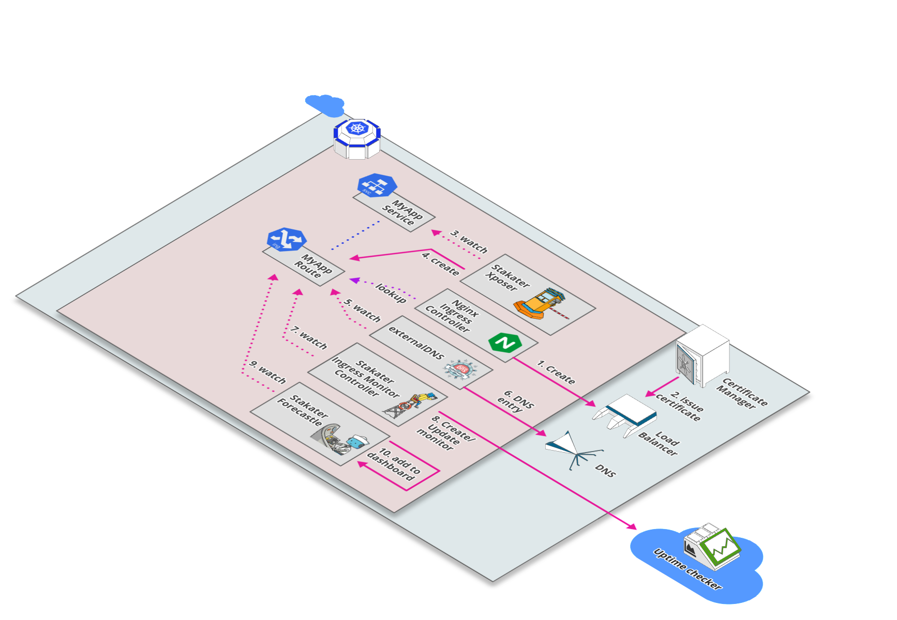
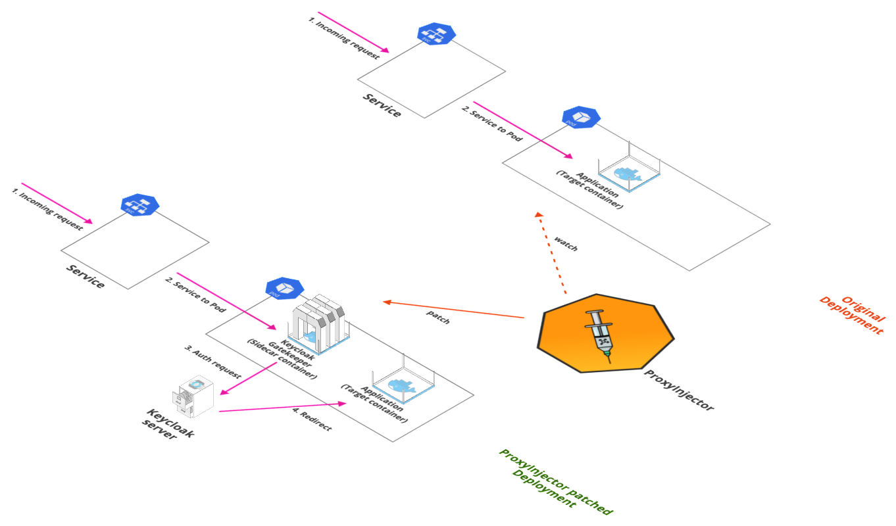

# StakaterPlatform

[[toc]]

## Overview 

Stakater has developed a consolidated solution named [StakaterPlatform](https://github.com/stakater/StakaterPlatform) that gives head-start to individuals and companies with a set of seven stacks containing opensource tools based on industry's recommendation and best practices for monitoring, logging, security, tracing, control, delivery and alerting of Kubernetes cluster. 

End-users only need to focus on developing their application while everything else will be managed by StakaterPlatform. StakaterPlatform consist of 7 [stacks](/content/stakaterplatform/stakaterplatform.html#stacks).

## Workflow

StakaterPlatform works on GitOps principle using an opensource tool [Flux](https://github.com/fluxcd/flux) which makes sure that cluster is always in the desired state by tracking a git repository. To make changes in your cluster, commit your changes in the git repository and the changes will be reflected in the kubernetes cluster.

## Prerequisites

- Kubernetes cluster with at least 8 VCPUS & 32 GB of RAM
- kubectl (between v1.11 & v1.15.3)
- helm (v2.15.0 or lower)
- A working domain (e.g. `stakaterplatform.com` ) 
- SSL Certificate for that domain

## Install via local machine

1. [Duplicate](https://help.github.com/en/github/creating-cloning-and-archiving-repositories/duplicating-a-repository#mirroring-a-repository) this [repository](https://github.com/stakater/stakaterplatform).
2. Update [configuration variables](#Basic-Configuration) in `variables.config` file and provide the relevant values.
3. [Recommended but optional] To take full advantage of the tool stack configure [Additional Variables](docs/detailed-config.md) as well.
4. Ensure that correct context is set for kubectl & helm.
5. Run `make configure`, this will make all required substitutions based on configuration variables in the repository. When prompted commit those changes.
6. [Add the public SSH key](https://help.github.com/en/github/authenticating-to-github/adding-a-new-ssh-key-to-your-github-account) of flux(configs/flux.pub) to your Git repository with **write access**.
7. Once changes are committed, run `make deploy` this will deploy flux, which will in turn deploy StakaterPlatform via GitOps strategy. Estimated time for everything to be up and running is 5-10.
9. Use the printed dashboard token to access the Kubernetes dashboard at `dashboard-control.YOURDOMAINNAME`
10. Visit `https://forecastle-control.YOURDOMAINNAME` and you'll be able to view all applications deployed by StakaterPlatform.


::: tip
Since `variables.config` file and `configs/` directory contains private information those files are not being tracked in git and won't/shouldn't be committed. In case you want to commit those changes run `make track-secrets`.
:::

## Install via GitLab CI Pipeline

1. [Duplicate](https://help.github.com/en/github/creating-cloning-and-archiving-repositories/duplicating-a-repository#mirroring-a-repository) this [repository](https://github.com/stakater/stakaterplatform) in a GitLab account.
2. Update [configuration variables](#Basic-Configuration) in `variables.config` file and provide the relevant values.
3. Create a [Personal Access Token](https://docs.gitlab.com/ee/user/profile/personal_access_tokens.html#creating-a-personal-access-token) on GitLab and note down Personal Access Token (Available only when created)
4. Configure CI/CD Environment variables in `<Your GitLab Project> -> Settings -> CI/CD`.
5. Add Following variables for the pipeline

| Pipeline Variables | Description |  
|:---|:---|
| KUBE_CONFIG | `Base64 encoded` KubeConfig of the kubernetes cluster you want to deploy on |
| REPO_ACCESS_TOKEN | Personal access token generated in Step 3 |
| TARGET | Make file target. Value: `pipeline-deploy` |
| AWS_ACCESS_KEY_ID | (Define only if `CLOUD_PROVIDER` is `aws`) AWS Access Key Id. |
| AWS_SECRET_ACCESS_KEY | (Define only if `CLOUD_PROVIDER` is `aws`) AWS Secret Access Key. |

6. [Add the public SSH key](https://docs.gitlab.com/ee/ssh/#per-repository-deploy-keys)(Deploy Keys) to your GitLab account with **write access** printed at the end of pipeline logs.
7. Once key is added, StakaterPlatform will deploy on your cluster (Estimated time: 10-15 minutes). :confetti_ball: :confetti_ball:
8. Use the printed dashboard token to access the Kubernetes dashboard at `dashboard-control.DOMAIN`

## Verification

### Locally
Run `make verify` to run tests to ensure that all the relevant endpoints are up and running.

### GitLab CI
Run pipeline with Pipeline variable: `TARGET` = verify 

## Basic Configuration
| Variables | Description | Default |  
|:---|:---|:---:|
| CLOUD_PROVIDER | Name of the k8s cloud provider | `nil` <br> (`aws` \| `azure`) |
| DNS_PROVIDER | Cloud DNS Provider | `aws` (Route53) |
| EXTERNAL_DNS_AWS_ACCESS_KEY_ID | AWS Access Key Id having access to create/delete/update Route53 HostedZone entries | `nil` |
| EXTERNAL_DNS_AWS_SECRET_ACCESS_KEY | AWS Secret Access Key having access to create/delete/update Route53 HostedZone entries | `nil` |
| DOMAIN | Domain to use for StakaterPlatform | `nil` |
| BASE64_ENCODED_SSL_CERTIFICATE_CA_CRT | Base64 encoded Intermediate Certificate value | `nil` |
| BASE64_ENCODED_SSL_CERTIFICATE_TLS_CRT | Base64 encoded Server Certificate value |`nil` |
| BASE64_ENCODED_SSL_CERTIFICATE_TLS_KEY | Base64 encoded Certificate Key value |`nil` |
| STAKATER_PLATFORM_SSH_GIT_URL | SSH URL for your Github repo. | `nil`<br>(e.g `git@github.com/stakater/StakaterPlatform.git`. Notice `:` is replaced with `/` in the URL ) |
| STAKATER_PLATFORM_BRANCH | Branch to use for `STAKATER_PLATFORM_SSH_GIT_URL` | `master` |


For generating certificates view: [Creating & using custom SSL certificates](https://playbook.stakater.com/content/processes/exposing/create-use-tls-custom-cert.html)


## Detailed Configuration and Stack definitions

To take full advantage of our tool stack, it is recommended to have the following things set-up:
1. 3 Slack channels with [webhook's](https://slack.com/intl/en-pk/help/articles/115005265063-Incoming-WebHooks-for-Slack) added. These are required for:
    * `Dev-notifications`: Notifications regarding up/down time and regarding new builds from jenkins
    * `infra-alerts`: Alerts from infrastructure
    * `apps-alerts`: Alerts for apps
2. An account at (Uptime Robot)[https://uptimerobot.com/] for [IMC](https://github.com/stakater/IngressMonitorController)
to work and provide you with up/down time alerts. For other supported down time monitors visit [Ingress Monitor Controller](https://github.com/stakater/IngressMonitorController#supported-uptime-checkers).


### Global Variables
| Variables | Description | Default |  
|---|---|---|
| CLOUD_PROVIDER | Name of the k8s cloud provider | `nil` <br> (`aws` \| `azure`) |
| DNS_PROVIDER | Cloud DNS Provider | `aws` (Route53). Currently only `Route53` is supported. |
| EXTERNAL_DNS_AWS_ACCESS_KEY_ID | AWS Access Key Id | `nil` |
| EXTERNAL_DNS_AWS_SECRET_ACCESS_KEY | AWS Secret Access Key | `nil` |
| DOMAIN | Domain to expose StakaterPlatform | `nil` |
| BASE64_ENCODED_SSL_CERTIFICATE_CA_CRT | Base64 encoded Intermediate Certificate value | `nil` |
| BASE64_ENCODED_SSL_CERTIFICATE_TLS_CRT | Base64 encoded Server Certificate value |`nil` |
| BASE64_ENCODED_SSL_CERTIFICATE_TLS_KEY | Base64 encoded Certificate Key value |`nil` |
| STAKATER_PLATFORM_SSH_GIT_URL | SSH URL for your Github repo. | `nil`<br>(e.g `git@github.com/stakater/StakaterPlatform.git`. Notice `:` is replaced with `/` in the URL ) |
| STAKATER_PLATFORM_BRANCH | Branch to use for `STAKATER_PLATFORM_SSH_GIT_URL` | `master` |

### KeyCloak
| Variables | Description | Default |  
|---|---|---|
| KEYCLOAK_CLIENT_ID | Client ID for KeyCloak Gatekeeper  | `stakater-online-platform` |
| KEYCLOAK_CLIENT_SECRET | Client Secret for KeyCloak Gatekeeper | `1de22f11-2068-df5h-9418-dawzxqwe2` |
| KEYCLOAK_DEFAULT_USERNAME | Username for the default user created |`stakater-user` |
| KEYCLOAK_DEFAULT_PASSWORD | Password for the default user created |`zUPaZnEfmYpcdd6X` |
| KEYCLOAK_DB_USER | KeyCloak DB (Postgresql) username |`admin` |
| KEYCLOAK_DB_PASSWORD | KeyCloak DB (Postgresql) password |`L3VT3hBysLGtsJaZ` |
| KEYCLOAK_PASSWORD | Password for the admin user `stakater` |`vuHBBDaVsS35jvF9` |

### IngressMonitorController IMC

| Variables | Description | Default |  
|---|---|---|
| IMC_API_KEY | API key of the monitor service provider |`nil` |
| IMC_ALERT_CONTACTS | Alert contacts for the monitor service provider |`nil` |

### Nexus
| Variables | Description | Default |  
|---|---|---|
| NEXUS_ADMIN_ACCOUNT_USER | Username for admin account |`nexus-admin` |
| NEXUS_ADMIN_ACCOUNT_PASSWORD | Password for admin account |`L8TcnrwMytCFpAFe` |
| NEXUS_CLUSTER_ACCOUNT_USER | Username for cluster admin account |`nexus-cluster-admin` |
| NEXUS_CLUSTER_ACCOUNT_PASSWORD | Password for cluster admin account |`mrzUGWrD9buDYhMF` |

### Jenkins
| Variables | Description | Default |  
|---|---|---|
| JENKINS_NOTIFICATIONS_SLACK_CHANNEL | Slack channel name to notify for jenkins pipeline result |`OPTIONAL` (e.g. `#slack-channel-name`) |
| JENKINS_NOTIFICATIONS_SLACK_WEBHOOK_URL | Slack webhook URL to notify for jenkins pipeline result |`OPTIONAL` |
| JENKINS_PIPELINE_GITHUB_TOKEN | GitHub API token. If configured Pipeline will comment on Pull Requests |`OPTIONAL` |
| JENKINS_PIPELINE_GITLAB_TOKEN | GitLab API token. If configured Pipeline will comment on Pull Requests |`OPTIONAL` |
| JENKINS_PIPELINE_BITBUCKET_TOKEN | BitBuckt API token. If configured Pipeline will comment on Pull Requests  |`OPTIONAL` |
| JENKINS_DOCKER_MAVEN_USERNAME | Maven repository used by Jenkins to store maven artifiacts |`admin` |
| JENKINS_DOCKER_MAVEN_PASSWORD | Maven repository used by Jenkins to store maven artifiacts |`xJuAWjG4GzrCkPJU` |
| JENKINS_LOCAL_NEXUS_USERNAME | Local repository used by Jenkins to store artifiacts |`admin` |
| JENKINS_LOCAL_NEXUS_PASSWORD | Local repository used by Jenkins to store artifiacts | `LXwEkC4jZzQj3DHY` |
| JENKINS_NEXUS_USERNAME | Nexus Username. Used by docker command in Jenkins Pipeline | `admin` |
| JENKINS_NEXUS_PASSWORD | Nexus Password. Used by docker command in Jenkins Pipeline | `CN3B6uY998kpBFDd` |
 
### AlertManager
| Variables | Description | Default |  
|---|---|---|
| SLACK_INFRA_ALERTS_CHANNEL | Slack channel name to send Alertmanager infrastructure alerts |`#stakater-platform-infra-alerts` |
| SLACK_INFRA_ALERTS_WEBHOOK_URL | Slack channel webhook URL to send Alertmanager infrastructure alerts |`OPTIONAL` |
| SLACK_APPS_ALERTS_CHANNEL | Slack channel webhook URL to send Alertmanager application alerts |`#stakater-platform-apps-alerts` |
| SLACK_APPS_ALERTS_WEBHOOK_URL | Slack channel name to send Alertmanager application alerts |`OPTIONAL` |

### Grafana
| Variables | Description | Default |  
|---|---|---|
| GRAFANA_USERNAME | Grafana dashboard username |`admin` |
| GRAFANA_PASSWORD | Grafana dashboard password |`CN3B6uY998kpBFDd` |


### Flux
In directory `configs`, SSH keys flux(private) & flux.pub(public) exist which flux uses for GitOps. You can provide, paste content of, your own SSH keys there. Else, a new unique key pair will be generated every time for you. 


## Uninstall

Run `make destroy` to remove StakaterPlatform from your cluster.


## Production Configuration and Hardening

- Change default usernames and passwords for all tools (`variables.config`)
- Add your own SSH keys for flux
- Use Identity Providers (e.g. Google, Active Directory etc.) and configure keyCloak to use that
- Replace all secrets with sealed-secrets. [Stakater Workshop - Sealed Secrets](https://playbook.stakater.com/content/workshop/sealed-secrets/introduction.html)
- Use keycloak for SSO over all exposed applications

## Compatibility Matrix

StakaterPlatform has been tested on following kubernetes flavors:

| Platform Version| K8s Version  | Infrastructure |
|---|---|---|
| v0.0.1 | 1.14 | [](https://aws.amazon.com/eks/) &nbsp; eks.6 |
| v0.0.1 | 1.14.8 | [](https://docs.microsoft.com/en-us/azure/aks/) &nbsp; aks |

<!-- #################################################### -->
<!-- ###################  STACKS  ########################## -->
<!-- #################################################### -->
## Stacks

### Control Stack



#### Overview

This stack provides tools that manage the components of StakaterPlatform.

#### Tools Matrix

|       Tool        | Chart Repository  |   Cherry Pickable |    SSO        | Pre-Requisites |
| :---------------: | :---------------: | :----------------:| :------------:| :-------------:|
| [External DNS](https://github.com/kubernetes-sigs/external-dns) | [Public](https://github.com/helm/charts/tree/master/stable/external-dns) | Yes | N/A |  None |
| [Nginx Ingress](https://github.com/kubernetes/ingress-nginx) | [Public](https://github.com/helm/charts/tree/master/stable/nginx-ingress) | Yes | N/A |  None |
| [Descheduler](https://github.com/kubernetes-sigs/descheduler) | [Stakater](https://github.com/stakater-charts/descheduler) | Yes | N/A |  None |
| [Forecastle](https://github.com/stakater/forecastle) | [Stakater](https://github.com/stakater/Forecastle/tree/master/deployments/kubernetes/chart/forecastle) | Yes | Yes |  Keycloak |
| [Reloader](https://github.com/stakater/Reloader) | [Stakater](https://github.com/stakater/Reloader/tree/master/deployments/kubernetes/chart/reloader) | Yes | N/A |  None |
| [K8s Dashboard](https://github.com/kubernetes/dashboard) | [Public](https://github.com/helm/charts/tree/master/stable/kubernetes-dashboard) | Yes | Depends |  None |
| [Gitwebhookproxy](https://github.com/stakater/GitWebhookProxy) | [Stakater](https://github.com/stakater/GitWebhookProxy/tree/master/deployments/kubernetes/chart/gitwebhookproxy) | Yes | N/A |  None |
| [IMC](https://github.com/stakater/IngressMonitorController) | [Stakater](https://github.com/stakater/IngressMonitorController/tree/master/deployments/kubernetes/chart/ingressmonitorcontroller) | Yes | N/A |  None |
| [Xposer](https://github.com/stakater/Xposer) | [Stakater](https://github.com/stakater/Xposer/tree/master/deployments/kubernetes/chart/xposer) | Yes | N/A |  None |


#### Default Configurations

Following are the default configurations that are used by StakaterPlatform for `Control` stack. These configurations can be found under `config/` directory in the StakaterPlatform Github [repository](https://github.com/stakater/StakaterPlatform)

#### IngressMonitorController IMC

IMC supports multiple online monitoring services. By default `UptimeRobot` is configured. Provide `IMC_API_KEY` and `IMC_ALERT_CONTACTS` in `variables.config` to monitor every ingress via UptimeRobot.

| Variables | Description | Default |  
|:---|:---|---|
| IMC_API_KEY | API key of the monitor service provider |`nil` |
| IMC_ALERT_CONTACTS | Alert contacts for the monitor service provider |`nil` |

For more details See IMC [Github Repository](https://github.com/stakater/IngressMonitorController)

`configs/imc.yaml:`
```
# For more details: https://github.com/stakater/IngressMonitorController
providers:
  - name: UptimeRobot
    apiKey: IMC_API_KEY
    apiURL: https://api.uptimerobot.com/v2/
    alertContacts: "IMC_ALERT_CONTACTS"
enableMonitorDeletion: true
monitorNameTemplate: "{{.IngressName}}-{{.Namespace}}"
resyncPeriod: 0 # how often (in seconds) monitors should be synced to their Kubernetes resources (0 = disabled)
```


<!-- DELIVERY STACK -->
### Delivery Stack


#### Overview

Delivery Stack is responsible for CI/CD and artifacts management of pipelines.

#### Tools Matrix

|       Tool        | Chart Repository                                                     | Cherry Pickable | SSO | Pre-Requisites |
| :---------------: | :------------------------------------------------------------------: | :--------------:| :--:| :-------------:|
| [Jenkins](https://github.com/jenkinsci/jenkins) | [Public](https://github.com/helm/charts/tree/master/stable/jenkins)            |       Yes       | Yes |     KeyCloak   |
| [Sonatype-Nexus](https://github.com/sonatype/nexus-public)   | [Public](https://github.com/helm/charts/tree/master/stable/sonatype-nexus)     |       Yes       | No  |      None      |
| RDLM    | [Stakater](https://github.com/stakater-charts/restful-distributed-lock-manager)|       Yes       | N/A |      None      |

#### Default Configurations

Following are the default configurations that are used by StakaterPlatform for `Delivery` stack. These configurations can be found under `configs/` directory in the StakaterPlatform Github [repository](https://github.com/stakater/StakaterPlatform)

#### Jenkins

Jenkins provide automation pipelines for CI/CD workflow. 

#### Maven Configs

Following variables should be configured in `variables.config` for Caching maven artifacts and speeding up maven builds.

| Variables | Description | Default |  
|:---|:---|---|
| JENKINS_DOCKER_MAVEN_USERNAME | Maven repository used by Jenkins to store maven artifiacts |`admin` |
| JENKINS_DOCKER_MAVEN_PASSWORD | Maven repository used by Jenkins to store maven artifiacts |`xJuAWjG4GzrCkPJU` |
| JENKINS_LOCAL_NEXUS_USERNAME | Local repository used by Jenkins to store artifiacts |`admin` |
| JENKINS_LOCAL_NEXUS_PASSWORD | Local repository used by Jenkins to store artifiacts | `LXwEkC4jZzQj3DHY` |
| JENKINS_NEXUS_USERNAME | Nexus Username. Used by docker command in Jenkins Pipeline | `admin` |
| JENKINS_NEXUS_PASSWORD | Nexus Password. Used by docker command in Jenkins Pipeline | `CN3B6uY998kpBFDd` |

`configs/jenkins-maven-config.xml:`
```
<settings>
    <!-- sets the local maven repository outside of the ~/.m2 folder for easier mounting of secrets and repo -->
    <localRepository>${user.home}/.mvnrepository</localRepository>
    <mirrors>
        <mirror>
            <id>nexus</id>
            <mirrorOf>external:*</mirrorOf>
            <url>http://nexus.release/repository/public/</url>
        </mirror>
    </mirrors>

    <!-- lets disable the download progress indicator that fills up logs -->
    <interactiveMode>false</interactiveMode>

    <servers>
        <server>
            <id>docker-delivery.DOMAIN:443</id>
            <username>JENKINS_DOCKER_MAVEN_USERNAME</username>
            <password>JENKINS_DOCKER_MAVEN_PASSWORD</password>
        </server>
        <server>
            <id>local-nexus</id>
            <username>JENKINS_LOCAL_NEXUS_USERNAME</username>
            <password>JENKINS_LOCAL_NEXUS_PASSWORD</password>
        </server>
        <server>
            <id>nexus</id>
            <username>JENKINS_NEXUS_USERNAME</username>
            <password>JENKINS_NEXUS_PASSWORD</password>
        </server>
        <server>
            <id>oss-sonatype-staging</id>
            <username></username>
            <password></password>
        </server>
    </servers>

    <profiles>
        <profile>
            <id>nexus</id>
            <properties>
                <altDeploymentRepository>local-nexus::default::http://nexus.release/repository/maven-releases/</altDeploymentRepository>
                <altReleaseDeploymentRepository>local-nexus::default::http://nexus.release/repository/maven-releases/</altReleaseDeploymentRepository>
                <altSnapshotDeploymentRepository>local-nexus::default::http://nexus.release/repository/maven-snapshots/</altSnapshotDeploymentRepository>
            </properties>
            <repositories>
                <repository>
                    <id>central</id>
                    <url>http://central</url>
                    <releases><enabled>true</enabled></releases>
                    <snapshots><enabled>true</enabled></snapshots>
                </repository>
            </repositories>
            <pluginRepositories>
                <pluginRepository>
                    <id>central</id>
                    <url>http://central</url>
                    <releases><enabled>true</enabled></releases>
                    <snapshots><enabled>true</enabled></snapshots>
                </pluginRepository>
            </pluginRepositories>
        </profile>
        <profile>
            <id>release</id>
            <properties>
                <gpg.executable>gpg</gpg.executable>
                <gpg.passphrase>mysecretpassphrase</gpg.passphrase>
            </properties>
        </profile>
    </profiles>
    <activeProfiles>
        <!--make the profile active all the time -->
        <activeProfile>nexus</activeProfile>
    </activeProfiles>
</settings>
```

#### Jenkins docker cfg

Jenkins use docker to build images for CI/CD pipleline. To push and pull images from image registry ( Nexus in `StakaterPlatform`) docker configuration file needs to be provided. This configuration file corresponds to `$HOME/.docker/config.json`. Configure following varaibles in `variables.config` to allow pull/push from nexus repository in Jenkins

| Variables | Description | Default |  
|:---|:---|---|
| JENKINS_NEXUS_USERNAME | Nexus Username. Used by docker command in Jenkins Pipeline | `admin` |
| JENKINS_NEXUS_PASSWORD | Nexus Password. Used by docker command in Jenkins Pipeline | `CN3B6uY998kpBFDd` |

`JENKINS_NEXUS_AUTH` is replaced by encoding above variables in base64 in this format: `NEXUS_ADMIN_ACCOUNT_USER:NEXUS_ADMIN_ACCOUNT_PASSWORD`

`configs/jenkins.json:`
```
{
  "auths": {
    "docker-delivery.DOMAIN:443": {
      "auth": "JENKINS_NEXUS_AUTH"
    }
  }
}
```

#### Nexus

Nexus is used as a private image repository to push/pull images and artifacts. Configure following varaibles in `variables.config` to configure nexus registry.

| Variables | Description | Default |  
|:---|:---|---|
| NEXUS_ADMIN_ACCOUNT_USER | Username for admin account |`nexus-admin` |
| NEXUS_ADMIN_ACCOUNT_PASSWORD | Password for admin account |`L8TcnrwMytCFpAFe` |
| NEXUS_CLUSTER_ACCOUNT_USER | Username for cluster admin account |`nexus-cluster-admin` |
| NEXUS_CLUSTER_ACCOUNT_PASSWORD | Password for cluster admin account |`mrzUGWrD9buDYhMF` |

`configs/nexus-admin-account.json:`
```
{"name": "NEXUS_ADMIN_ACCOUNT_USER","type": "groovy","content": "security.addUser('NEXUS_ADMIN_ACCOUNT_USER', 'Stakater', 'Admin', 'user@gmail.com', true, 'NEXUS_ADMIN_ACCOUNT_PASSWORD', ['nx-admin'])"}
```

`configs/nexus-cluster-account.json:`
```
{"name": "NEXUS_CLUSTER_ACCOUNT_USER","type": "groovy","content": "security.addRole('cluster', 'cluster', 'User with privileges to allow read access to repo content and healtcheck', ['nx-healthcheck-read','nx-repository-view-docker-stakater-docker-browse','nx-repository-view-docker-stakater-docker-read','nx-search-read'],  ['nx-anonymous']); security.addUser('NEXUS_CLUSTER_ACCOUNT_USER', 'Cluster', 'Cluster', 'user@gmail.com', true, 'NEXUS_CLUSTER_ACCOUNT_PASSWORD', ['cluster'])"}
```

[Stakater Pipeline Library](https://github.com/stakater/stakater-pipeline-library)

#### Storage Details

|          Tool         |                            PVC                                     | Recommended Space |
| :-------------------: | :------------------------------------------------------------------------------: | :--------------:| :--:| :-------------:|
| [Jenkins](https://github.com/jenkinsci/jenkins)          | [stakater-delivery-jenkins](https://github.com/helm/charts/tree/master/stable/jenkins#persistence)                                 |     8Gi |
| [Sonatype-Nexus](https://github.com/sonatype/nexus-public)           | [stakater-delivery-sonatype-nexus-data-big](https://github.com/helm/charts/tree/master/stable/sonatype-nexus#persistence)                             |     80Gi |


<!-- LOGGING STACK -->

### Logging Stack


#### Overview

Logging Stack contains all tools required to collect and store logs of your pods.

#### Tools Matrix

|          Tool         |                            Chart Repository                                      | Cherry Pickable | SSO | Pre-Requisites |
| :-------------------: | :------------------------------------------------------------------------------: | :--------------:| :--:| :-------------:|
| Elasticsearch         | [Public](https://github.com/elastic/helm-charts)                                 |       Yes       | N/A |      None      |
| Fluentd               | [Public](https://github.com/kiwigrid/helm-charts)                                |        No      | N/A |      Elasticsearch      |
| Eventrouter           | [Public](https://github.com/helm/charts/tree/master/stable/eventrouter)          |        No      | N/A |      None      |
| Kibana                | [Public](https://github.com/helm/charts/tree/master/stable/kibana)               |       No       | Yes |    KeyCloak, Elasticsearch    |
| Cerebro               | [Public](https://github.com/helm/charts/tree/master/stable/cerebro)              |       No       | Yes |    KeyCloak, Elasticsearch    |
| Elasticsearch Curator | [Public](https://github.com/helm/charts/tree/master/stable/elasticsearch-curator)|       No       | N/A |      Elasticsearch      |
| Logrotate             | [Stakater](https://github.com/stakater-charts/logrotate)                         |      Yes       | N/A |      None      |
| [Konfigurator](https://github.com/stakater/Konfigurator)          | [Stakater](https://github.com/stakater/Konfigurator/tree/master/deployments/kubernetes/chart/konfigurator)                      |       No       | N/A |      Fluentd      |

#### Storage Details

|          Tool         |                            PVC                                     | Recommended Space |
| :-------------------: | :------------------------------------------------------------------------------: | :--------------:| :--:| :-------------:|
| [Elasticsearch](https://github.com/elastic/elasticsearch)          | [PVC details](https://github.com/elastic/helm-charts/tree/master/elasticsearch)                                 |     - |
| -          | elasticsearch-master-elasticsearch-master-0                                |     8Gi |
| -          | elasticsearch-data-elasticsearch-data-0                             |     20Gi |
| -          | elasticsearch-data-elasticsearch-data-1                                 |     20Gi |

**Details:** Our recommended configuration for elasticsearch, used in StakaterPlatform, is to have 1 master node, 1 client node and 2 data nodes. Persistence should be enabled for master and data nodes. 

<!-- MONITORING STACK -->
### Monitoring Stack


#### Overview

Monitoring Stack includes tools required for the monitoring of applications and infrastructure.

#### Tools Matrix

|          Tool         |                            Chart Repository                                      | Cherry Pickable | SSO | Pre-Requisites |
| :-------------------: | :------------------------------------------------------------------------------: | :--------------:| :--:| :-------------:|
| [Prometheus Operator](https://github.com/coreos/prometheus-operator)         | [Public](https://github.com/helm/charts/tree/master/stable/prometheus-operator)                                 |       Yes       | N/A |      None      |
| [Metrics server](https://github.com/coreos/prometheus-operator)         | [Public](https://github.com/helm/charts/tree/master/stable/metrics-server)                                 |       Yes       | N/A |      None      |

We are using Prometheus Operator helm chart to deploy following monitoring components:

- **Prometheus**: It is an opensource monitoring solution for metrics and alerting.

- **Service Monitors**: CRD to generate prometheus configuration to monitor Kubernetes services.

- **AlertManager**: It is part of Prometheus's alerting feature. Alert rules are defined in Prometheus server that send alerts to Alertmanager. Once alerts are received Alertmanager can group, inhibit or silence them.

- **Node Exporter**: Prometheus exporter for hardware and OS metrics exposed by *NIX kernels, with pluggable metric collectors.

- **Kube State Metrics**: It is a service that generates metrics about kubernetes objects by using Kubebernetes API server.

- **Grafana**: Grafana is an open source metric analytics & visualization suite with support for Elasticsearch, Prometheus etc. Currently, it is being used with Prometheus.

#### Default Configurations

Following are the default configurations that are used by StakaterPlatform for `Monitoring` stack. These configurations can be found under `configs/` directory in the StakaterPlatform Github [repository](https://github.com/stakater/StakaterPlatform)

#### AlertManager

Alertmanager generates alerts on the basis of prometheus rules. These alerts can be sent over to `Slack` for better alerting workflow.

Configure the following variables in `variables.config` to send alerts to Slack channels.

| Variables | Description | Default |
|---|---|---|
| SLACK_INFRA_ALERTS_WEBHOOK_URL | Slack channel webhook URL to send Alertmanager k8s infrastructure alerts |`OPTIONAL` |
| SLACK_INFRA_ALERTS_CHANNEL | Slack channel name to send Alertmanager k8s infrastructure alerts |`#stakater-platform-infra-alerts` |
| SLACK_APPS_ALERTS_WEBHOOK_URL | Slack channel name to send Alertmanager application alerts |`OPTIONAL` |
| SLACK_APPS_ALERTS_CHANNEL | Slack channel webhook URL to send Alertmanager application alerts |`#stakater-platform-apps-alerts` |

`configs/alertmanager.yaml`
```
# For more details: https://github.com/prometheus/alertmanager
global:
  resolve_timeout: 5m
inhibit_rules:
  - target_match:
      alertname: 'CPUThrottlingHigh'
    source_match:
      alertname: 'Watchdog'
    equal: ['prometheus']
receivers:
  - name: alerts-null
  - name: default-infra-alerts
    slack_configs:
      - api_url: SLACK_INFRA_ALERTS_WEBHOOK_URL
        channel: '#SLACK_INFRA_ALERTS_CHANNEL'
        send_resolved: true
        text: |2-

          {{ range .Alerts }}
            *Alert:* {{ .Annotations.summary }} - `{{ .Labels.severity }}`

            *Description:* {{ .Annotations.description }}

            *Graph:* <{{ .GeneratorURL }}|:chart_with_upwards_trend:> *Runbook:* <{{ .Annotations.runbook }}|:spiral_note_pad:>

            *Details:*

            {{ range .Labels.SortedPairs }} *{{ .Name }}:* `{{ .Value }}`

            {{ end }}

          {{ end }}
        title: '[{{ .Status | toUpper }}{{ if eq .Status "firing" }}:{{ .Alerts.Firing | len }}{{ end }}] Prometheus Event Notification'
        title_link: |2

          https://alertmanager-monitoring.DOMAIN
  - name: apps-alerts
    slack_configs:
      - api_url: SLACK_APPS_ALERTS_WEBHOOK_URL
        channel: '#SLACK_APPS_ALERTS_CHANNEL'
        send_resolved: true
        text: |2-

          {{ range .Alerts }}
            *Alert:* {{ .Annotations.summary }} - `{{ .Labels.severity }}`

            *Description:* {{ .Annotations.description }}

            *Graph:* <{{ .GeneratorURL }}|:chart_with_upwards_trend:> *Runbook:* <{{ .Annotations.runbook }}|:spiral_note_pad:>

            *Details:*

            {{ range .Labels.SortedPairs }} *{{ .Name }}:* `{{ .Value }}`

            {{ end }}

          {{ end }}
        title: '[{{ .Status | toUpper }}{{ if eq .Status "firing" }}:{{ .Alerts.Firing| len }}{{ end }}] Prometheus Event Notification'
        title_link: |2

          https://alertmanager-monitoring.DOMAIN
route:
  group_by:
    - alertname
    - cluster
    - service
  group_interval: 5m
  group_wait: 30s
  repeat_interval: 1h
  receiver: default-infra-alerts
  routes:
    - match:
        kind: apps
      receiver: apps-alerts
    - match:
        alertname: Watchdog
      receiver: alerts-null
```

Metrics-server is a cluster level component that uses Summary API to scrape metrics from all nodes & pods served by kubelet. 
It allows us to query resource metrics using kubectl utility.


#### Storage Details

|          Tool         |                            PVC                                     | Recommended Space |
| :-------------------: | :------------------------------------------------------------------------------: | :--------------:| :--:| :-------------:|
| [Prometheus Operator](https://github.com/coreos/prometheus-operator)          | [prometheus-stakater-prometheus-db-prometheus-stakater-prometheus-0](https://github.com/helm/charts/tree/master/stable/prometheus-operator#persistent-volumes)                                 |     6Gi |

<!-- SECURITY STACK -->
### Security Stack



#### Overview

Security Stack includes tools that provides authentication for applications.

#### Tools Matrix

|       Tool        | Chart Repository                                                     | Cherry Pickable | SSO | Pre-Requisites |
| :---------------: | :------------------------------------------------------------------: | :--------------:| :--:| :-------------:|
| [Keycloak](https://github.com/keycloak/keycloak) | [Public](https://github.com/codecentric/helm-charts/tree/master/charts/keycloak)            |       Yes       | N/A |     Postgres   |
| [ProxyInjector](https://github.com/stakater/proxyinjector) | [Stakater](https://github.com/stakater/ProxyInjector/tree/master/deployments/kubernetes/chart/proxyinjector) | No | N/A |  Keycloak |
| [Sealed Secrets Controller](https://github.com/bitnami-labs/sealed-secrets) | [Public](https://github.com/helm/charts/tree/master/stable/sealed-secrets) | Yes | N/A |  None |


#### Default Configurations

Following are the default configurations that are used by StakaterPlatform for `Security` stack. These configurations can be found under `configs/` directory in the StakaterPlatform Github [repository](https://github.com/stakater/StakaterPlatform)

##### ProxyInjector

ProxyInjector serves as a client proxy for KeyCloak SSO server. ProxyInjector injects sidecar proxy on the basis of annotations on pods.

For more information See ProxyInjector Github [repository](https://github.com/stakater/ProxyInjector)

Configure the following variables in `variables.config` to configure proxy sidecar

| Variables | Description | Default |  
|---|---|---|
| KEYCLOAK_CLIENT_ID | Client ID for KeyCloak Gatekeeper  | `stakater-online-platform` |
| KEYCLOAK_CLIENT_SECRET | Client Secret for KeyCloak Gatekeeper | `1d123a23-2068-3f5r-9120-f03fa1d1r5tyhf` |

::: tip
KEYCLOAK_CLIENT_ID and KEYCLOAK_CLIENT_SECRET variables will be used by both ProxyInjector and KeyCloak.`
:::


**`configs/proxyinjector.yaml:`**
```
gatekeeper-image : "keycloak/keycloak-gatekeeper:5.0.0"
client-id: KEYCLOAK_CLIENT_ID
client-secret: KEYCLOAK_CLIENT_SECRET
discovery-url: "https://keycloak-security.DOMAIN/auth/realms/stakater"
enable-default-deny: true
secure-cookie: false
verbose: true
enable-logging: true
cors-origins:
  - '*'
cors-methods:
  - GET
  - POST
resources:
  - uri: '/*'
scopes:
  - 'good-service'
```


##### KeyCloak

KeyCloak provides Single Sign On (SSO) server for all applications in StakaterPlatform. It is responsible for authentication of users. By default a single user `stakater-user` is used for providing SSO and an admin user `stakater` for accessing KeyCloak administration console.

Update the following variables to change default configurations: 

| Variables | Description | Default |  
|---|---|---|
| KEYCLOAK_DEFAULT_USERNAME | Username for the default user created |`stakater-user` |
| KEYCLOAK_DEFAULT_PASSWORD | Password for the default user created |`zUPaZnEfmYpcdd6X` |
| KEYCLOAK_DB_USER | KeyCloak DB (Postgresql) username |`admin` |
| KEYCLOAK_DB_PASSWORD | KeyCloak DB (Postgresql) password |`L3VT3hBysLGtsJaZ` |
| KEYCLOAK_PASSWORD | Password for the admin user `stakater` |`vuHBBDaVsS35jvF9` |

`configs/keycloak.json:`
```
{
  "realm": "stakater",
  "enabled": true,
  "loginTheme": "keycloak",
  "sslRequired": "external",
  "accessTokenLifespan" : 2592000,
  "accessTokenLifespanForImplicitFlow" : 1296000,
  "ssoSessionIdleTimeout" : 2592000,
  "accessCodeLifespanUserAction" : 36000,
  "accessCodeLifespanLogin" : 2592000,
  "ssoSessionMaxLifespan" : 2592000,
  "offlineSessionIdleTimeout" : 2592000,
  "accessCodeLifespan" : 60,
  "clients": [
    {
      "clientId": "KEYCLOAK_CLIENT_ID",
      "enabled": true,
      "standardFlowEnabled": true,
      "implicitFlowEnabled": false,
      "directAccessGrantsEnabled": true,
      "authorizationServicesEnabled" : true,
      "fullScopeAllowed": true,
      "serviceAccountsEnabled": true,
      "clientAuthenticatorType": "client-secret",
      "secret": "KEYCLOAK_CLIENT_SECRET",
      "publicClient" : true,
      "adminUrl" : "",
      "baseUrl" : "",
      "redirectUris": [
        "*"
      ],
      "webOrigins": [
        "*"
      ],
      "defaultRoles": ["uma_protection"],
      "authorizationSettings" : {
        "allowRemoteResourceManagement" : true,
        "policyEnforcementMode" : "ENFORCING",
        "scopes" : [ {
          "name" : "read:space"
          }, {
          "name" : "admin:space"
        } ]
      },
      "protocolMappers": [
        {
          "name": "Groups",
          "protocol": "openid-connect",
          "protocolMapper": "oidc-group-membership-mapper",
          "consentRequired": false,
          "config": {
            "full.path": "true",
            "id.token.claim": "true",
            "access.token.claim": "true",
            "claim.name": "groups",
            "userinfo.token.claim": "true"
          }
        }
      ],
      "defaultClientScopes": [
        "good-service",
        "email"
      ]
    },
    {
      "clientId": "che",
      "enabled": true,
      "redirectUris": [
        "*"
      ],
      "implicitFlowEnabled": false,
      "directAccessGrantsEnabled": true,
      "publicClient": true,
      "protocol": "openid-connect",
      "fullScopeAllowed": true
    }
  ],
  "clientScopes": [
    {              
      "name": "email",
      "description": "OpenID Connect built-in scope: email",
      "protocol": "openid-connect",
      "attributes": {
        "include.in.token.scope": "true",
        "display.on.consent.screen": "true",
        "consent.screen.text": "${emailScopeConsentText}"
      },
      "protocolMappers": [
        {
          "name": "email",
          "protocol": "openid-connect",
          "protocolMapper": "oidc-usermodel-property-mapper",
          "consentRequired": false,
          "config": {
            "userinfo.token.claim": "true",
            "user.attribute": "email",
            "id.token.claim": "true",
            "access.token.claim": "true",
            "claim.name": "email",
            "jsonType.label": "String"
          }
        },
        {                  
          "name": "email verified",
          "protocol": "openid-connect",
          "protocolMapper": "oidc-usermodel-property-mapper",
          "consentRequired": false,
          "config": {
            "userinfo.token.claim": "true",
            "user.attribute": "emailVerified",
            "id.token.claim": "true",
            "access.token.claim": "true",
            "claim.name": "email_verified",
            "jsonType.label": "boolean"
          }
        }
      ]
    },
    {
      "name": "good-service",
      "protocol": "openid-connect",
      "attributes": {
        "include.in.token.scope": "true",
        "display.on.consent.screen": "true"
      },
      "protocolMappers": [
        {
          "name": "stakater-audience",
          "protocol": "openid-connect",
          "protocolMapper": "oidc-audience-mapper",
          "consentRequired": false,
          "config": {
            "included.client.audience": "KEYCLOAK_CLIENT_ID",
            "id.token.claim": "false",
            "access.token.claim": "true"
          }
        }
      ]
    }
  ],
  "clientScopeMappings": {
    "realm-management": [
        {
            "client": "KEYCLOAK_CLIENT_ID",
            "roles": ["view-users"]
        },
        {
            "client": "KEYCLOAK_CLIENT_ID",
            "roles": ["manage-authorization"]
        }
    ],
    "broker": [
        {
            "client": "KEYCLOAK_CLIENT_ID",
            "roles": ["read-token"]
        }
    ]
  },
  "users": [{
      "username": "service-account-KEYCLOAK_CLIENT_ID",
      "enabled": true,
      "totp": false,
      "emailVerified": false,
      "email": "service-account-KEYCLOAK_CLIENT_ID@placeholder.org",
      "serviceAccountClientId": "KEYCLOAK_CLIENT_ID",
      "credentials": [],
      "disableableCredentialTypes": [],
      "requiredActions": [],
      "realmRoles": ["offline_access", "uma_authorization"],
      "clientRoles": {
        "realm-management": ["view-users", "manage-authorization"],
        "broker": ["read-token"],
        "KEYCLOAK_CLIENT_ID": ["uma_protection"],
        "account": ["manage-account", "view-profile"]
      },
      "groups": []
    },
    {
      "username": "KEYCLOAK_DEFAULT_USERNAME",
      "enabled": true,
      "emailVerified": false,
      "email": "stakater-userm@placeholder.org",
      "credentials": [
        { 
          "type" : "password",
          "value" : "KEYCLOAK_DEFAULT_PASSWORD"
        }
      ],
      "realmRoles": ["offline_access", "uma_authorization"],
      "clientRoles": {
        "realm-management": ["view-users", "manage-authorization"],
        "broker": ["read-token"],
        "KEYCLOAK_CLIENT_ID": ["uma_protection"],
        "account": ["manage-account", "view-profile"]
      }
    }],
  "roles" : {
    "realm" : [
      {
        "name": "read:space",
        "description": "Read space"
      },
      {
        "name": "admin:space",
        "description": "Admin space"
      }
    ]
  },
  "authenticationFlows": [
    {
      "id": "8f18a831-de51-4163-89fc-c90d274d13b7",
      "alias": "Basic Auth",
      "description": "",
      "providerId": "basic-flow",
      "topLevel": true,
      "builtIn": false,
      "authenticationExecutions": [
        {
          "authenticator": "registration-page-form",
          "requirement": "REQUIRED",
          "priority": 0,
          "flowAlias": "Form",
          "userSetupAllowed": false,
          "autheticatorFlow": true
        }
      ]
    },
        {
      "id": "e540d440-9943-4a64-a79c-c3930f432acf",
      "alias": "Form",
      "description": "",
      "providerId": "basic-flow",
      "topLevel": false,
      "builtIn": false,
      "authenticationExecutions": [
        {
          "authenticator": "auth-cookie",
          "requirement": "ALTERNATIVE",
          "priority": 0,
          "userSetupAllowed": false,
          "autheticatorFlow": false
        },
        {
          "authenticator": "auth-username-password-form",
          "requirement": "REQUIRED",
          "priority": 4,
          "userSetupAllowed": false,
          "autheticatorFlow": false
        }
      ]
    },
    {
      "id": "5bd08fae-683d-4580-974e-a0fa1ca703ff",
      "alias": "Browser Passwordless",
      "description": "Browser flow without username password form",
      "providerId": "basic-flow",
      "topLevel": true,
      "builtIn": false,
      "authenticationExecutions": [
        {
          "authenticator": "auth-cookie",
          "requirement": "ALTERNATIVE",
          "priority": 0,
          "userSetupAllowed": false,
          "autheticatorFlow": false
        },
        {
          "authenticator": "registration-page-form",
          "requirement": "ALTERNATIVE",
          "priority": 1,
          "flowAlias": "Email Verifier",
          "userSetupAllowed": false,
          "autheticatorFlow": true
        }
      ]
    },
    {
      "id": "b2becd61-16d7-480d-b4db-ef61f12ab632",
      "alias": "Email Verifier",
      "description": "",
      "providerId": "basic-flow",
      "topLevel": false,
      "builtIn": false,
      "authenticationExecutions": [
        {
          "authenticatorConfig": "google",
          "authenticator": "identity-provider-redirector",
          "requirement": "ALTERNATIVE",
          "priority": 0,
          "userSetupAllowed": false,
          "autheticatorFlow": false
        },
        {
          "authenticatorConfig": "azure",
          "authenticator": "identity-provider-redirector",
          "requirement": "ALTERNATIVE",
          "priority": 1,
          "userSetupAllowed": false,
          "autheticatorFlow": false
        }
      ]
    },
    {
      "id": "8095b653-cd87-45f2-a434-426232e5167c",
      "alias": "Handle Existing Account",
      "description": "Handle what to do if there is existing account with same email/username like authenticated identity provider",
      "providerId": "basic-flow",
      "topLevel": false,
      "builtIn": true,
      "authenticationExecutions": [
        {
          "authenticator": "idp-confirm-link",
          "requirement": "REQUIRED",
          "priority": 10,
          "userSetupAllowed": false,
          "autheticatorFlow": false
        },
        {
          "authenticator": "idp-email-verification",
          "requirement": "ALTERNATIVE",
          "priority": 20,
          "userSetupAllowed": false,
          "autheticatorFlow": false
        },
        {
          "requirement": "ALTERNATIVE",
          "priority": 30,
          "flowAlias": "Verify Existing Account by Re-authentication",
          "userSetupAllowed": false,
          "autheticatorFlow": true
        }
      ]
    },
    {
      "id": "fe8cb277-fb16-4fc9-a840-1c66b3e36815",
      "alias": "Verify Existing Account by Re-authentication",
      "description": "Reauthentication of existing account",
      "providerId": "basic-flow",
      "topLevel": false,
      "builtIn": true,
      "authenticationExecutions": [
        {
          "authenticator": "idp-username-password-form",
          "requirement": "REQUIRED",
          "priority": 10,
          "userSetupAllowed": false,
          "autheticatorFlow": false
        },
        {
          "authenticator": "auth-otp-form",
          "requirement": "OPTIONAL",
          "priority": 20,
          "userSetupAllowed": false,
          "autheticatorFlow": false
        }
      ]
    },
    {
      "id": "4fbe8594-cb0e-498f-af94-a54de2f71075",
      "alias": "browser",
      "description": "browser based authentication",
      "providerId": "basic-flow",
      "topLevel": true,
      "builtIn": true,
      "authenticationExecutions": [
        {
          "authenticator": "auth-cookie",
          "requirement": "ALTERNATIVE",
          "priority": 10,
          "userSetupAllowed": false,
          "autheticatorFlow": false
        },
        {
          "authenticator": "auth-spnego",
          "requirement": "DISABLED",
          "priority": 20,
          "userSetupAllowed": false,
          "autheticatorFlow": false
        },
        {
          "authenticator": "identity-provider-redirector",
          "requirement": "ALTERNATIVE",
          "priority": 25,
          "userSetupAllowed": false,
          "autheticatorFlow": false
        },
        {
          "requirement": "ALTERNATIVE",
          "priority": 30,
          "flowAlias": "forms",
          "userSetupAllowed": false,
          "autheticatorFlow": true
        }
      ]
    },
    {
      "id": "df29c121-3f20-4051-b7ba-baa75c029c10",
      "alias": "clients",
      "description": "Base authentication for clients",
      "providerId": "client-flow",
      "topLevel": true,
      "builtIn": true,
      "authenticationExecutions": [
        {
          "authenticator": "client-secret",
          "requirement": "ALTERNATIVE",
          "priority": 10,
          "userSetupAllowed": false,
          "autheticatorFlow": false
        },
        {
          "authenticator": "client-jwt",
          "requirement": "ALTERNATIVE",
          "priority": 20,
          "userSetupAllowed": false,
          "autheticatorFlow": false
        },
        {
          "authenticator": "client-secret-jwt",
          "requirement": "ALTERNATIVE",
          "priority": 30,
          "userSetupAllowed": false,
          "autheticatorFlow": false
        },
        {
          "authenticator": "client-x509",
          "requirement": "ALTERNATIVE",
          "priority": 40,
          "userSetupAllowed": false,
          "autheticatorFlow": false
        }
      ]
    },
    {
      "id": "702b8a07-d62d-4e37-ad3d-c9375a4ef92e",
      "alias": "direct grant",
      "description": "OpenID Connect Resource Owner Grant",
      "providerId": "basic-flow",
      "topLevel": true,
      "builtIn": true,
      "authenticationExecutions": [
        {
          "authenticator": "direct-grant-validate-username",
          "requirement": "REQUIRED",
          "priority": 10,
          "userSetupAllowed": false,
          "autheticatorFlow": false
        },
        {
          "authenticator": "direct-grant-validate-password",
          "requirement": "REQUIRED",
          "priority": 20,
          "userSetupAllowed": false,
          "autheticatorFlow": false
        },
        {
          "authenticator": "direct-grant-validate-otp",
          "requirement": "OPTIONAL",
          "priority": 30,
          "userSetupAllowed": false,
          "autheticatorFlow": false
        }
      ]
    },
    {
      "id": "fb3f60b9-ead2-4739-a184-a866649f2fc7",
      "alias": "docker auth",
      "description": "Used by Docker clients to authenticate against the IDP",
      "providerId": "basic-flow",
      "topLevel": true,
      "builtIn": true,
      "authenticationExecutions": [
        {
          "authenticator": "docker-http-basic-authenticator",
          "requirement": "REQUIRED",
          "priority": 10,
          "userSetupAllowed": false,
          "autheticatorFlow": false
        }
      ]
    },
    {
      "id": "e966f6f0-9705-4b66-bd13-657d437676f3",
      "alias": "first broker login",
      "description": "Actions taken after first broker login with identity provider account, which is not yet linked to any Keycloak account",
      "providerId": "basic-flow",
      "topLevel": true,
      "builtIn": true,
      "authenticationExecutions": [
        {
          "authenticatorConfig": "review profile config",
          "authenticator": "idp-review-profile",
          "requirement": "REQUIRED",
          "priority": 10,
          "userSetupAllowed": false,
          "autheticatorFlow": false
        },
        {
          "authenticatorConfig": "create unique user config",
          "authenticator": "idp-create-user-if-unique",
          "requirement": "ALTERNATIVE",
          "priority": 20,
          "userSetupAllowed": false,
          "autheticatorFlow": false
        },
        {
          "requirement": "ALTERNATIVE",
          "priority": 30,
          "flowAlias": "Handle Existing Account",
          "userSetupAllowed": false,
          "autheticatorFlow": true
        }
      ]
    },
    {
      "id": "29844e30-39ac-4693-b3cd-acfbefc8e660",
      "alias": "forms",
      "description": "Username, password, otp and other auth forms.",
      "providerId": "basic-flow",
      "topLevel": false,
      "builtIn": true,
      "authenticationExecutions": [
        {
          "authenticator": "auth-username-password-form",
          "requirement": "REQUIRED",
          "priority": 10,
          "userSetupAllowed": false,
          "autheticatorFlow": false
        },
        {
          "authenticator": "auth-otp-form",
          "requirement": "OPTIONAL",
          "priority": 20,
          "userSetupAllowed": false,
          "autheticatorFlow": false
        }
      ]
    },
    {
      "id": "0e9065bb-43b6-4ccd-a762-15133577183a",
      "alias": "http challenge",
      "description": "An authentication flow based on challenge-response HTTP Authentication Schemes",
      "providerId": "basic-flow",
      "topLevel": true,
      "builtIn": true,
      "authenticationExecutions": [
        {
          "authenticator": "no-cookie-redirect",
          "requirement": "REQUIRED",
          "priority": 10,
          "userSetupAllowed": false,
          "autheticatorFlow": false
        },
        {
          "authenticator": "basic-auth",
          "requirement": "REQUIRED",
          "priority": 20,
          "userSetupAllowed": false,
          "autheticatorFlow": false
        },
        {
          "authenticator": "basic-auth-otp",
          "requirement": "DISABLED",
          "priority": 30,
          "userSetupAllowed": false,
          "autheticatorFlow": false
        },
        {
          "authenticator": "auth-spnego",
          "requirement": "DISABLED",
          "priority": 40,
          "userSetupAllowed": false,
          "autheticatorFlow": false
        }
      ]
    },
    {
      "id": "4db462fc-2a42-4928-877a-026178ddf6cb",
      "alias": "registration",
      "description": "registration flow",
      "providerId": "basic-flow",
      "topLevel": true,
      "builtIn": true,
      "authenticationExecutions": [
        {
          "authenticator": "registration-page-form",
          "requirement": "REQUIRED",
          "priority": 10,
          "flowAlias": "registration form",
          "userSetupAllowed": false,
          "autheticatorFlow": true
        }
      ]
    },
    {
      "id": "ec602541-0374-45a8-afac-b3f7fd5c71b8",
      "alias": "registration form",
      "description": "registration form",
      "providerId": "form-flow",
      "topLevel": false,
      "builtIn": true,
      "authenticationExecutions": [
        {
          "authenticator": "registration-user-creation",
          "requirement": "REQUIRED",
          "priority": 20,
          "userSetupAllowed": false,
          "autheticatorFlow": false
        },
        {
          "authenticator": "registration-profile-action",
          "requirement": "REQUIRED",
          "priority": 40,
          "userSetupAllowed": false,
          "autheticatorFlow": false
        },
        {
          "authenticator": "registration-password-action",
          "requirement": "REQUIRED",
          "priority": 50,
          "userSetupAllowed": false,
          "autheticatorFlow": false
        },
        {
          "authenticator": "registration-recaptcha-action",
          "requirement": "DISABLED",
          "priority": 60,
          "userSetupAllowed": false,
          "autheticatorFlow": false
        }
      ]
    },
    {
      "id": "52860428-390b-49f1-a3e2-600501cde677",
      "alias": "reset credentials",
      "description": "Reset credentials for a user if they forgot their password or something",
      "providerId": "basic-flow",
      "topLevel": true,
      "builtIn": true,
      "authenticationExecutions": [
        {
          "authenticator": "reset-credentials-choose-user",
          "requirement": "REQUIRED",
          "priority": 10,
          "userSetupAllowed": false,
          "autheticatorFlow": false
        },
        {
          "authenticator": "reset-credential-email",
          "requirement": "REQUIRED",
          "priority": 20,
          "userSetupAllowed": false,
          "autheticatorFlow": false
        },
        {
          "authenticator": "reset-password",
          "requirement": "REQUIRED",
          "priority": 30,
          "userSetupAllowed": false,
          "autheticatorFlow": false
        },
        {
          "authenticator": "reset-otp",
          "requirement": "OPTIONAL",
          "priority": 40,
          "userSetupAllowed": false,
          "autheticatorFlow": false
        }
      ]
    },
    {
      "id": "70e73944-986b-41c0-99f9-c2f70fd930e9",
      "alias": "saml ecp",
      "description": "SAML ECP Profile Authentication Flow",
      "providerId": "basic-flow",
      "topLevel": true,
      "builtIn": true,
      "authenticationExecutions": [
        {
          "authenticator": "http-basic-authenticator",
          "requirement": "REQUIRED",
          "priority": 10,
          "userSetupAllowed": false,
          "autheticatorFlow": false
        }
      ]
    }
  ],
  "authenticatorConfig": [
    {
      "id": "b9690fd2-6a1b-415d-b880-2c7118905404",
      "alias": "azure",
      "config": {}
    },
    {
      "id": "b9503c78-8714-441c-8286-5160168cdea8",
      "alias": "create unique user config",
      "config": {
        "require.password.update.after.registration": "false"
      }
    },
    {
      "id": "be242f49-d017-46bf-a377-4819fc3b2aa8",
      "alias": "google",
      "config": {
        "defaultProvider": "google"
      }
    },
    {
      "id": "3754de52-4f27-4e55-ab34-0b31207cbe36",
      "alias": "review profile config",
      "config": {
        "update.profile.on.first.login": "missing"
      }
    }
  ],
  "requiredActions": [
    {
      "alias": "CONFIGURE_TOTP",
      "name": "Configure OTP",
      "providerId": "CONFIGURE_TOTP",
      "enabled": true,
      "defaultAction": false,
      "priority": 10,
      "config": {}
    },
    {
      "alias": "terms_and_conditions",
      "name": "Terms and Conditions",
      "providerId": "terms_and_conditions",
      "enabled": false,
      "defaultAction": false,
      "priority": 20,
      "config": {}
    },
    {
      "alias": "UPDATE_PASSWORD",
      "name": "Update Password",
      "providerId": "UPDATE_PASSWORD",
      "enabled": true,
      "defaultAction": false,
      "priority": 30,
      "config": {}
    },
    {
      "alias": "UPDATE_PROFILE",
      "name": "Update Profile",
      "providerId": "UPDATE_PROFILE",
      "enabled": true,
      "defaultAction": false,
      "priority": 40,
      "config": {}
    },
    {
      "alias": "VERIFY_EMAIL",
      "name": "Verify Email",
      "providerId": "VERIFY_EMAIL",
      "enabled": true,
      "defaultAction": false,
      "priority": 50,
      "config": {}
    }
  ],
  "browserFlow": "Basic Auth",
  "registrationFlow": "registration",
  "directGrantFlow": "direct grant",
  "resetCredentialsFlow": "reset credentials",
  "clientAuthenticationFlow": "clients",
  "dockerAuthenticationFlow": "docker auth"
}
```

#### Storage Details

|          Tool         |                            PVC                                     | Recommended Space |
| :-------------------: | :------------------------------------------------------------------------------: | :--------------:| :--:| :-------------:|
| [Keycloak](https://github.com/keycloak/keycloak)         | [data-stakater-security-postgresql-postgresql-0](https://github.com/codecentric/helm-charts/tree/master/charts/keycloak#database-setup)                                 |     1Gi |


#### Configuring KeyCloak with identity Providers

To configure keyCloak with Identity Providers like `Google oidc` and `Azure Active Directory` See section [KeyCloak with Identity Providers](/content/stacks/security/keycloak.html#keycloak-with-identity-providers)


<!-- ALERTING STACK -->
### Alerting Stack


#### Overview

This stack provides tools that are responsible for alert functions of StakaterPlatform.

#### Tools Matrix

|       Tool        | URL  |  Description |
| :---------------: | :--: | :-----------:|
| UptimeRobot | [https://www.uptimerobot.com](https://www.uptimerobot.com) | Uptime Robot monitors URLs via [IngressMonitorController](https://github.com/stakater/IngressMonitorController) and inform downtime/uptime events on Slack |
| Slack | [https://www.slack.com]([https://www.slack.com/]) | Slack is where all alerts from Stakater Platform is aggregated for the users to see via Logging/Monitoring/Alerting tools. |

<!-- TRACING STACK -->
### Tracing Stack

#### Overview

Tracing Stack includes applications that create mesh of services and provide traces  for the communication between mesh components.

#### Tools Matrix

|          Tool         |                            Chart Repository                                      | Cherry Pickable | SSO | Pre-Requisites |
| :-------------------: | :------------------------------------------------------------------------------: | :--------------:| :--:| :-------------:|
| [Istio](https://github.com/istio/operator)                                 |       Yes       | N/A |      None      |

Detail regarding tracing is provided in this [section](/content/stacks/tracing/introduction.html).


## Community

If you have questions, talk to us on slack [#community on Stakater Slack](https://stakater.slack.com/messages/community).
 
Click [here](https://slack-inviter.stakater.com) to join [Stakater](https://stakater.com) on Slack.


## Useful Resources

[Stakater Platform](/content/stakaterplatform/stakaterplatform)

[Create Slack Webhook](/content/stacks/monitoring/creating-hooks-slack.html)

[Configuring Kibana](/content/stacks/logging/configure-kibana.html)

[Keycloak](/content/stacks/security/keycloak.html)

[Creating & using custom SSL certificates](/content/processes/exposing/create-use-tls-custom-cert.html)

[Excerpts of useful knowledge based on our teams learning](https://github.com/stakater/til)
