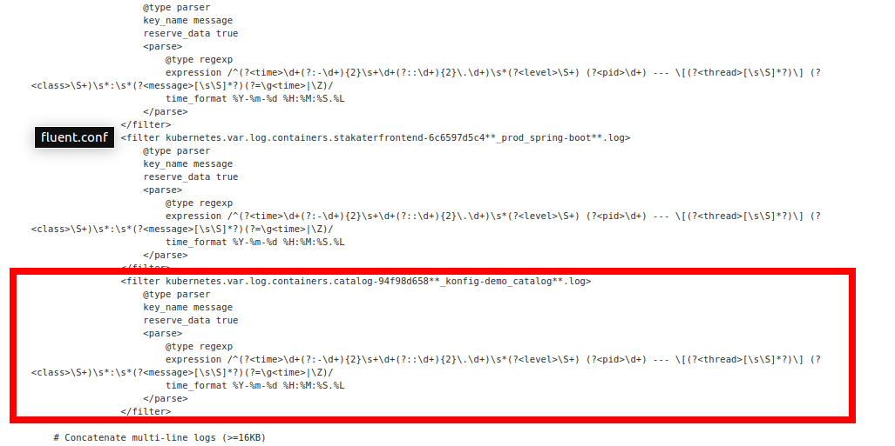

# Example Scenario


Konfigurator Operator looks for `KonfiguratorTemplate` Custom Resource in the namespaces specified, render the configuration and then mount these configmaps/secrets to the specified resource.

In this example we will generate fluentd configurations dynamically so that our application specific logs can be parsed.

Our application service `nordmart-catalog` is a java application that generate logs of the following format:
```
2019-11-27 11:04:12.682  INFO 1 --- [nio-8080-exec-1] o.s.web.servlet.DispatcherServlet        : Initializing Servlet 'dispatcherServlet'
``` 
and the regex to parse this log line:
```
/^(?<time>\d+(?:-\d+){2}\s+\d+(?::\d+){2}.\d+)\s*(?<level>\S+) (?<pid>\d+) --- \[(?<thread>[\s\S]*?)\] (?<class>\S+)\s*:\s*(?<message>[\s\S]*?)(?=\g<time>|\Z)/
```

## Before Parsing

Raw logs are being pushed in elasticsearch and are seen unparsed as below:


## Steps
1. Deploy Konfigurator Operator (already running in namespace `logging`)
2. Deploy KonfiguratorTemplate resource for templating fluentd config.
3. Verify rendered configmap `konfigurator-stakater-logging-fluentd-elasticsearch-rendered` in `logging` namespace without sample app config.
4. Deploy a sample application with regex to be used by Konfigurator in a separate namespace.
5. Konfigurator will read the newly created resource and render the new config.
6. `Reloader` will reload the pods as soon as the config is updated.

## Deploy Konfigurator Operator

Konfigurator Operator is already deployed with following values in `logging` namespace. 

```
apiVersion: helm.fluxcd.io/v1
kind: HelmRelease
metadata:
  name: stakater-logging-konfigurator
  namespace: logging
spec:
  releaseName: stakater-logging-konfigurator
  chart:
    repository: https://stakater.github.io/stakater-charts/
    name: konfigurator
    version: 0.0.20
  values:
    kubernetes:
      host: https://kubernetes.default

    konfigurator:
      deployCRD: true
      labels:
        provider: stakater
        group: com.stakater.platform
        version: v0.0.20
      image:
        name: stakater/konfigurator
        tag: "v0.0.20"
        pullPolicy: IfNotPresent
      env:
      - name: WATCH_NAMESPACE
        valueFrom:
          fieldRef:
            fieldPath: metadata.namespace
```
Konfigurator Operator creates CRD (Custom Resource Definition) `konfiguratorTemplate` and watches resources of this type in namespaces. You can view the CRD via running this command
```
kubectl describe crd konfiguratortemplates.konfigurator.stakater.com
``` 

## Deploy KonfiguratorTemplate resource

Following is a Konfigurator Template that will templatize `fluent.conf` and mounts the template as a configMap on the `stakater-logging-fluentd-elasticsearch` DaemonSet so that the fluentd pod can use this config. Save the following manifest in a file named `fluent-template.yaml` and apply by running
```
kubectl apply -f fluent-template.yaml
```
```yaml
apiVersion: konfigurator.stakater.com/v1alpha1
kind: KonfiguratorTemplate
metadata:
  name: fluentd
  namespace: logging
  labels:
    app: konfigurator
spec:
  renderTarget: ConfigMap
  app:
    name: stakater-logging-fluentd-elasticsearch
    kind: DaemonSet
    volumeMounts:
      - mountPath: /etc/fluent
        container: stakater-logging-fluentd-elasticsearch
  templates:
    fluent.conf: |
      # Do not collect fluentd's own logs to avoid infinite loops.
      <match fluent.**>
          @type null
      </match>

      @include /etc/fluent/config.d/*.conf        

      <match kubernetes.var.log.containers.**fluentd**.log>
          @type null
      </match>

      # Do not collect tiller logs as they are too frequent and of very less value
      <match kubernetes.var.log.containers.**tiller**.log>
          @type null
      </match>      

      <filter kubernetes.var.log.containers.**.log>
          @type kubernetes_metadata
      </filter>

      # Workaround until fluent-slack-plugin adds support for nested values
      <filter kubernetes.var.log.containers.**.log>
          @type record_transformer
          enable_ruby
          <record>
              kubernetes_pod_name ${record["kubernetes"]["pod_name"]}
              kubernetes_namespace_name ${record["kubernetes"]["namespace_name"]}
          </record>
      </filter>

      # Get distinct pods per application
      {{- $podsWithAnnotations := whereExist .Pods "ObjectMeta.Annotations.fluentdConfiguration" -}}
      {{- $distinctPods := distinctPodsByOwner $podsWithAnnotations -}}

      # Create concat filters for supporting multiline
      {{- range $pod := $distinctPods -}}
          {{- $config := first (parseJson $pod.ObjectMeta.Annotations.fluentdConfiguration) }}

          {{- range $containerConfig := $config.containers }}
              {{- if (len $pod.Spec.Containers) eq 1 }}
              <filter kubernetes.var.log.containers.{{ (index $pod.ObjectMeta.OwnerReferences 0).Name }}**_{{ $pod.ObjectMeta.Namespace }}_{{ (index $pod.Spec.Containers 0).Name }}**.log>
              {{- else }}
      <filter kubernetes.var.log.containers.{{ (index $pod.ObjectMeta.OwnerReferences 0).Name }}**_{{ $pod.ObjectMeta.Namespace }}_{{ $containerConfig.containerName }}**.log>
              {{- end }}
          @type concat
          key message
          multiline_start_regexp {{ $containerConfig.expressionFirstLine }}
          flush_interval 5s
          timeout_label @LOGS
      </filter>
      {{- end }}
      {{- end }}

      # Relabel all logs to ensure timeout logs are treated as normal logs and not ignored
      <match **>
          @type relabel
          @label @LOGS
      </match>

      <label @LOGS>
          # Create regexp filters for parsing internal logs of applications
          {{- range $pod := $distinctPods -}}
              {{- $config := first (parseJson $pod.ObjectMeta.Annotations.fluentdConfiguration) }}
              {{- range $containerConfig := $config.containers }}
                  {{- if (len $pod.Spec.Containers) eq 1 }}
                      <filter kubernetes.var.log.containers.{{ (index $pod.ObjectMeta.OwnerReferences 0).Name }}**_{{ $pod.ObjectMeta.Namespace }}_{{ (index $pod.Spec.Containers 0).Name }}**.log>
                  {{- else }}
                      <filter kubernetes.var.log.containers.{{ (index $pod.ObjectMeta.OwnerReferences 0).Name }}**_{{ $pod.ObjectMeta.Namespace }}_{{ $containerConfig.containerName }}**.log>
                  {{- end }}
                          @type parser
                          key_name message
                          reserve_data true
                          <parse>
                              @type regexp
                              expression {{ $containerConfig.expression }}
                              time_format {{ $containerConfig.timeFormat }}
                          </parse>
                      </filter>
              {{- end }}
          {{- end }}

          # Send parsed logs to both output and notification labels
          <match **>
              @type copy
              deep_copy true
              # If one store raises an error, it ignores other stores. So adding `ignore_error` ensures that the log will be sent to all stores regardless of the error
              <store ignore_error>
                  @type relabel
                  @label @NOTIFICATION
              </store>
              <store ignore_error>
                  @type relabel
                  @label @OUTPUT
              </store>
          </match>

      </label>


      <label @OUTPUT>
      
      # Send the the logs to elasticsearch 
        <match kubernetes.**>  
          @id elasticsearch-pliro
          @type elasticsearch
          @log_level info
          include_tag_key true
          type_name _doc
          host "elasticsearch-data.logging"
          port "9200"
          scheme "#{ENV['OUTPUT_SCHEME']}"
          ssl_version "#{ENV['OUTPUT_SSL_VERSION']}"
          ssl_verify false
          logstash_prefix "#{ENV['LOGSTASH_PREFIX']}"
          logstash_format true
          flush_interval 30s
          # Never wait longer than 5 minutes between retries.
          max_retry_wait 60
          # Disable the limit on the number of retries (retry forever).
          disable_retry_limit
          time_key timestamp
          reload_connections false
        </match>
        
        
      </label>

      <label @NOTIFICATION>
          # Filter ERROR level logs
          <filter **>
              @type grep
              <regexp>
                  key level
                  pattern (ERROR|error|Error|^E[0-9]{4})
              </regexp>
          </filter>
      {{- if (len $distinctPods) ge 1 }}
      {{- range $pod := $distinctPods -}}
          {{- $config := first (parseJson $pod.ObjectMeta.Annotations.fluentdConfiguration) }} 
          # Create slack notification matchers for sending error notifications per app
          <match kubernetes.var.log.containers.{{ (index $pod.ObjectMeta.OwnerReferences 0).Name }}**_{{ $pod.ObjectMeta.Namespace }}_**.log>
          {{- if $config.notifications.slack }}
              @type copy
              <store ignore_error>
                  @type slack
                  webhook_url {{ $config.notifications.slack.webhookURL }}
                  channel {{ $config.notifications.slack.channelName }}
                  username fluentd
                  icon_url https://raw.githubusercontent.com/fluent/fluentd-docs/master/public/logo/Fluentd_square.png
                  flush_interval 15s
                  parse full
                  color danger
                  link_names false
                  title_keys level            
                  title %s log
                  message_keys level,timestamp,kubernetes_pod_name,kubernetes_namespace_name,message
                  message *Level* %s *Time* %s *Pod* %s *Namespace* %s *Message* %s
                  time_key timestamp
              </store>
          {{- else }}
              # notifications
              @type null
          {{- end }}
          </match>
      {{- end }}
      {{- else }}
          <match app.**>
          # distinctPods
          @type null
          </match>
      {{- end }}
      </label>
```

## Verify rendered configmap

`konfigurator-stakater-logging-fluentd-elasticsearch-rendered` can be seen in configMaps in logging `namespace`. This fluentd config will contain filters for different applications whose regex were provided in their pod annotations.


## Deploy a sample application

1. Create a separate namespace `konfig-demo`

```
kubectl create namespace konfig-demo
```
2. Use the following manifest to deploy a sample nordmart application named `nordmart-konfig-demo` with regex passed under `values.deployment.fluentdConfigAnnotations`.

```yaml
apiVersion: helm.fluxcd.io/v1
kind: HelmRelease
metadata:
  name: nordmart-konfig-demo
  namespace: konfig-demo
spec:
  releaseName: nordmart-konfig-demo
  chart:
    repository: https://stakater.github.io/stakater-charts/
    name: application
    version: 0.0.12
  values:
    applicationName: "catalog"
    deployment:
      podLabels:
        app: catalog
      volumes: {}
      image:
        repository: stakater/stakater-nordmart-catalog
        tag: v0.0.1
      fluentdConfigAnnotations:
         regex: /^(?<time>\\d+(?:-\\d+){2}\\s+\\d+(?::\\d+){2}\\.\\d+)\\s*(?<level>\\S+) (?<pid>\\d+) --- \\[(?<thread>[\\s\\S]*?)\\] (?<class>\\S+)\\s*:\\s*(?<message>[\\s\\S]*?)(?=\\g<time>|\\Z)/
         regexFirstLine: /^\\d+(?:-\\d+){2}\\s+\\d+(?::\\d+){2}\\.\\d+/
         timeFormat: "%Y-%m-%d %H:%M:%S.%L"
      probes:
        readinessProbe:
          failureThreshold: 3
          periodSeconds: 10
          successThreshold: 1
          timeoutSeconds: 1
          initialDelaySeconds: 10
          httpGet:
            path: /actuator/health
            port: 8080
        livenessProbe:
          failureThreshold: 3
          periodSeconds: 10
          successThreshold: 1
          timeoutSeconds: 1
          initialDelaySeconds: 10
          httpGet:
            path: /actuator/health
            port: 8080
    service:
      ports:
      - port: 8080
        name: web
        protocol: TCP
        targetPort: 8080
    rbac:
      create: false
      serviceAccount:
        name: default
    configMap:
      enabled: false
```

## Konfigurator in action

Konfigurator operator in `logging` namespace will read the annotations from the newly created pod and generate the fluentd config with name `konfigurator-stakater-logging-fluentd-elasticsearch-rendered` and mounts the new configMap on `stakater-logging-fluentd-elasticsearch` DaemonSet in `logging` namespace.

Verify that the newly rendered fluentd configMap has entry for `konfig-demo` by running the following
```
kubectl describe configmap konfigurator-stakater-logging-fluentd-elasticsearch-rendered -n logging
```
From K8s dashboard:


## Reloader reloads DaemonSet/Pods

`Reloader` operator running in the `control` namespace will rollout the daemonset with the new configMap mounted because of the following annotation on `stakater-fluentd-elasticsearch` daemonset.
```
configmap.reloader.stakater.com/reload: konfigurator-stakater-logging-fluentd-elasticsearch-rendered
```
Reloader details can be found [here](https://github.com/stakater/Reloader)

## After Parsing

After dynamic generation and parsing of the logs the parsed log entry can be seen as below:

