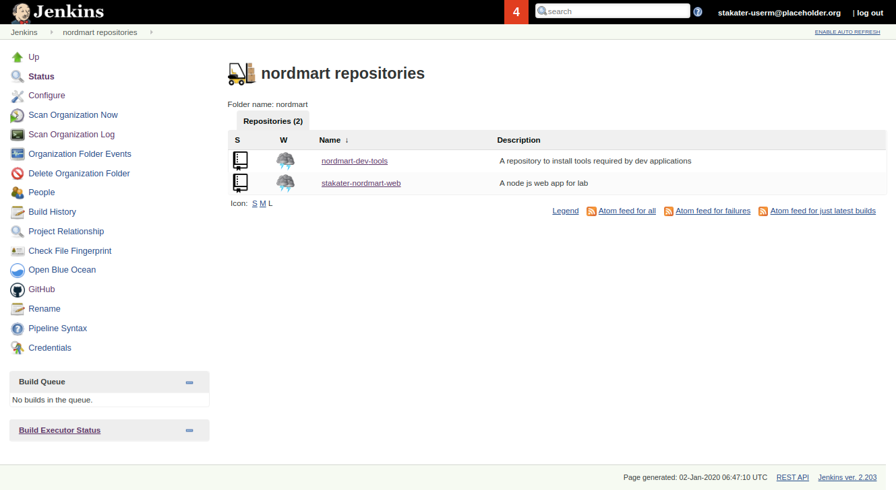

# CI/CD for NordMart

## Overview

Nordmart has 5 microservices for now. The strategy we use is each microservice will have its own codebase and repository and will be using the same pipeline library function [`releaseApplication`](https://github.com/stakater/stakater-pipeline-library/blob/master/vars/releaseApplication.groovy), a generic function for:

1. application build.
2. unit tests execution. 
3. build & push docker image
4. run end-to-end tests.

## Branching Strategy

For versioning, we also have different strategies for PR and master. For master, we use semantic versioning. And for PR, we use `0.0.0-PR-Number-BuildNumber-SNAPSHOT`.

We currently have setup 2 environments for Nordmart, we create separate repos for different environments e.g. `nordmart-dev-apps` and `nordmart-prod-apps`

**1. Dev:** We use GitOps for Dev Environment and we use Flux for GitOps. `Nordmart-Dev-Apps` will contain all the HelmReleases required for setting up Nordmart microservices, and soon as new image is built which follows the PR regex, Flux will update it automatically in the Dev Environment. So whenever a PR is created and its pipeline runs successfully pushing the image to docker registry, Flux will update dev environment to latest image.

For Deployment of Dev Environment, currently we have scaled down Flux to 0, and have all the manifests in the repo. As soon as flux's pod is scaled up to 1, it will sync the state of `nordmart-dev-apps` with the cluster.

Go to Openshift Console -> Select Project nordmart-dev-apps -> Scale Flux's Deployment to 1.

**2. Prod:** We use CIOps for Prod Environment and we use Jenkins for CIOps. `Nordmart-Prod-Apps` will contain all the HelmReleases required for setting up Nordmart microservices, So when a PR is approved and merged, master pipeline is run, it will generate an image in semantic version, so you can update that in the `nordmart-prod-apps` repo and its corresponding pipeline will run which will update the image in the cluster.

Prod environment is already deployed in the cluster.

## CI/CD Pipeline Creation

Follow the guidelines given below to create CI/CD jenkins pipeline:

1. Open the Jenkins using the link provided in Forecastle.

2. Create an organization and fork the following repositories:

    2.1. [Normart dev tools](https://github.com/stakater-lab/nordmart-dev-tools), it contains the tools required to deploy the web application.

    2.2. [Nordmart dev apps](https://github.com/stakater-lab/nordmart-dev-apps), it contains the manifests for the normart appplication microservices.
    
    2.3. [Stakater Nordmart web](https://github.com/stakater-lab/stakater-nordmart-web), it contains the manifests for the normart web application.

3. Create following credentials in Jenkins:

    3.1. Credentials for cloning repositories.
    
    3.2. Github token api, used for commenting on PRs.

4. Create a Github Organization for the nordmart application with following configuration.

    4.1. Use the credentials created above.
    
    4.2. Set organization name as the owner.
    
    4.3. Add the regex filter for repositories to just get the nordmart repos. The regex is given below:
    ```
        .*nordmart.*
    ```
    
    4.4. Add the regex given below in the `Automatic branch project triggering` sections, as we will be triggering only master and PRs:
    ```
        PR-\d+|master
    ```
    Once all the configurations are done, the configuration panel should look like this:
    
    
    4.5. Save the configuration, it will scan the organization and create pipeline for the repositories you forked in `step 2`.
    
    After organization scan, jenkins panel should look like this:

    


5. Once repositories are forked. Make the required changes in the `nordmart-dev-tools` repository's Jenkinsfile. Jenkinsfile use the [Stakater Pipeline Library](https://github.com/stakater/stakater-pipeline-library).

6. Now run the pipeline. If pipeline run sucessfully, it will perform following things:
    
    6.1. Create a namespace named `nordmart-dev-apps`.

    6.2. Install flux in the namespace.

7. Flux need access to the `nordmart-dev-apps` repository to deploy the applications. Access can be provided to flux add its SSH key in repository. flux SSH key can be retrieved using the commands given below:

8. Flux need access to the `nordmart-dev-apps` repository to deploy the applications. Access can be provided to flux add its SSH key in repository. flux SSH key can be retrieved using the commands given below:

```bash
$ kubectl -n flux logs deployment/flux | grep identity.pub | cut -d '"' -f2
```
    
9. Once key is added, microservice will be deployed. Mircoservices will pull the images from Stakater's [dockerhub](https://hub.docker.com/u/stakater/).

10. Nordmart application can be access via following URL:

    ```bash
    https://web-dev.YOUR_DOMAIN
    ```

## Using Custom Images

In previous section public dockerhub images were deployed but what if we want to deployed our own image. Follow the guidelines given below to deploy your own images:

1. We will build and deploy [stakater-nordmart-web](https://github.com/stakater-lab/stakater-nordmart-web) image.

2. To build an image, run a pipeline for stakater-nordmart-web master branch. But before running the pipeline change the following paramters in [Jenkinsfile](https://github.com/stakater-lab/stakater-nordmart-web/blob/master/Jenkinsfile) of your forked repository:


| Parameter | Description | Default Value |
|---|---|---|
| notifySlack | Notify on slack channel. It should be configure to `false` unless slack channel exists.| false |
|gitUser| Username for Git | username |
| gitEmail | Email for Git | user@gmail.com |
|usePersonalAccessToken| Personal Access token for the repository | true |
|tokenCredentialID| ID of the credentials created in previous section's `step 3` | GithubToken |
|dockerRepositoryURL| URL of the repository used to push image after build. Replace the `DOMAIN` value in the default URL provided. | docker-delivery.DOMAIN:443 |
|e2eTestJob| Boolean check to run e2e tests. If tests needs to executed provide any value otherwise assign `false` to it. | false |
| e2eJobName | Name of the tests branch. It must only be provided if above parameter `e2eTestJob` is configured| "" |


3. Run the pipeline for the branch in which the above changes are done.

4. If pipeline is executed successfully it must build and push an image on nexus repository.

5. Nexus registry can be access on this following url:
    ```bash
    nexus-delivery.DOAMIN
    ```

    It requires username and password to access the nexus repository, which was configured during nexus deployment.

6. If image is build and available in the nexus registry. Update the configurations parameter given below in web microservice [manifest](https://github.com/stakater-lab/nordmart-dev-apps/blob/master/releases/web-helm-release.yaml) of you branch:

    1. `repository`: Replace the old value(`stakater/stakater-nordmart-web`) with this one `docker-delivery.DOMAIN:443/stakater-lab/web`. After this change it will point to nexus registry instead of dockerhub registry.

    2. `tag`: Replace it with  image tag for the build.

    Once these parameters are configured commit your changes.

7. Now the image for the previous build should be deployed. It can be verified using the command given below:

    ```bash
    # get all pods name in nordmart-dev-apps
    kubectl get pods -n nordmart-dev-apps

    # get the manifest of web microservice pod
    kubectl describe pod <POD_NAME> -n nordmart-dev-apps

    Now check repository and tag name in the manifest show by the output of previous command.
    ```
