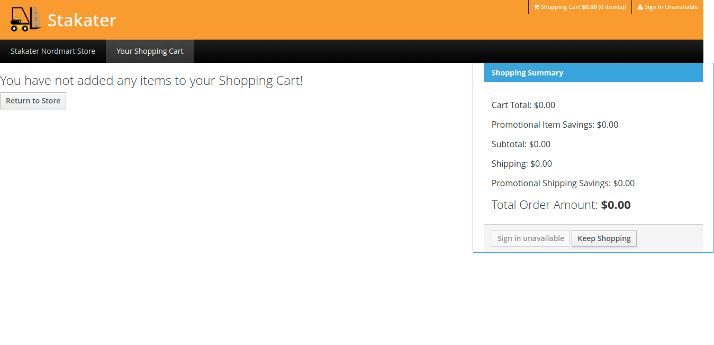

# NordMart Web Application

## Introduction

Nordmart is an online store web application built using Spring Boot, WildFly Swarm, Eclipse Vert.x, Node.js and AngularJS adopting the microservices architecture.

## Services

* **Web**: A Node.js/Angular front-end. Details can be found on this [link](https://github.com/stakater-lab/stakater-nordmart-web)

* **API Gateway**: vert.x service aggregates API calls to back-end services and provides a condenses REST API for front-end. Details can be found on this [link](https://github.com/stakater-lab/stakater-nordmart-gateway)

* **Catalog**: Spring Boot service exposing REST API for the product catalog and product information. Details can be found on this [link](https://github.com/stakater-lab/stakater-nordmart-catalog).

* **Inventory**: WildFly Swarm service exposing REST API for product's inventory status. Details can be found on this [link](https://github.com/stakater-lab/stakater-nordmart-inventory)

* **Cart**: Spring Boot service exposing REST API for shopping cart. Details can be found on this [link](https://github.com/stakater-lab/stakater-nordmart-cart)

## Architecture

The diagram given below shows architecture of the application.
```text
                              +-------------+
                              |             |
                              |     Web     |
                              |             |
                              |   Node.js   |
                              |  AngularJS  |
                              +------+------+
                                     |
                                     v
                              +------+------+
                              |             |
                              | API Gateway |
                              |             |
                              |   Vert.x    |
                              |             |
                              +------+------+
                                     |
                 +---------+---------+-------------------+
                 v                   v                   v
          +------+------+     +------+------+     +------+------+
          |             |     |             |     |             |
          |   Catalog   |     |  Inventory  |     |     Cart    |
          |             |     |             |     |             |
          | Spring Boot |     |WildFly Swarm|     | Spring Boot |
          |             |     |             |     |             |
          +------+------+     +-------------+     +-------------+
                 |                                       |
                 v                                       v
          +------+------+                         +------+------+
          |             |                         |             |
          |    MySQL    |                         |    MySQL    |
          |             |                         |             |
          +-------------+                         +-------------+
```

## Views

The app contains two main screens.

* First one is the home screen which lists all the products. It fetches all the products from catalog and their available stock value from inventory and displays them. You can add an item to the cart using the respective `Add To Cart` button.

  

* Second is the cart screen which shows the items currently in your cost and their cost.

  

## Monitoring

Dasbhoards given below can be used to monitor application by configuring them in Monitoring stack.

* JVM metrics dashboard is offered via the monitoring stack which displays JVM metrices.

  

* Catalog service metrics dashboard can be configured using this [config](https://github.com/stakater-lab/nordmart-dev-apps/blob/master/releases/catalog-service-dashboard.yaml).

  
