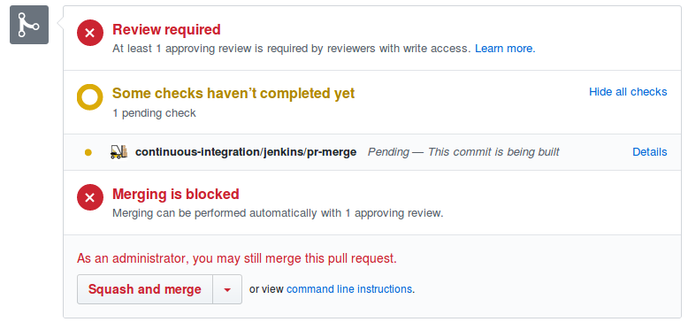

# Branching

## default(master) branch
Development of a feature, enhancement or bug fix should start with a git branch.
There should be no direct pushes to the master branch.
Any change that is required must be pushed to a branch other than master and then follow the merge workflow.

## Merge workflow
Once development in a branch is complete, the developer should create a pull request.
Once a pull request is created we send a notification on a messaging platform, e.g. slack and email.
This alerts all stakeholders that a change is planned and is being requested for merge.
On the pull request we add two checks that must be satisfied before it can be merged to master.
These checks can be configured in the Git service such as Github.
1. The first check, a code review by a peer or lead must be done.
Changes can be requested by the PR author, and once the changes are made to satisfaction, the pull request can be approved.
2. The second check is that of the Jenkins CI pipeline. The pipeline is triggered automatically using webhooks
 and if the pipeline runs successfully, the second check on the PR is satisfied.
 
These checks are visible on the Pull Request as seen in the following screenshot: 

With the CI pipeline for the PR successful, a snapshot of the build artifact as well as docker image,
 if the repository has a Dockerfile, is created and pushed to the Nexus OSS repository.
For public repositories, the docker image is pushed to docker hub. This is configured by configuring the appropriate
 Jenkins pipeline from the library in the Jenkinsfile

The pipeline is configured to name the snapshot versions using the PR number and build runs, e.g. PR-5-1.
This helps to easily track which snapshot belongs to which PR.

Once the PR is merged into master, another Jenkins pipeline is triggered.
This time a release is created and pushed to Nexus, and the release versions are bumped based on the previous ones.
These release versions are tagged on the git repository, and updated within the project repository in files
such as helm chart yaml, package.json, or other version file.
