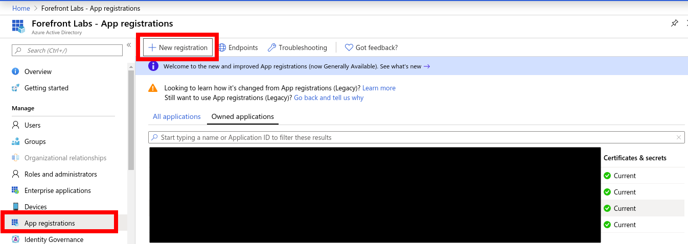
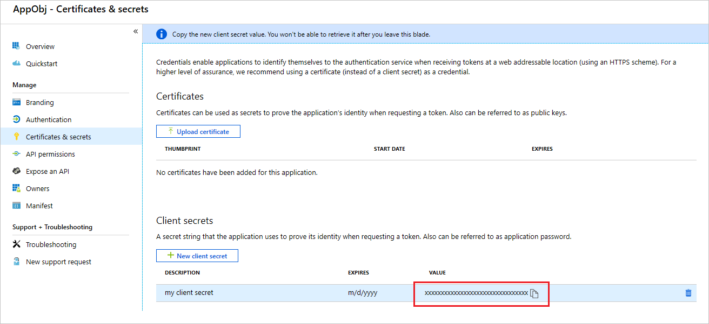

# Adding Azure Active Directory Users to KeyCloak

You can add Azure AD (Active directory) users to KeyCloak by following steps

1. Create Azure AD instance
1. Create AD Users
2. Create App Registration for Openshift cluster
3. Add Azure AD authentication in KeyCloak

## Create Azure AD instance.

### Create AD 
1. Select Azure Active Directory Resource Group.
2. Open the App registrations blade and click `+New registration`.

3. In the Register an application pane, enter a name for your application registration e.g. (OpenshiftAD).
4. Ensure that under Supported account types that Accounts in this organizational directory only is selected. This is the most secure choice.
5. Click the Register button to create the Azure AD application registration.
6. On the page that appears, copy down the Application (client) ID.

### Create Secret 
1. In the Manage section of the app registrations page, click Certificates & secrets.
2. On the Certificates & secrets pane, click +New client secret. The Add a client secret pane appears. Provide a Description.
3. Set Expires to the duration you prefer, for example In 2 Years.
4. Click Add and the key value will appear in the Client secrets section of the page.
5. Copy down the key value.

### Create AD Users
`Note:` Use account which has privilege to add user accounts.

1. Sign in to the Azure portal as a User administrator for the organization.
2. Select Azure Active Directory Resource Group, select Users, and then select New user.

3. On the User page, fill out the required information
    - Name (required). The first and last name of the new user. For example, Mary Parker.
    - User name (required). The user name of the new user. For example, mary@contoso.com.
4. Select Create.

### Add API Permissions

1. In the Manage section click API permissions.
2. Click Add permission and select Azure Active Directory Graph then Delegated permissions
3. Expand User on the list below and make sure User.Read is enabled.
4. Scroll up and select Application permissions.
5. Expand Directory on the list below and enable Directory.ReadAll
6. Click Add permissions to accept the changes.
7. The API permissions panel should now show both User.Read and Directory.ReadAll.
8. If you are the Azure Subscription Administrator, click Grant admin consent for Subscription Name below. If you are not the Azure Subscription Administrator, request the consent from your administrator.

## Create App Registration for Openshift cluster

1. Go to your Azure AD instance, select *App Registrations* on the left panel and click *Endpoints* on the top panel displayed. Copy values for *OAuth 2.0 authorization  endpoint (v2)* and *OAuth 2.0 token endpoint (v2)* values. these will be used in the Keycloak configurations.

2. Go to your Azure AD instance, select *App Registrations* on the left panel and Select Azure AD instance (OpenshiftAD). Copy the *Application (client) ID*. Click *Certificates and Secrets* from the left panel and click *New Client Secret* button and create a new secret. Copy the value of the secret.

3. Open Keycloak administrative console and Select Identity Providers in the left panel.

4. Click on the Add Provider drop down and select OpenID Connect v1.0 

5. Fill in the Options as below:
  
    * alias: azure-ad
    * Display Name: Microsoft Azure AD
    * First login flow: first broker login
    * Authorization URL: (*OAuth 2.0 authorization  endpoint (v2)*)
    * Token URL: (*OAuth 2.0 token endpoint (v2)*)
    * Client ID: (*Application (client) ID*) from step 2
    * Client secret: client secret from step 2
    * Prompt: unspecified

6. Click Save to create the OIDC type Identity Provider.

7. Copy the Redirect URI form the created Identity Provider. In Azure AD instance go to App Registration, Select AD Client application, select Authentication, and paste this URI in Redirect URI field and type Web and click the add button to add.

8. Open application in browser to test Keycloak is working fine with Azure AD.