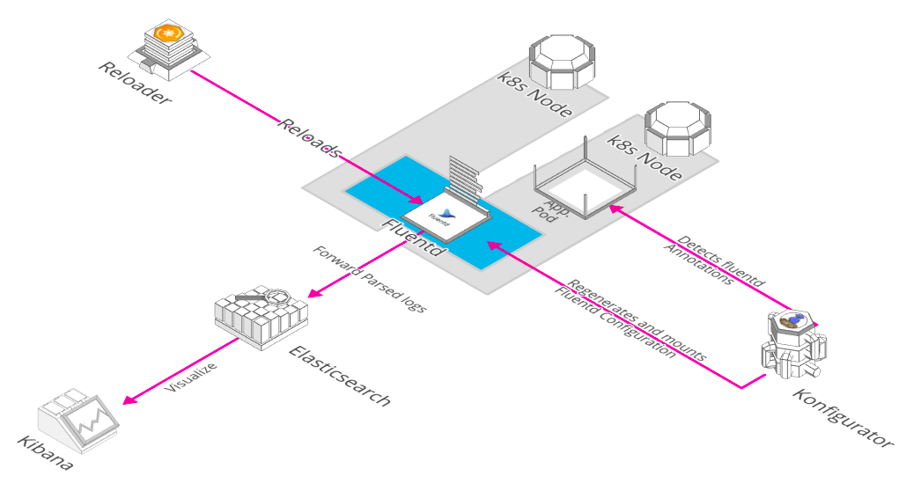
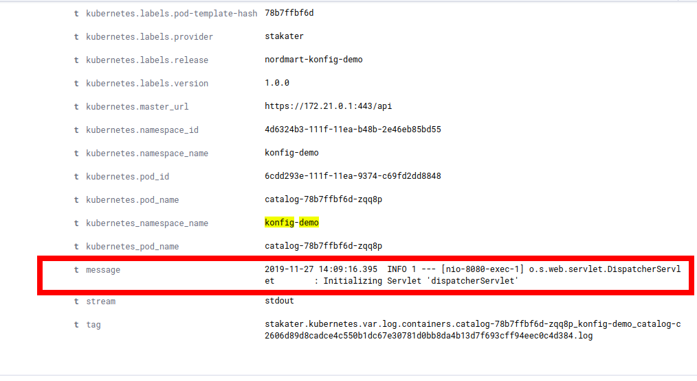
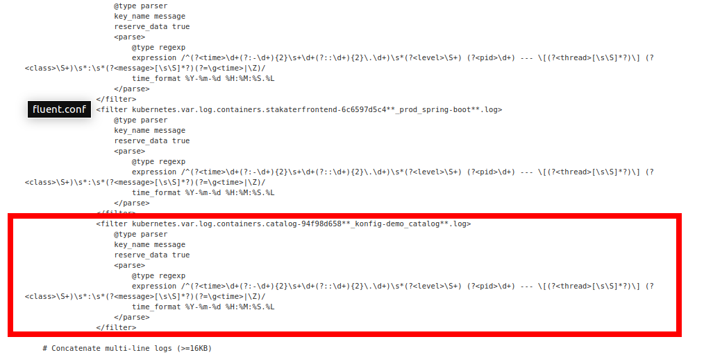
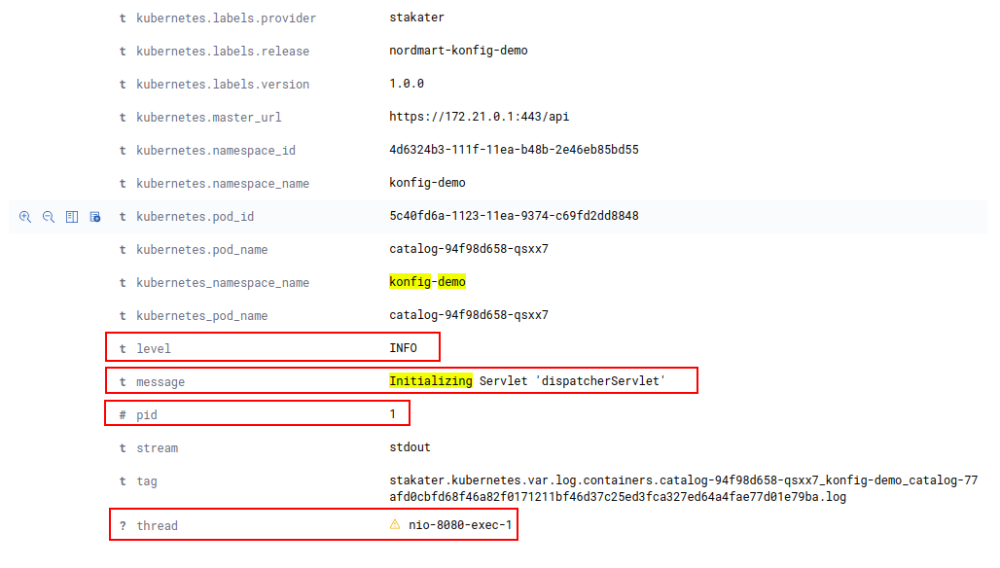

# Example Scenario



Konfigurator Operator looks for `KonfiguratorTemplate` Custom Resource in the namespaces specified, render the configuration and then mount these configmaps/secrets to the specified resource.

In this example we will generate fluentd configurations dynamically so that our application specific logs can be parsed.

Our application service `nordmart-catalog` is a java application that generate logs of the following format:
```
2019-11-27 11:04:12.682  INFO 1 --- [nio-8080-exec-1] o.s.web.servlet.DispatcherServlet        : Initializing Servlet 'dispatcherServlet'
``` 
and the regex to parse this log line:
```
/^(?<time>\d+(?:-\d+){2}\s+\d+(?::\d+){2}.\d+)\s*(?<level>\S+) (?<pid>\d+) --- \[(?<thread>[\s\S]*?)\] (?<class>\S+)\s*:\s*(?<message>[\s\S]*?)(?=\g<time>|\Z)/
```

## Before Parsing

Raw logs are being pushed in elasticsearch and are seen unparsed as below:


## Steps
1. Deploy Konfigurator Operator (already running in namespace `logging`)
2. Deploy KonfiguratorTemplate resource for templating fluentd config.
3. Verify rendered configmap `konfigurator-stakater-logging-fluentd-elasticsearch-rendered` in `logging` namespace without sample app config.
4. Deploy a sample application with regex to be used by Konfigurator in a separate namespace.
5. Konfigurator will read the newly created resource and render the new config.
6. `Reloader` will reload the pods as soon as the config is updated.

## Deploy Konfigurator Operator

Konfigurator Operator is already deployed with following values in `logging` namespace. 

```
apiVersion: helm.fluxcd.io/v1
kind: HelmRelease
metadata:
  name: stakater-logging-konfigurator
  namespace: logging
spec:
  releaseName: stakater-logging-konfigurator
  chart:
    repository: https://stakater.github.io/stakater-charts/
    name: konfigurator
    version: 0.0.20
  values:
    kubernetes:
      host: https://kubernetes.default

    konfigurator:
      deployCRD: true
      labels:
        provider: stakater
        group: com.stakater.platform
        version: v0.0.20
      image:
        name: stakater/konfigurator
        tag: "v0.0.20"
        pullPolicy: IfNotPresent
      env:
      - name: WATCH_NAMESPACE
        valueFrom:
          fieldRef:
            fieldPath: metadata.namespace
```
Konfigurator Operator creates CRD (Custom Resource Definition) `konfiguratorTemplate` and watches resources of this type in namespaces. You can view the CRD via running this command
```
kubectl describe crd konfiguratortemplates.konfigurator.stakater.com
``` 

## Deploy KonfiguratorTemplate resource

Following is a Konfigurator Template that will templatize `fluent.conf` and mounts the template as a configMap on the `stakater-logging-fluentd-elasticsearch` DaemonSet so that the fluentd pod can use this config. Save the following manifest in a file named `fluent-template.yaml` and apply by running
```
kubectl apply -f https://raw.githubusercontent.com/stakater/Playbook/master/content/workshop/konfigurator/yaml/konfigTemplate-logging.yaml
```

## Verify rendered configmap

`konfigurator-stakater-logging-fluentd-elasticsearch-rendered` can be seen in configMaps in logging `namespace`. This fluentd config will contain filters for different applications whose regex were provided in their pod annotations.


## Deploy a sample application

1. Create a separate namespace `konfig-demo`

```
kubectl create namespace konfig-demo
```
2. Use the following manifest to deploy a sample nordmart application named `nordmart-konfig-demo` with regex passed under `values.deployment.fluentdConfigAnnotations`.

```
kubectl apply -f https://raw.githubusercontent.com/stakater/Playbook/master/content/workshop/konfigurator/yaml/catalog.yaml
```

## Konfigurator in action

Konfigurator operator in `logging` namespace will read the annotations from the newly created pod and generate the fluentd config with name `konfigurator-stakater-logging-fluentd-elasticsearch-rendered` and mounts the new configMap on `stakater-logging-fluentd-elasticsearch` DaemonSet in `logging` namespace.

Verify that the newly rendered fluentd configMap has entry for `konfig-demo` by running the following
```
kubectl describe configmap konfigurator-stakater-logging-fluentd-elasticsearch-rendered -n logging
```
From K8s dashboard:


## Reloader reloads DaemonSet/Pods

`Reloader` operator running in the `control` namespace will rollout the daemonset with the new configMap mounted because of the following annotation on `stakater-fluentd-elasticsearch` daemonset.
```
configmap.reloader.stakater.com/reload: konfigurator-stakater-logging-fluentd-elasticsearch-rendered
```
Complete stakater-fluentd-elasticsearch manifest is as follows:
```
apiVersion: helm.fluxcd.io/v1
kind: HelmRelease
metadata:
  name: stakater-logging-fluentd-elasticsearch
  namespace: logging
spec:
  releaseName: stakater-logging-fluentd-elasticsearch
  chart:
    repository: https://kiwigrid.github.io
    name: fluentd-elasticsearch
    version: 4.9.1
  values:
    image:
      pullPolicy: Always
      repository: stakater/fluentd-elasticsearch
      tag: v1.0.0
      
    awsSigningSidecar:
      enabled: false
      image:
        repository: abutaha/aws-es-proxy
        tag: 0.9
      
    priorityClassName: 
    hostLogDir:
      dockerContainers: /var/lib/docker/containers
      libSystemdDir: /usr/lib64
      varLog: /var/log
      
    resources:
      {}
      
    elasticsearch:
      auth:
        enabled: false
        password: yourPass
        user: yourUser
      bufferChunkLimit: 2M
      bufferQueueLimit: 8
      host: elasticsearch-client.logging
      logLevel: info
      logstashPrefix: logstash
      path: ""
      port: 9200
      scheme: http
      sslVerify: false
      sslVersion: TLSv1_2
      typeName: _doc
      
    fluentdArgs: --no-supervisor -q
    env:
      {}
      
    secret:
      {}
      
    rbac:
      create: true
      
    serviceAccount:
      create: true
      name: ""
      
    podSecurityPolicy:
      annotations: {}
      enabled: false
      
    livenessProbe:
      enabled: false
      
    annotations:
      configmap.reloader.stakater.com/reload: konfigurator-stakater-logging-fluentd-elasticsearch-rendered,stakater-fluentd-elasticsearch
          
    podAnnotations:
      prometheus.io/port: "24231"
      prometheus.io/scrape: "true"
      
    updateStrategy:
      type: RollingUpdate
      
    tolerations:
      - effect: NoSchedule
        key: node-role.kubernetes.io/master
        operator: Exists
      
    affinity:
      {}
      
    nodeSelector:
      {}
      
    service:
      ports:
      - name: monitor-agent
        port: 24231
        type: ClusterIP
      
    serviceMonitor:
      enabled: false
      interval: 10s
      labels: {}
      path: /metrics
      port: 24231
      
    prometheusRule:
      enabled: false
      labels: {}
      prometheusNamespace: monitoring
      
    configMaps:
      useDefaults:
        containersInputConf: true
        forwardInputConf: true
        monitoringConf: true
        outputConf: false
        systemConf: true
        systemInputConf: true
      
    extraConfigMaps:
      output.conf: |
        # Empty Output conf
      
    extraVolumes:
      - hostPath:
          path: /var/data
        name: vardata
      
    extraVolumeMounts:
      - mountPath: /var/data
        name: vardata
        readOnly: true
```
Reloader details can be found [here](https://github.com/stakater/Reloader)

## After Parsing

After dynamic generation and parsing of the logs the parsed log entry can be seen as below:

